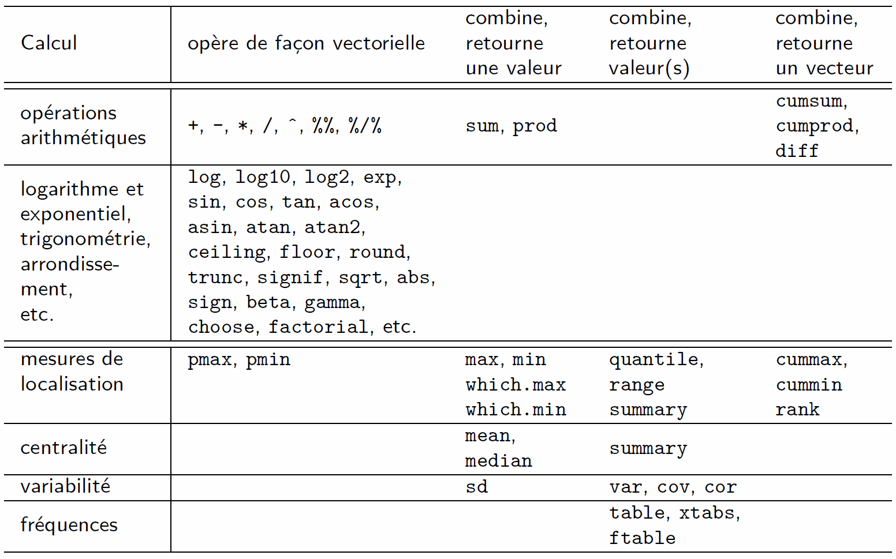

***

R est un environnement spécialisé dans les calculs statistiques. Voyons comment réaliser de tels calculs en R, en se limitant pour l'instant à des calculs simples. Des fonctionnalités de R permettant de réaliser des calculs plus avancés (ex. réaliser des tests statistiques, ajuster des modèles, générer des observations aléatoires, faire de l'algèbre linéaire, etc.) seront vues dans un autre cours. Je présente ici des fonctionnalités utiles pour :

- implanter une formule mathématique,
- effectuer une transformation mathématique de variables dans un jeu de données,
- calculer des statistiques descriptives, par exemple dans le cadre d'une analyse exploratoire de données.


# Fonctionnement vectoriel et règle de recyclage

Tous les opérateurs et plusieurs des fonctions qui sont présentées dans cette fiche agissent de façon vectorielle. Ils appliquent un calcul terme à terme entre deux objets atomiques (vecteurs, matrices ou arrays) ou data frames contenant uniquement des éléments numériques.

Par exemple, si les deux matrices suivantes sont additionnées avec l'opérateur `+`,

```{r}
matrix(1:6 , nrow = 2, ncol = 3)
matrix(6:1 , nrow = 2, ncol = 3)
```

l'élément en position (i,j) dans la première matrice sera additionné à l'élément à la même position dans la deuxième matrice, et ce, pour toutes les positions. Le résultats cette addition terme à terme est donc le suivant :

```{r}
matrix(1:6 , nrow = 2, ncol = 3) + matrix(6:1 , nrow = 2, ncol = 3)
```

&nbsp;

Si les deux objets intervenant dans l'opération ne sont pas de mêmes dimensions, la **règle de recyclage** s'applique. Cette règle avait déjà été mentionnée dans les notes sur les [structures de données en R](https://stt4230.rbind.io/manipulation_donnees/structures_r/#remplacement-delements). Étant donné son importance, revoyons-là plus en profondeur ici.

```{r}
c(5, 6) + c(2, 5, 3, 1)
```

L'instruction précédente effectue 4 additions, une pour chacun des 4 éléments du plus long des deux vecteurs dans l'opération, soit ici le deuxième. Le premier vecteur est plutôt de longueur 2. R répète donc ses éléments pour créer un vecteur aussi long que le deuxième

```{r}
rep(c(5, 6), 4/2)
```

et effectue en réalité l'opération suivante :

```{r}
c(5, 6, 5, 6) + c(2, 5, 3, 1)
```

Cette règle de recyclage est exploitée, souvent sans que l'utilisateur en soit pleinement conscient,  lorsque l'un des deux vecteurs impliqués dans une opération est de longueur 1. Par exemple, la commande suivante impliquant un exposant,
```{r}
c(2, 5, 3, 1)^2
```
est en fait traduite par R en la commande suivante :
```{r}
c(2, 5, 3, 1)^rep(2, 4)
```

#### Règle de recyclage avec des objets à plus d'une dimension

Cette règle ne s'applique pas seulement avec des vecteurs. Par exemple, pour additionner le même vecteur, disons
```{r}
3:1
```
à chacune des colonnes d'une matrice, disons
```{r}
matrix(1:12 , nrow = 3, ncol = 4)
```
il suffit de lancer la commande suivante 
```{r}
matrix(1:12 , nrow = 3, ncol = 4) + 3:1
```
au lieu de la suivante, qui retourne exactement le même résultat.
```{r eval = FALSE}
matrix(1:12 , nrow = 3, ncol = 4) + matrix(rep(3:1, 4), nrow = 3, ncol = 4)
```
Dans cette dernière commande, les deux arguments fournis à l'opérateur `+` sont réellement de mêmes dimensions, car la deuxième matrice est la suivante
```{r}
matrix(rep(3:1, 4), nrow = 3, ncol = 4)
```
Une règle de recyclage utilisée pour former une matrice de dimension appropriée va donc remplir la matrice une colonne à la fois, comme le fait la fonction `matrix` par défaut.

#### Règle de recyclage lorsque la longueur de l'objet le plus long n'est pas multiple de la longueur de l'objet le plus court

Lorsque la longueur de l'objet le plus long n'est pas multiple de la longueur de l'objet le plus court, la règle de recyclage fonctionne quand même. R recycle l'objet le plus court assez de fois pour arriver à un objet de longueur égale ou supérieure à l'objet le plus long. Ensuite, si l'objet recyclé est plus long que l'autre objet, il est tronqué de façon à ce que les deux objets aient la même longueur.

Supposons par exemple que la commande suivante soit soumise en R.

```{r eval = FALSE}
1:12 + 5:1
```

L'objet de gauche dans l'addition est de longueur 12 et l'objet de droite de longueur 5. L'objet de droite sera donc recyclé 3 fois,

```{r}
objet_recycle <- rep(5:1, 3)
objet_recycle
```

puis sa longueur sera réduite à la longueur de l'objet de gauche.

```{r}
length(objet_recycle) <- length(1:12)
objet_recycle
```

Ensuite l'addition terme à terme sera effectuée.

```{r}
1:12 + objet_recycle
```

Cependant, R émettra un avertissement pour nous informer qu'il a dû faire cet ajustement de longueur.

```{r eval = TRUE}
1:12 + 5:1
```


# Fonctions et opérateurs pour des calculs mathématiques

## Opérateurs mathématiques

### Opérateurs arithmétiques

Voici une liste d'opérateurs arithmétiques disponibles en R :

- `+` : addition, 
- `-` : soustraction, 
- `*` : multiplication, 
- `/` : division,
- `^` : puissance, 
- `%/%` : division entière,
- `%%` : modulo = reste de la division entière.

Les premiers opérateurs sont usuels et ne requièrent aucune explication. Expliquons cependant brièvement les deux derniers opérateurs de cette liste.

#### Division entière et modulo

L'opérateur `%/%` réalise une division entière. Pour illustrer ce type de division, prenons l'exemple suivant.
```{r}
5/2
```
L'opérateur de division ordinaire `/` retourne un nombre réel. L'opérateur `%/%` retourne la partie entière du résultat obtenu avec `/`. La partie décimale est tronquée. 
```{r}
5%/%2
```
L'opérateur modulo `%%` retourne le reste de la division entière. Dans l'exemple traité ici, ce reste vaut 1 car 5 - 2*2 = 1.
```{r}
5%%2
```

**Astuces** : Cet opérateur est pratique pour tester si des nombres sont pairs ou impairs. Les nombres pairs sont des multiples de 2. Alors `x %% 2` retourne 0 pour les nombres pairs et 1 pour les nombres impairs. L'opérateur modulo peut aussi servir à tester si un nombre stocké sous le type `double` est en réalité un entier. S'il s'agit d'un entier, `x %% 1` retournera 0.  


### Opérateurs de comparaison

Les opérateurs de comparaison permettent de comparer des valeurs. Ils retournent `TRUE` ou `FALSE`. Il s'agit des opérateurs suivants :
 
- `==` : égalité,
- `!=` : non-égalité,
- `>` : plus grand,
- `>=` : plus grand ou égal, 
- `<` : plus petit, 
- `<=` : plus petit ou égal.

Supposons `a` et `b` les deux vecteurs numériques suivants.

```{r}
a <- c(2, 5, 7, 3)
b <- c(3, 5, 6, 4)
```

Comparons ces vecteurs à l'aide d'un opérateur de comparaison. Est-ce que les valeurs contenues dans `a` sont supérieures ou égales aux valeurs contenues dans `b` ?

```{r}
a >= b
```

L'opérateur fonctionne de façon vectorielle, donc la comparaison est effectuée terme à terme. Les valeurs dans le résultat retourné sont de type logique.

Les valeurs dans un vecteur peuvent aussi être comparées à une seule valeur, auquel cas la règle de recyclage s'applique.

```{r}
a != 5
```

#### Comparaison de valeurs non numériques

Les opérateurs de comparaison ne fonctionnent pas seulement avec des valeurs numériques. Ils peuvent aussi être utilisés pour comparer des valeurs logiques ou caractères. Dans ce cas, il faut savoir que R considère que `FALSE` est inférieure à `TRUE`. 

```{r}
FALSE < TRUE 
```

Quant aux caractères, les opérateurs de comparaison utilisent l'ordre de classement des caractères pour déterminer, entre deux valeurs, celle qui est inférieure. Cet ordre dépend des paramètres régionaux de la session R. D'une langue à l'autre, cet ordre peut varier.

Pour connaître l'ordre utilisé dans une session R, les instructions suivantes sont utiles :

```{r eval = FALSE}
caracteres_speciaux <- 
  c("!", "\"", "#", "$", "%", "&", "'", "(", ")", "*", "+", ",", "-", ".", "/", ":", ";", 
    "<", "=",">", "?", "@", "[", "\\", "]", "^", "_", "{", "|", "}", "~")
lettres_accentuees <- c("à", "â", "é", "è", "ê", "ë", "ï", "î", "ô", "ù", "ü", "û", "ç")
catacteres_ordonnes <- sort(c(caracteres_speciaux, 0:9, letters, LETTERS, 
                              lettres_accentuees, toupper(lettres_accentuees))) 
paste(catacteres_ordonnes, collapse = "")
```

J'ai obtenu le résultat suivant, qui sera peut-être différent sur votre ordinateur si vous n'avez pas les mêmes paramètres régionaux que moi.

```
"'-!\"#$%&()*,./:;?@[\\]^_{|}~+<=>0123456789aAàÀâÂbBcCçÇdDeEéÉèÈêÊëËfFgGhHiIîÎïÏjJkKlLmM
nNoOôÔpPqQrRsStTuUùÙûÛüÜvVwWxXyYzZ"
```

Ainsi, dans ma session R :

- les caractères spéciaux sont inférieurs aux chiffres et aux lettres, 
- les chiffres sont inférieurs aux lettres,
- les lettres sont classées en ordre aphabétique et
    + les lettres minuscules sont inférieures aux lettres majuscules,
    + les lettres non accentuées sont inférieures aux lettres accentuées.

Pour des chaînes à plus d'un caractère, la comparaison s'effectue caractère par caractère (premiers caractères comparés entre eux, puis deuxièmes en cas d’égalité, puis troisièmes en cas d'égalités aux deux premières positions, etc.). 

```{r}
"arborescence" < "arbre" 
```

Aussi, l’absence de caractères vaut moins que la présence.

```{r}
"a" < "aa"
```

&nbsp;

**Remarque** : Afin de correctement ordonner des nombres, il faut s'assurer de les stocker sous un format numérique. 

```{r}
2 < 10
```

S'ils sont stockés sous forme de chaînes de caractères, les résultats obtenus ne seront pas toujours ceux attendus.   

```{r}
"2" < "10"
```


### Opérateurs logiques

Les opérateurs logiques prennent en entrée un ou deux vecteurs de logiques et retournent un vecteur de logiques. Il s'agit des opérateurs suivants.

- `!` : négation, 
- `|` et `||` : ou, 
- `&` et `&&` : et.

De plus, le «&nbsp;ou&nbsp;» exclusif est implémenté par la fonction `xor`.

L'opérateur `!` n'a qu'un seul argument, alors que les autres opérateurs logiques en ont deux. Il effectue une négation. Il transforme les `TRUE` en `FALSE` et les `FALSE` en `TRUE`.
```{r}
! c(TRUE, FALSE)
```

Les opérateurs `|` et `&` appliquent de façon vectorielle les tables de vérité[^1] des opérateurs logiques « ou » et « et » respectivement. 

[^1]: https://fr.wikipedia.org/wiki/Table_de_v%C3%A9rit%C3%A9

Rappel : **table de vérité de « ou »**

```{r}
v1 <- rep(c(FALSE, TRUE), each = 2)
v2 <- rep(c(FALSE, TRUE), 2)
cbind(v1, v2, "v1 | v2" = v1 | v2)
```

Ainsi, l'opération « a ou b » retourne faux uniquement si a et b sont faux.

Rappel : **table de vérité de « et »**

```{r}
cbind(v1, v2, "v1 & v2" = v1 & v2)
```

Ainsi, l'opération « a et b » retourne vrai uniquement si a et b sont vrais.

Les opérateurs `||` et `&&` appliquent ces mêmes tables de vérité, mais ils ne travaillent pas de façon vectorielle. Ils retournent toujours un seul `TRUE` ou un seul `FALSE`. Si, par inadvertance, `||` ou `&&` reçoit en entrée des vecteurs, il effectuera une opération seulement sur les premiers éléments de ces vecteurs, comme dans cet exemple.

```{r}
c(TRUE, FALSE, TRUE) && c(TRUE, FALSE, FALSE)
```


## Fonctions mathématiques agissant de façon vectorielle

R offre aussi plusieurs fonctions de calculs mathématiques, travaillant de façon vectorielle, dont les suivantes :

- racine carrée : `sqrt`;
- logarithmes et exponentiels : `exp`, `log` (= logarithme naturel), `log10`, `log2`;
- fonctions trigonométriques : `sin`, `cos`, `tan`, `acos`, `asin`, `atan`, `atan2`;
- fonctions relatives aux signes : `abs`, `sign`;
- fonctions d'arrondissement : `ceiling`, `floor`, `round`, `trunc`, `signif`;
- fonctions reliées aux fonctions mathématiques bêta et gamma: `beta`, `gamma`, `factorial`, `choose`, etc.

Ces fonctions font un calcul pour tous les éléments de l'objet fourni en entrée et retournent un résultat de même dimension que l'objet en entrée. Voici quelques exemples.

```{r}
x <- -5:4
x
exp(x)
xMat <- matrix(x, nrow = 2)
xMat
sign(xMat)
```


## Fonctions mathématiques combinant des éléments

Certaines fonctions mathématiques en R effectuent des calculs faisant intervenir plus d'un élément de l'objet donné en entrée, plutôt que d'effectuer un calcul distinct pour chacun des éléments. C'est le cas des fonctions suivantes :

- somme ou produit de tous les éléments (retourne une seule valeur) : `sum`, `prod`;
- somme ou produit cumulatif des éléments (retourne un vecteur de même longueur que le vecteur en entrée) : `cummsum`, `cumprod`;
- différences entre des éléments : `diff`.

Voici quelques exemples.
```{r}
mat <- matrix(c(2,5,3,4,6,5,4,3,1,2,9,8), nrow = 3, ncol = 4)
mat
prod(mat)
cumsum(mat)
```

#### Fonction `diff`

Pour une matrice, `diff` calcule les différences terme à terme des éléments composant les lignes. Par défaut, il compare une ligne à la ligne en dessous.

\newpage

```{r diff}
diff(mat)
```
La commande suivante retourne donc le même résultat que la précédente. 
```{r}
mat[-1, ] - mat[-nrow(mat), ]
```
Pour un vecteur, la fonction `diff` retourne les différences entre un terme et le terme précédent. 
```{r}
diff(c(2,5,3,4))
```
La fonction `diff` peut calculer des différences entre des termes séparés par plus d'une position grâce à l'argument `lag`. 
```{r}
diff(c(2,5,3,4), lag = 2)
```


## Fonctions d'opérations sur des ensembles

Les fonctions R d'opération sur des ensembles sont les suivantes : 

- `union` : union, 
- `intersect` : intersection, 
- `setdiff` : différence, 
- `setequal` : test d'égalité, 
- `is.element` : test d'inclusion.

Voici quelques exemples utilisant les deux ensembles suivants

```{r}
x <- c("M", "S", "A", "F", "M")
y <- c("M", "A", "H", "B")
```

Union de tous les éléments des ensembles `x` et `y`, en retirant les doublons :

```{r}
union(x, y)
```

Identification des éléments communs dans `x` et `y`, en retirant les doublons :

```{r}
intersect(x, y)
```

Identification des éléments de `x` ne se retrouvant pas dans `y`, en retirant les doublons :

```{r}
setdiff(x, y)
```

\newpage

Test sur l'égalité entre les ensembles `x` et `y` :

```{r}
setequal(x,y)
```

Test sur la présence de `"A"` et `"B"` dans l'ensemble `x` :

```{r}
is.element(el = c("A", "B"), set = x)
```


## Mots-clés mathématiques

Le nombre $\pi$ est représenté en R par le mot-clé `pi`.
```{r}
pi
```

`Inf` est le symbole en R pour l'infini $\infty$.
```{r}
-5/0
```

`NaN` est un mot-clé signifiant *Not A Number*. Ce mot-clé est retourné par R lorsqu'un utilisateur lui demande d'effectuer une opération mathématique impossible.
```{r}
log(-1)
```

**Rappel** : Attention de ne pas confondre le mot-clé `NaN` avec le mot-clé `NA` qui signifie plutôt *Not Available* et qui sert à représenter les données manquantes.


***


# Fonctions pour le calcul de statistiques descriptives

## Fonctions retournant une seule statistique

Certaines fonctions de calcul de statistiques descriptives prennent en entrée un objet atomique (vecteur, matrice ou array) contenant uniquement des éléments numériques et retournent en sortie une seule valeur, soit une statistique.

- minimum et maximum : `min`, `max`;
- mesures de tendance centrale : `mean`, `median`;
- mesures de variabilité : `sd` (écart-type).

Utilisons le jeu de données `cars` du package `datasets` pour faire quelques exemples.

```{r}
str(cars)
mean(cars$speed)
```

Si l'objet en entrée a plus d'une dimension, la sortie est tout de même de longueur 1. Donc tous les éléments contenus dans l'objet sont mis en commun pour faire le calcul.
```{r}
sd(as.matrix(cars))
```

#### Fonctions `which.max` et `which.min`

Les fonctions `min`  et `max` retournent respectivement la valeur la plus petite et la valeur la plus grande parmi les éléments d'un objet.
```{r}
max(cars$dist)
```

Les fonctions `which.max` et `which.min` retournent pour leur part la position dans l'objet du maximum ou du minimum.  
```{r}
which.max(cars$dist)
```

Ainsi, nous pourrions par exemple afficher la ligne de `cars` contenant la plus grande observation pour la variable `dist` comme suit.
```{r}
cars[which.max(cars$dist), ]
```


### Traitement des observations manquantes et argument `na.rm`

Les fonctions `min`, `max`, `mean`, `median` et `sd`, ainsi que quelques autres fonctions vues dans ces notes, ont un argument en commun nommé `na.rm`. Cet argument spécifie le comportement de la fonction en présence de données manquantes (`NA`). Par défaut, `na.rm` prend la valeur `FALSE` pour ces fonctions. Cette valeur signifie que les données manquantes ne doivent pas être retirées avant d'effectuer le calcul. Cependant, en présence de données manquantes, ces fonctions ne sont pas en mesure de calculer des statistiques. Par exemple, supposons que nous voulions calculer la médiane des données dans le vecteur suivant.

```{r}
x <- c(3, 6, NA, 8, 11, 15, 23)
```

Si nous ne retirons pas la donnée manquante, nous obtenons le résultat suivant.

```{r}
median(x)
```

Ce résultat s'explique par le fait que la valeur de la médiane dépend de toutes les observations, incluant l'observation manquante, qui est inconnue. La valeur de la médiane est donc elle aussi inconnue. 

Pour calculer plutôt la médiane des observations non manquantes, il faut donner la valeur `TRUE` à l'argument `na.rm` comme suit.

```{r}
median(x, na.rm = TRUE)
```

Notons que la fonction `na.omit` permet de retirer les observations manquantes d'un objet R. Si l'objet est un vecteur, les éléments contenant `NA` sont retirés.

\newpage

```{r}
na.omit(x)
```

La fonction `na.omit` ajoute un attribut à l'objet pour identifier les observations retirées. 

Remarquons que les deux commandes suivantes retournent le même résultat.

```{r}
median(x, na.rm = TRUE)
median(na.omit(x))
```


Si la fonction `na.omit` reçoit en entrée une matrice ou un data frame, elle retire toutes les lignes contenant au moins un `NA`.

```{r}
exJeu <- data.frame(x, y = c(2, NA, 8, 9, 6, NA, 2))
exJeu
na.omit(exJeu)
```


## Fonctions pouvant retourner plusieurs statistiques

D'autres fonctions peuvent retourner plus d'une statistique.

- mesures de localisation : `range`, `quantile`;
- résumé comprenant plusieurs mesures : `summary`;
- variance, covariance et corrélations : `var`, `cov`, `cor`.

#### Fonctions `range` et `quantile`

La fonction `range` retourne à la fois le minimum est le maximum.
```{r range}
range(cars$speed)
```
La fonction `quantile` calcule des quantiles empiriques. Par défaut, elle retourne le minimum, le maximum et les quartiles.
```{r quantile}
quantile(cars$speed)
```
L'argument `probs` permet de demander n'importe quels quantiles.
```{r}
quantile(cars$speed, probs = c(0.1,0.9))
```

**Remarque** : Il existe plusieurs façons de calculer des quantiles. La fonction `quantile` implémente 9 algorithmes de calcul de quantiles (voir [`help(quantile)`](https://stat.ethz.ch/R-manual/R-devel/library/stats/html/quantile.html)).

#### Fonction `summary`

La fonction `summary` retourne les statistiques suivantes selon l'entrée qu'elle reçoit : 

- vecteur numérique : minimum, premier quartile, médiane, moyenne, troisième quartile, maximum;
- facteur : fréquences des modalités (comme la fonction `table` vue plus loin);
- matrice ou data frame : la fonction `summary` est appliquée séparément à chacune des colonnes.

Voici quelques exemples.

Vecteur numérique en entrée :

```{r }
summary(cars$speed)
```

Facteur en entrée :

```{r }
summary(Puromycin$state)
```

Data frame en entrée :

```{r }
summary(cars)
```


#### Fonctions `var`, `cov` et `cor`

La fonction `var` peut prendre en entrée un vecteur ou un objet à deux dimensions. Si elle reçoit en entrée un vecteur, elle calcule la variance empirique de toutes les valeurs. 
```{r var}
var(cars$speed)
```
Cependant, si elle reçoit en entrée une matrice ou un data frame de valeurs numériques, elle considère que chaque colonne contient les observations d'une variable aléatoire. Elle va calculer une matrice de variance-covariance.
```{r}
var(cars)
```
La fonction `cov` fait exactement le même calcul par défaut. 
```{r}
cov(cars)
```
Elle peut cependant calculer des covariances de Kendall ou de Spearman (toutes deux des statistiques non paramétriques basées sur les rangs des observations) au lieu de la covariance classique de Pearson. La fonction `cor` calcule des corrélations plutôt que des covariances.
```{r}
cor(cars, method = "spearman")
```


## Fonctions retournant un vecteur de statistiques

Certaines fonctions retournent autant de statistiques qu'il y a d'éléments dans l'objet donné en entrée.

- minimum et maximum : `cummin`, `cummax`, `pmin`, `pmax`;
- rangs : `rank`.

#### Fonctions `cummin` et `cummax`

Les fonctions `cummin` et `cummax` calculent le minimum et le maximum cumulatif.
```{r}
x <- c(-2, 4, -3, 4, 7, -6, 0)
```
```{r}
cummin(x)
```
La valeur en position `i` est la valeur minimale dans le sous-vecteur `x[1:i]`.


#### Fonctions `pmin` et `pmax` 

Les fonctions `pmin` et `pmax` calculent le minimum et le maximum élément par élément, entre des vecteurs. 
```{r}
pmax(x, 1:7)
```
Elle est utile pour tronquer des valeurs. Par exemple, l'instruction suivante permet de tronquer à zéro les valeurs dans le vecteur `x`.
```{r}
pmax(x, 0)
```

#### Fonction `rank`

Certains tests statistiques non paramétriques utilisent des statistiques basées sur les rangs des observations. Voici comment obtenir ces rangs :
```{r rank}
rank(x)
```
Par défaut, en cas d'égalité, le rang moyen est utilisé. Pour changer cette option, il faut modifier la valeur de l'argument `ties.method`.
```{r}
rank(x, ties.method = "min")
```


## Fonctions de calcul de fréquences

Les fonctions `table`, `xtabs` et `ftable` permettent de calculer des fréquences.

Voici un petit jeu de données pour illustrer l'utilisation de ces fonctions. Il contient des observations concernant 7 individus fictifs : leur sexe, la couleur de leurs yeux et la couleur de leurs cheveux.
```{r}
sondage <- data.frame(yeux = c("brun", "brun", "bleu", "brun", "vert", "brun", "bleu"),
                      cheveux = c("brun", "noir", "blond", "brun", "brun", "blond", "brun"),
                      sexe = c("F", "M", "F", "F", "M", "F", "M"))
sondage
```

#### Fonctions `table`

La fonction `table` permet de compter le nombre d'occurrences de chacune des modalités d'une variable catégorique dans des observations.
```{r table}
table(sondage$yeux)
```
Elle produit un tableau de fréquences à une variable si elle reçoit les observations d'une seule variable. Elle peut aussi produire des tableaux de fréquences croisées à deux variables ou plus.
```{r}
table(sondage$yeux, sondage$cheveux)
```

\newpage

```{r}
table(sondage)
```


#### Fonctions `xtabs`

La fonction `xtabs` fait le même calcul, mais prend en entrée une formule.
```{r}
xtabs(~ yeux + cheveux, data = sondage)
```

#### Fonctions `ftable`

Finalement, la fonction `ftable` retourne le résultat sous la forme d'une table « plate » (en anglais *flat*, d'où le `f` dans le nom de la fonction) plutôt que d'un array dans le cas d'un croisement de 3 variables ou plus.
```{r}
ftable(sondage)
```

#### Autres fonctions relatives au calcul de fréquences

Les fonctions `margin.table`, `addmargins` et `prop.table` permettent de calculer des fréquences marginales ou relatives à partir d'un tableau de fréquences.

\newpage

Voici quelques exemples avec le tableau de fréquences suivant.

```{r}
freq <- table(sondage$yeux, sondage$cheveux)
freq
```

Fréquences marginales en colonnes :

```{r}
margin.table(freq, margin = 2)
```

Fréquences marginales ajoutées au tableau :

```{r}
addmargins(freq)
```

Fréquences relatives :

```{r}
prop.table(freq)
```

#### Transformation du format d'un objet de classe `"table"`
Les fonctions `table` et `xtabs` attribuent à l'objet qu'ils retournent en sortie la classe `"table"`. 

```{r}
attributes(freq)
str(freq)
```


Il est parfois utile de transformer un objet de classe `"table"` en un array (matrice si la table croise deux variables) ou un data frame. Pour la transformation en array, il suffit de retirer l'attribut `class` avec la fonction `unclass`.

```{r}
unclass(freq)
str(unclass(freq))
```

La transformation en data frame transforme la table en format « plat ».

```{r}
as.data.frame(freq)
str(as.data.frame(freq))
```


## Fonctions pour le traitement des observations dupliquées

Il est parfois utile de gérer les observations dupliquées dans un jeu de données. En R, les fonctions suivantes sont utiles avec des observations dupliquées :

- pour tester la présence d'observations dupliquées : `duplicated`,
- pour retirer les observations dupliquées : `unique`.

Une observation est ici définie par l'ensemble des valeurs observées de toutes les variables pour un individu (ou une unité) de la population statistique à l'étude. Donc une observation dupliquée est une ligne répétée (donc deux lignes ou plus complètement identiques) dans une matrice ou un data frame. Dans le cas d'une seule variable, stockée dans un vecteur, une observation dupliquée est une valeur présente plus d'une fois dans le vecteur.

Pour illustrer l'emploi des fonctions `duplicated` et `unique`, réutilisons le jeu de données `sondage`. Ce jeu de données contient une observation dupliquée.
```{r}
sondage
```
En effet, les lignes 1 et 4 sont identiques. La fonction `duplicated` identifie la 4e observation comme une duplication d'une autre observation.
```{r}
duplicated(sondage)
```
L'observation peut être retirée avec la fonction `unique` comme suit.
```{r}
unique(sondage)
```
Si elles reçoivent un vecteur en entrée, les fonctions `duplicated` et `unique` réagissent comme suit.
```{r}
duplicated(c(1, 3, 2, 1, 2, 1))
unique(c(1, 3, 2, 1, 2, 1))
```


***

# Fonctions de la famille des `apply`

R propose plusieurs fonctions, dites « de la famille des `apply` », qui ont pour but d'appliquer itérativement une autre fonction sur des sous-sections d'un objet. Les grandes étapes de traitement de ces fonctions sont les suivantes :

- séparer un objet en sous-objets;
- répéter la même action pour tous les sous-objets : appeler une fonction en lui donnant comme premier argument le sous-objet;
- combiner les résultats obtenus.

Ces fonctions cachent en fait une boucle, mais avec une syntaxe allégée.

Les fonctions de la famille des `apply` sont utiles pour :

- les calculs sur les marges d'une matrice ou d'un array,
- appliquer le même traitement à tous les éléments d'une liste, 
- le calcul de statistiques descriptives selon les niveaux de facteurs,
- les calculs en parallèle (nous y reviendrons plus tard),
- etc.

Nous verrons ici les fonctions : `apply`, `lapply`, `sapply`, `mapply`, `tapply`, `by` et `aggregate`.

## Fonction `apply`

La fonction `apply` applique une fonction sur toutes les lignes ou toutes les colonnes d'un array (souvent une matrice). 

Voici un exemple.
```{r}
mat <- matrix(1:12, nrow = 3, ncol = 4, byrow = TRUE)
mat[2,3] <- NA
mat
```
Calcul sur chaque ligne :
```{r apply}
apply(mat, MARGIN = 1, FUN = mean)
```
Calcul sur chaque colonne :
```{r}
apply(mat, MARGIN = 2, FUN = mean)
```

Pour ajouter un argument à envoyer à la fonction `FUN`, il suffit de l'ajouter à la liste des arguments fournis, préférablement en le nommant. C'est l'argument `...` qui permet ce transfert d'arguments entre une fonction principale et une fonction présente dans le corps de la fonction principale.
```{r}
apply(mat, 2, mean, na.rm = TRUE)
```

La fonction retourne une liste si `FUN` retourne plus d'une valeur.
```{r}
apply(mat, 1, summary)
```

Elle peut aussi prendre en entrée un array à plus de deux dimensions.

```{r}
arr <- array(1:12, dim = c(2, 3, 2))
arr
apply(arr, MARGIN = c(1, 2), FUN = sum)
```

Si elle reçoit en entrée un data frame, elle le transformera en matrice avant d'effectuer les calculs.


### Fonctions raccourcies : `rowSums`, `colSums`, `rowMeans` et `colMeans`

Pour le calcul de sommes et de moyennes, il existe des fonctions raccourcies un peu plus rapides qu'un appel à la fonction `apply` : `rowSums`, `colSums`, `rowMeans`, `colMeans`. Par exemple :

```{r}
rowMeans(mat, na.rm = TRUE)
```
est équivalent à `apply(mat, 1, mean, na.rm = TRUE)` et
```{r}
colSums(mat, na.rm = TRUE)
```
est équivalent à `apply(mat, 2, sum, na.rm = TRUE)`.

Ces fonctions spécialisées ont été optimisées en termes de temps d'exécution.


## Fonctions `lapply`, `sapply` et `mapply`

Les fonctions `lapply`, `sapply` et `mapply` prennent en entrée un vecteur ou une liste (qui peut aussi être un data frame). Elles appliquent une fonction sur chaque élément du vecteur ou de la liste (ou chaque colonne du data frame).

Voici une liste qui sera utilisée pour illustrer l'emploi de ces fonctions. Cette liste contient les mots formant trois courtes phrases (ponctuation omise).

```{r}
phrases <- list(
  phrase1 = c("regarde", "la", "belle", "neige"),
  phrase2 = c("allons", "skier"),
  phrase3 = c("non", "il", "fait", "trop", "froid")
)
```


#### Fonction `sapply` :

Supposons que nous voulons isoler le dernier mot de chaque phrase dans la liste `phrases`. L'action que nous souhaitons réaliser revient à extraire le dernier élément d'un vecteur. Elle doit être réalisée pour tous les vecteurs qui sont des éléments de la liste `phrases`. 

Nous pourrions réaliser cette tâche avec la commande suivante.

```{r}
dernier_mot <- sapply(phrases, FUN = tail, n = 1)
dernier_mot
```

Décortiquons maintenant cette commande. L'instruction `sapply(phrases, FUN = tail, n = 1)` permet d'appliquer la fonction `tail` à chaque élément de la liste `phrases`, qui sont tous des vecteurs. L'argument `n = 1` est passé à la fonction `tail`. Ainsi, seul le dernier élément de chaque vecteur est extrait. C'est comme si nous avions soumis la commande 

```{r}
tail(phrases[[1]], n = 1)
```

séparément pour tous les éléments (fait pour l'élément 1 seulement dans la commande ci-dessus), puis que nous avions rassemblé les résultats.


#### Utilisation d'un opérateur comme valeur de l'argument `FUN` :

Si nous cherchions plutôt à isoler le deuxième mot de chaque phrase dans la liste `phrases`, nous pourrions réaliser cette extraction avec la commande suivante.
```{r}
sapply(phrases, FUN = '[', 2)
```
Dans cet exemple, la fonction à appliquer est en fait l'opérateur d'extraction du crochet simple. Rappelons que les opérateurs sont en fait des fonctions. Donc, pour un vecteur quelconque, disons
```{r}
x <- phrases[[1]]
```
les commandes suivantes sont équivalentes.
```{r}
x[2]
'['(x, 2)
```
Ainsi, l'objet duquel nous voulons extraire est le premier argument à fournir à l'opérateur `[`. L'identifiant de l'élément à extraire (ici un entier représentant une position) est le deuxième argument à fournir à l'opérateur `[`. Si l'objet avait plus d'une dimension, il suffirait d'ajouter des arguments.

Lorsque l'argument `FUN` d'une fonction de la famille des `apply` est un opérateur, il faut toujours l'encadrer de guillemets (simples ou doubles).

#### Fonction `lapply` :

La fonction `lapply` fait exactement le même calcul que la fonction `sapply`, mais retourne le résultat sous la forme d'une liste plutôt que sous une forme simplifiée.

\newpage

```{r}
reslapply <- lapply(phrases, FUN = tail, n = 1)
reslapply
```

#### Fonction `mapply` :

Il aurait aussi été possible de solutionner le problème de l'extraction des derniers mots des phrases dans `phrases` en utilisant la fonction `mapply`. La différence entre cette fonction et les fonctions `sapply` et `lapply` est qu'elle peut fournir à la fonction `FUN` plusieurs (ou de multiples, d'où le `m` dans `mapply`) arguments qui sont des vecteurs ou des listes.

Par exemple, nous pourrions extraire les derniers mots en appliquant l'opérateur `[` à chaque élément de la liste `phrases`, mais en spécifiant comme argument pour l'opérateur d'extraction la position du dernier élément. Cette position diffère un peu d'un élément à l'autre. Elle est égale à la longueur de l'élément.

Nous pourrions donc, dans un premier temps, calculer la longueur de chaque élément de `phrases` comme suit :

```{r}
longueurs_phrases <- sapply(phrases, length)
longueurs_phrases
```

Ayant en main un vecteur contenant les longueurs, le vecteur `longueurs_phrases`, nous pouvons utiliser `mapply` pour extraire les derniers éléments des vecteurs dans `phrases`. L'appel à la fonction `mapply` est le suivant :

```{r}
mapply(FUN = "[", phrases, longueurs_phrases)
```

La boucle cachée derrière cet appel à la fonction `mapply` est la suivante : pour `i` allant de 1 à `r length(phrases)`, soit le nombre total d'éléments dans la liste `phrases`, l'extraction suivante est effectuée.

```{r, eval = FALSE}
"["(phrases[[i]], longueurs_phrases[[i]])
```


## Fonctions `tapply`, `by` et `aggregate`

Ces fonctions appliquent encore la même fonction à plusieurs sous-objets. Ce qui les distingue des autres fonctions de la famille des `apply` est la formation des sous-objets selon les niveaux de facteurs.

Nous allons utiliser le jeu de données `Puromycin` du data frame `datasets` pour illustrer l'utilisation de ces fonctions.

\newpage

```{r}
str(Puromycin)
```

#### Fonction `tapply` :

Par exemple, nous pourrions calculer la moyenne de la variable `rate` selon les niveaux du facteur `state` comme suit.
```{r}
tapply(Puromycin$rate, INDEX = Puromycin$state, FUN = mean)
```
L'argument `INDEX` pourrait être une liste de plusieurs facteurs.
```{r}
tapply(Puromycin$rate, INDEX = Puromycin[, c("conc", "state")], FUN = mean)
```
Dans l'exemple ci-dessous, nous avons fourni à `INDEX` un data frame, mais rappelons-nous que les data frames sont des cas particulier de listes. De plus, un élément de ce data frame n'est pas un facteur. Il s'agit de la variable `conc`. Cela n'a pas posé problème parce que `lapply` est arrivé à transformer l'élément en facteur.

#### Fonction `by` :

La fonction `by` prend comme objet en entrée un data frame et permet d'effectuer un calcul sur des sous-objets qui sont aussi des data frames. Par exemple, nous pourrions calculer la matrice de corrélations entre les observations des variables `conc` et `rate` selon les niveaux du facteur `state` comme suit.
```{r}
by(Puromycin[, c("conc", "rate")], INDICES = Puromycin$state, FUN = cor)
```


#### Fonction `aggregate` :

Finalement, la fonction `aggregate` prend aussi en entrée un data frame, mais elle applique la fonction séparément pour chaque colonne du data frame.
```{r}
aggregate(Puromycin[, c("conc", "rate")], by = list(Puromycin$state), FUN = mean)
```
L'argument `by` doit obligatoirement être une liste. Nommer les éléments de la liste modifie le nom des colonnes dans la sortie.
```{r}
aggregate(Puromycin[, c("conc", "rate")], by = list(state = Puromycin$state), FUN = mean)
```
La fonction `aggregate` accepte aussi des formules en entrée, comme dans les exemples ci-dessous.
```{r}
aggregate(cbind(conc, rate) ~ state, data = Puromycin, FUN = mean)
aggregate(rate ~ conc + state, data = Puromycin, FUN = median)
```


#### Comparaison entre les fonctions `tapply`, `by` et `aggregate` et la fonction `ave` :

Tout comme les fonctions `tapply`, `by` et `aggregate`, la fonction `ave` permet de calculer une statistique selon des combinaisons de niveaux de facteurs. Cependant, plutôt que de retourner une valeur par combinaison distincte, elle retourne un objet de même dimension que le premier argument qu'elle reçoit en entrée. Dans cet objet, chaque valeur est remplacée par la valeur de la statistique calculée sur toutes les valeurs associées à la même combinaison de facteurs que la valeur en question. L'exemple suivant devrait aider à clarifier cette phrase.

```{r}
Puromycin$median_rate <- ave(Puromycin$rate, Puromycin$state, Puromycin$conc, FUN = median)
Puromycin
```


## Choix de la fonction de la famille des `apply` à utiliser

Les fonctions de la famille des `apply` servent à appliquer un même calcul sur différentes parties (sous-objets) d'une structure de données R (objet principal).

La structure de données peut être brisée en sous-objets de différentes façons. Par exemple, s'il s'agit d'une matrice, elle peut être séparée en lignes ou en colonnes. S'il s'agit d'une liste, elle peut être séparée en éléments. Il est aussi possible de briser un vecteur ou un data frame en blocs d'observations référant à différents niveaux de facteurs. Dans ces notes, les fonctions de la famille des `apply` ont été séparées en 3 catégories selon la façon de former les sous-objets.

Le format de la sortie retournée varie aussi d'une fonction à l'autre.

Quand vient le temps de choisir une fonction de la famille des `apply` à utiliser, il faut donc se demander :

- Quel est le type de l'objet sur lequel appliquer les calculs?
- Comment les sous-objets doivent-ils être formés?
- Quel format de sortie est le plus approprié?

Le tableau suivant permet de facilement comparer les fonctions de la famille des `apply` présentées en fournissant les réponses aux questions précédentes.

Fonction | Objet typique en entrée | Formation des sous-objets  | Format de la sortie 
---------------|------------------------------------|---------------------------------------|--------------------------
`apply`  | array (matrice) | selon une ou des dimensions | vecteur, array, liste
---------------|------------------------------------|---------------------------------------|--------------------------
`lapply` | vecteur, liste (data frame) | éléments de l'objet en entrée | liste
`sapply` | vecteur, liste (data frame) | éléments de l'objet en entrée | simplifié par défaut
`mapply` | vecteurs, listes (data frames) | éléments des objets en entrée | simplifié par défaut
---------------|------------------------------------|---------------------------------------|--------------------------
`tapply` | vecteur | selon les niveaux de facteurs | array ou liste
`by` | data frame | selon les niveaux de facteurs | array ou liste
`aggregate` | data frame | selon les niveaux de facteurs | data frame  
&nbsp;  |  | et par colonne du data frame | 


***

# Écriture de conditions logiques

Lors d'une analyse de données, il est fréquent de devoir extraire les observations respectant une certaine condition logique. Cette action est parfois appelée « filtrer » les observations. Pour ce faire, il faut savoir écrire des conditions logiques en R. L'écriture de conditions logiques sera aussi utile pour composer des structures conditionnelles, ce qui sera couvert plus tard.

Les opérateurs de comparaison `==`, `!=`, `>`, `>=`, `<` et `<=` sont utiles pour écrire des conditions logiques. Par exemple, reprenons le vecteur de lancés d'un dé créé dans le cours sur les [structures de données en R](https://stt4230.rbind.io/manipulation_donnees/structures_r/#fonction-c).

```{r}
de <- c(2, 3, 4, 1, 2, 3, 5, 6, 5, 4)
```

La condition logique suivante permet d'identifier les valeurs supérieures à 4 dans ce vecteur.

```{r}
de > 4
```

En fournissant le vecteur logique obtenu en argument à un opérateur ou une fonction d'extraction appliquée sur `de`, les valeurs supérieures à 4 dans ce vecteur sont retournées. 

```{r}
de[de > 4] 
```

La fonction `which` permet quant à elle de savoir quelles sont les positions dans un vecteur des éléments respectant une condition logique.

```{r}
which(de > 4)
```

Des vecteurs logiques peuvent être combinés avec `|` (ou) ou `&` (et). Par exemple, la commande suivante identifie les éléments de `de` égaux à 1, 4 ou 6.

```{r}
de == 1 | de == 4 | de == 6
```

L'opérateur `%in%` est cependant plus convivial pour créer ce vecteur logique. Il compare les éléments d'un vecteur (placé avant l'opérateur) aux éléments d'un ensemble présenté sous la forme d'un vecteur (placé après). Il retourne `TRUE` pour un élément égal à n'importe lequel des éléments de l'ensemble, `FALSE` sinon. 

```{r}
de %in% c(1,4,6)
```

Combiné à un opérateur de négation `!`, l'opérateur `%in%` permet de tester si les valeurs dans un vecteur sont différentes des valeurs d'un ensemble.

```{r}
! de %in% c(1,4,6)
```

Notons que tester si un ou des éléments sont égaux à `NA`, `NaN` ou `Inf` (constante pour l'infini), ne se fait pas directement avec l'opérateur `==` comme suit.

```{r}
c(1, 2, NA, 4, 5) == NA
```

Il faut plutôt utiliser la fonction `is.na`, `is.nan` ou `is.infinite`.

\newpage

```{r}
is.na(c(1, 2, NA, 4, 5))
```


## Opérateurs et fonctions retournant toujours un logique de longueur 1

Lors de l'écriture d'une condition logique, il faut parfois s'assurer de retourner un vecteur logique de longueur 1. C'est le cas lors de l'écriture d'une condition logique dans une structure de contrôle conditionnelle `if...else` (que nous verrons plus loin). La condition dans un `if` doit être obligatoirement de longueur 1. Les opérateurs `||` et `&&` sont conçus pour écrire de telles conditions logiques.  Avec `||` et `&&`, il est certain que le résultat est de longueur 1.

```{r}
de == 1 || de == 4 || de == 6
```

Comme il a déjà été mentionné, seuls les premiers éléments des vecteurs impliqués sont comparés avec `||` ou `&&`.

De plus, la fonction `all` indique si tous les éléments d'un vecteur logique sont `TRUE`.
```{r}
v1
all(v1)
```
La fonction `any` indique si au moins un élément d'un vecteur logique est `TRUE`.
```{r}
any(v1)
```

Finalement, les fonctions `is.numeric`, `is.character`, `is.logical`, `is.vector`, `is.matrix`, `is.data.frame`, `is.factor`, `is.null`, `is.function`, etc., testent une condition et retournent toujours un logique de longueur unitaire.


***

# Comparaison de deux objets R

Les opérateurs de comparaison permettent de comparer les éléments d'objets R. Mais comment comparer des objets entiers? Cela dépend de ce qui doit être comparé.

- Pour comparer tous les éléments, mais pas les attributs : `all(x == y)`
    + retourne `TRUE` si tous les éléments sont égaux, 
    + `FALSE` sinon,
    + `NA` si un des deux objets comparés contient au moins une valeur manquante et que l'argument `na.rm` de la fonction `all` prend la valeur `FALSE`.
- Pour comparer les objets dans leur totalité (éléments, attributs, type de l'objet et de ses éléments) :  `identical(x, y)`
    + retourne `TRUE` si les deux objets comparés sont totalement identiques,
    + `FALSE` sinon.
- Pour comparer tous les éléments et les attributs, en acceptant des différences dans les valeurs numériques selon une certaine tolérance :  `all.equal(x, y)`
    + retourne `TRUE` en cas d'égalité respectant la tolérance, 
    + sinon retourne des informations sur les différences.


Voici quelques exemples.

#### Éléments identiques, mais attributs différents
```{r}
x <- 1:5
y <- 1:5
names(x) <- letters[1:5]
str(x)
str(y)

all(x == y)
identical(x, y)
all.equal(x, y)
```

#### Éléments équivalents, mais de types différents, attributs identiques
```{r}
x <- as.double(x)
str(x)
str(y)

all(x == y)
identical(x, y)
all.equal(x, y)
```

#### Éléments numériques pas tout à fait identiques, attributs et types identiques
```{r}
y <- 1:5 + 1e-10
str(x)
str(y)
```
Bien que les valeurs numériques dans `x` et `y` ne soient pas tout à fait identiques, elles semblent identiques à l'affichage de `x` et `y`.
```{r}
all(x == y)
identical(x, y)
all.equal(x, y)
```

Rappel : Il est possible de contrôler le nombre de chiffres affichés dans un nombre avec l'option `digits` de la session R.
```{r options}
optionsDefaut <- options()
optionsDefaut$digits # valeur par défaut
options(digits = 11)
x
y
```

L'option `digits` est remise à sa valeur par défaut comme suit.
```{r}
options(digits = optionsDefaut$digits)
```

***

\newpage

# Synthèse

#### Fonctions et opérateurs de base pour le calcul mathématique ou de statistiques descriptives

```{r echo = FALSE, out.width = "95%", fig.pos = 'H', fig.align = 'center', fig.cap = "Vue d'ensemble de plusieurs fonctions et opérateurs mathématiques et statistiques en R"}

```

##### Calculs mathématiques :

- fonctionnement vectoriel et règle de recyclage : calculs terme à terme entre deux objets atomiques;
- mots-clés mathématiques : `pi`, `Inf`, `NaN`;
- opérations sur des ensembles : `union`, `intersect`, `setdiff`, `setequal`, `is.element`.

##### Calcul de statistiques descriptives :

- argument `na.rm` : spécifie le comportement de la fonction en présence de valeurs manquantes;
- traitement des observations dupliquées : `duplicated`, `unique`.
  

#### Fonctions R de la famille des `apply`

Principe de base derrière ces fonctions (qui cachent des boucles) :

- séparer un objet en sous-objets;
- appeler une fonction en lui donnant comme premier argument tous les
  sous-objets, un à la fois;
- combiner les résultats obtenus.

\newpage

Résumé du fonctionnement des fonctions présentées :

Fonction | Objet typique en entrée | Formation des sous-objets  | Format de la sortie 
---------------|------------------------------------|---------------------------------------|--------------------------
`apply`  | array (matrice) | selon une ou des dimensions | vecteur, array, liste
---------------|------------------------------------|---------------------------------------|--------------------------
`lapply` | vecteur, liste (data frame) | éléments de l'objet en entrée | liste
`sapply` | vecteur, liste (data frame) | éléments de l'objet en entrée | simplifié par défaut
`mapply` | vecteurs, listes (data frames) | éléments des objets en entrée | simplifié par défaut
---------------|------------------------------------|---------------------------------------|--------------------------
`tapply` | vecteur | selon les niveaux de facteurs | array ou liste
`by` | data frame | selon les niveaux de facteurs | array ou liste
`aggregate` | data frame | selon les niveaux de facteurs | data frame  
&nbsp;  |  | et par colonne du data frame | 


Description des arguments à donner en entrée à ces fonctions :

- 1^e^ argument (sauf pour `mapply`) : objet à séparer et sur lequel appliquer la fonction;

- argument suivant : information pour spécifier comment séparer l'objet en sous-objets (sauf pour les fonctions prenant en entrée une liste, soit pour `lapply`, `sapply` et
  `mapply`, car dans ce cas les sous-objets sont les éléments de la liste);

- argument suivant (celui nommé `FUN`) : la fonction à appliquer (les sous-objets lui seront fournis comme premier argument);

- `...` : il est possible de passer des arguments supplémentaires à la fonction à appliquer (`FUN`) simplement en les donnant en argument à la fonction de la famille des `apply` grâce aux `...` (rappel : il s'agit de la deuxième utilité de l'argument `...` mentionnée dans les notes sur les [concepts de base en R](https://stt4230.rbind.io/introduction/base_r/#largument-...-et-ses-deux-utilites.)).


Note : La fonction `aggregate` accepte aussi une formule en entrée.


#### Écriture de conditions logiques

Fonctions opérant de façon vectorielle :

- Opérateurs de comparaison :
	`==`, `!=`, `>`, `>=` , `<`, `<=`.
- Opérateur de comparaison à un ensemble de valeurs : `%in%`.
- Fonctions de comparaison pour caractères spéciaux :
	`is.na`, `is.nan`, `is.infinite`.
- Opérateurs logiques : `!` (négation), `|` (ou),
	`&` (et).

Fonctions retournant toujours un logique de longueur 1 :

- Opérateurs logiques (qui utilisent seulement le premier élément des
	vecteurs) : `||` (ou), `&&` (et).
- Fonctions qui condensent un vecteur logique en une seule valeur
	logique : `all`, `any`.
- Fonctions de vérification de type :  
`is.`(`numeric`/`character`/`logical`/`vector`/`matrix`/`array`/`list`/`data.frame`/`factor`/`null`/...)  
(il en existe beaucoup!).


#### Comparaison de deux objets R

- Pour comparer uniquement les valeurs, pas les attributs :
`all(x == y)`.
- Pour comparer les objets dans leur totalité (valeurs, attributs, type
de l'objet ou des éléments) : `identical(x, y)`.
- Pour comparer les valeurs et les attributs, en acceptant des
différences dans les valeurs numériques selon une certaine tolérance :
`all.equal(x, y)`.


***


# Références

- Cotton, R. (2013). Learning R: A Step-by-Step Function Guide to Data Analysis, O'Reilly Media.
- Teetor, P. (2011). R Cookbook. O'Reilly Media. http://www.cookbook-r.com/
- Muenchen, R. A. (2011). R for SAS and SPSS Users. Second edition. Springer.
- Zumel, N. et Mount, J. (2014). Practical Data Science with R. Manning Publications Co.
- Zuur, A. F., Ieno, E. N. et Meesters, E. H.W.G. (2009). A Beginner's Guide to R. Springer.

#### Pour mieux comprendre les fonctions de la famille des `apply`

- https://www.datacamp.com/community/tutorials/r-tutorial-apply-family


#### Pour aller plus loin

Le package [`dplyr`](https://dplyr.tidyverse.org/) offre des fonctions permettant de réaliser quelques-unes des manipulations de données vues dans ce cours ainsi que le cours précédent, par exemple :

- alternatives à `[` ou `subset` : 
    + sélectionner des lignes avec `filter`; 
    + sélectionner des colonnes avec `select`; 
- alternative à `aggregate`:
    + créer des jeux de données agrégés avec `group_by` et `summarise`;
- etc.

Ce package est très populaire. Les [tutoriels rédigés par des étudiants du cours en 2016](https://stt4230.rbind.io/tutoriels_etudiants/hiver_2016/), dans le cadre d'un travail pratique, illustrent l'utilisation de diverses fonctions de ce package.

