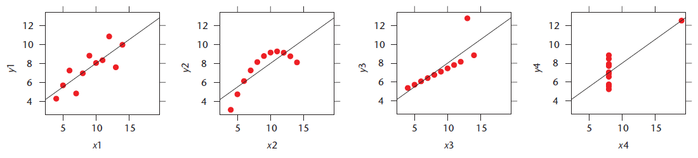
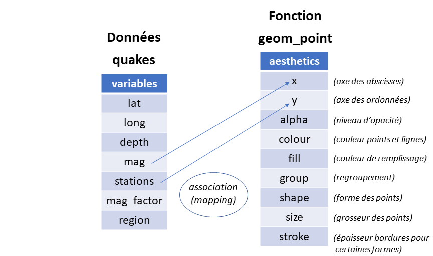

```{r echo = FALSE}
knitr::opts_chunk$set(fig.align = 'center', fig.show = 'hold',
                      out.width = "100%")  # out.width = "70%" pour PDF, 100% pour HTML
knitr::opts_knit$set(global.par = TRUE)
par.default <- par(no.readonly = TRUE)
```


***

# Introduction

#### La visualisation graphique, une étape importante en analyse de données

\mbox{}

La communauté statistique insiste depuis longtemps sur l'importance de visualiser graphiquement des données avant de les analyser. En 1973, Anscombe[^1] publiait les [quatre jeux de données suivants](https://fr.wikipedia.org/wiki/Quartet_d%27Anscombe), ayant les mêmes paramètres estimés de régression linéaire simple ($y = 3 + 0.5x$), mais présentant des relations bien différentes!

```{r Anscombe, echo = FALSE, out.width = "100%", fig.pos = 'h', fig.align = 'center'}

```

[^1]: Anscombe, F.J. (1973). Graphs in Statistical Analysis. *The American Statistician*, **27**(1). pp. 17-21.


Plusieurs autres exemples de [jeux de données possédant les mêmes statistiques descriptives, mais des représentations graphiques très différentes](https://www.autodeskresearch.com/publications/samestats) ont été publiés depuis[^2].

[^2]: Matejka, J. et Fitzmaurice, G. (2017, Mai). Same Stats, Different Graphs: Generating Datasets with Varied Appearance and Identical Statistics through Simulated Annealing. *Proceedings of the 2017 CHI Conference on Human Factors in Computing Systems*. ACM. pp. 1290-1294. URL : https://www.autodeskresearch.com/publications/samestats

Certains ont même mis en évidence l'importance de représenter graphiquement des données de plusieurs manières différentes afin de découvrir les surprises qu'elles peuvent cacher. Par exemple, les données suivantes, créées pour enseigner à des étudiants l'importance des graphiques en analyse de données[^3], forment le mot SUPERMAN si elles sont représentées sur une échelle adéquatement transformée et si les observations des deux groupes sont superposées.

```{r Superman, echo = FALSE, out.width = "100%", fig.pos = 'h', fig.align = 'center'}
knitr::include_graphics("fig/Superman.png")
```

[^3]: Kozak, M. (2002). Watch out for superman: first visualize, then analyze. *IEEE Computer Graphics and Applications*. **32**(3), pp. 6–9. 


#### Les graphiques, une force de R

\mbox{}

En plus d'être un environnement de calculs statistiques, R permet de produire des graphiques. Il s'agit d'une utilité importante de R. La toute première phrase du [site web de R](https://www.r-project.org) mentionne cette utilité.

> « R is a free software environment for statistical computing and graphics. »

Lors de comparaison entre R et d'autres logiciels permettant de faire de l'analyse de données, les capacités graphiques de R sont souvent considérées comme un de ses meilleurs atouts[^4][^5].

[^4]: http://www.theanalyticslab.nl/2017/03/18/python-r-vs-spss-sas/ 
[^5]: https://www.datacamp.com/community/tutorials/r-or-python-for-data-analysis

L'installation de base de R comporte beaucoup de fonctions graphiques. La première partie de ces notes présente ces fonctions. Elles permettent de produire des graphiques pour lesquels l'utilisateur garde le plein contrôle sur l'apparence du graphique. 

De plus, deux packages offrent des fonctions pouvant remplacer plusieurs des fonctions graphiques de base de R. Chacun de ces packages est tellement complet qu'il peut être qualifié de système graphique. Il s'agit des packages suivants :

- [`lattice`](https://CRAN.R-project.org/package=lattice) : package graphique qui met l'emphase sur les représentations multivariables,
- [`ggplot2`](https://CRAN.R-project.org/package=ggplot2) : package graphique conçu en ayant comme objectif la simplicité d'utilisation et la qualité des graphiques produits.

Le package `lattice` n'est présenté que très brièvement dans ce document, mais l'utilisation du package `ggplot2` est abordée avec assez de détails pour bien démarer un apprentissage de cet outil très populaire.

Pour finir, quelques autres possibilités graphiques en R sont mentionnées rapidement à la fin de ce document, notamment les :

- graphiques 3D,
- cartes géographiques,
- graphiques interactifs.

La grande quantité de possibilités graphiques en R contribue à en faire un puissant outil de visualisation de données.


#### Présentation des données utilisées pour les exemples

\mbox{}

Plusieurs des exemples de graphiques de ces notes représentent les mêmes données : celles stockées dans le [data frame `quakes`](https://stat.ethz.ch/R-manual/R-devel/library/datasets/html/quakes.html) du package `datasets` (chargé par défaut lors de l'ouverture de session).

```{r}
str(quakes)
```

Il s'agit d'observations pour 1000 évènements sismiques survenus près des îles Fidji depuis 1964. Pour chaque évènement, nous avons :

- `lat` et `long` : sa localisation géographique en latitude-longitude, 
- `depth` : sa [profondeur](https://fr.wikipedia.org/wiki/S%C3%A9isme), 
- `mag` : sa [magnitude](https://fr.wikipedia.org/wiki/Magnitude_d%27un_s%C3%A9isme) et 
- `stations` : le nombre de stations sismiques ayant rapporté l’évènement.

Pour certains exemples, nous aurons besoin de variables catégoriques stockées sous forme de facteur. Ajoutons donc les deux variables supplémentaires suivantes au jeu de données `quakes` :

- `mag_catego` : magnitude du séisme arrondie à l'entier inférieur (4, 5 ou 6),
- `region` : région où à eu lieu le séisme (`"Ouest"` ou `"Est"`).

```{r}
quakes$mag_catego <- factor(floor(quakes$mag))
quakes$region <- factor(quakes$long >= 175, labels = c("Ouest", "Est"))
```


##### Remarque concernant la présence de deux objets nommés `quakes` dans le chemin de recherche :

\mbox{}

Nous avons maintenant deux objets nommés `quakes` dans notre chemin de recherche, parce que nous venons d'ajouter des variables au data frame. Le data frame modifié, soit celui avec les variables ajoutées, est situé dans notre environnement de travail. Alors que le data frame `quakes` original est toujours dans l'environnement du package `datasets`. Celui-là n'a pas été modifié.

Le chemin de recherche de notre session R, pour une commande soumise dans la console, est le suivant.

```{r}
search()
```

Lorsque nous demandons à R d'accéder à l'objet nommé `quakes`, il cherche ce nom dans les environnements de son chemin de recherche, un environnement à la fois, en respectant l'ordre des environnements dans la liste précédente. L'environnement `".GlobalEnv"`, soit notre environnement de travail, est le premier de la liste. Lorsque R trouve le nom, il cesse sa recherche. Ainsi, toute commande dans la console contenant le nom `quakes`, accédera à l'objet nommé `quakes` de notre environnement de travail.

```{r}
str(quakes)
```

Il est possible de forcer R à aller chercher l'objet `quakes` dans le package `datasets` avec l'opérateur `::`.

```{r}
str(datasets::quakes)
```

Nous reviendrons sur le fonctionnement des évaluations en R dans un autre cours.

***

# Système graphique de base en R

Les graphiques de base en R sont créés grâce aux fonctions provenant des packages `graphics` et `grDevices` développés par le *R core team*. Ces packages sont intégrés à l'installation de base de R et ils sont chargés par défaut lors de l'ouverture d'une session R. Dans cette section, nous couvrirons les possibilités de ces packages. 


## Procédure de création d'un graphique

Un programme pour créer un graphique avec le système graphique de base en R se décompose typiquement en 3 étapes, les suivantes : 

1. La configuration des paramètres graphiques (au besoin) :
    + énoncé [`par`](https://stat.ethz.ch/R-manual/R-devel/library/graphics/html/par.html) ou [`layout`](https://stat.ethz.ch/R-manual/R-devel/library/graphics/html/layout.html).
2. L'initialisation d'un graphique :
    + fonction de base : [`plot`](https://stat.ethz.ch/R-manual/R-devel/library/graphics/html/plot.html) (choisit un graphique pertinent à produire selon ce qu’elle reçoit en entrée), 
    + ou fonction pour un type spécifique graphiques :  [`pairs`](https://stat.ethz.ch/R-manual/R-devel/library/graphics/html/pairs.html), [`matplot`](https://stat.ethz.ch/R-manual/R-devel/library/graphics/html/matplot.html), [`pie`](https://stat.ethz.ch/R-manual/R-devel/library/graphics/html/pie.html), [`barplot`](https://stat.ethz.ch/R-manual/R-devel/library/graphics/html/dotchart.html), [`dotchart`](https://stat.ethz.ch/R-manual/R-devel/library/graphics/html/mosaicplot.html), [`mosaicplot`](https://stat.ethz.ch/R-manual/R-devel/library/graphics/html/mosaicplot.html), [`hist`](http://stat.ethz.ch/R-manual/R-devel/library/graphics/html/hist.html), [`boxplot`](https://stat.ethz.ch/R-manual/R-devel/library/graphics/html/boxplot.html), [`qqnorm`](http://stat.ethz.ch/R-manual/R-devel/library/stats/html/qqnorm.html), [`qqplot`](http://stat.ethz.ch/R-manual/R-devel/library/stats/html/qqnorm.html), [`curve`](https://stat.ethz.ch/R-manual/R-devel/library/graphics/html/curve.html), etc.
3. L'ajout séquentiel d'éléments au graphique (au besoin) :
    + fonctions d'ajouts à un graphique déjà initialisé :
        + [`points`](https://stat.ethz.ch/R-manual/R-devel/library/graphics/html/points.html), [`matpoints`](https://stat.ethz.ch/R-manual/R-devel/library/graphics/html/matplot.html), [`lines`](https://stat.ethz.ch/R-manual/R-devel/library/graphics/html/lines.html), [`matlines`](https://stat.ethz.ch/R-manual/R-devel/library/graphics/html/matplot.html), [`abline`](https://stat.ethz.ch/R-manual/R-devel/library/graphics/html/abline.html), [`segments`](https://stat.ethz.ch/R-manual/R-devel/library/graphics/html/segments.html), [`arrows`](https://stat.ethz.ch/R-manual/R-devel/library/graphics/html/arrows.html), [`rect`](https://stat.ethz.ch/R-manual/R-devel/library/graphics/html/rect.html), [`polygon`](https://stat.ethz.ch/R-manual/R-devel/library/graphics/html/polygon.html), [`legend`](https://stat.ethz.ch/R-manual/R-devel/library/graphics/html/legend.html), [`text`](https://stat.ethz.ch/R-manual/R-devel/library/graphics/html/text.html), [`mtext`](https://stat.ethz.ch/R-manual/R-devel/library/graphics/html/mtext.html), [`title`](https://stat.ethz.ch/R-manual/R-devel/library/graphics/html/title.html), [`axis`](https://stat.ethz.ch/R-manual/R-devel/library/graphics/html/axis.html), [`box`](https://stat.ethz.ch/R-manual/R-devel/library/graphics/html/box.html), [`qqline`](https://stat.ethz.ch/R-manual/R-devel/library/stats/html/qqnorm.html), etc.;
        + `matplot`, `barplot`, `hist`, `boxplot`, `curve` avec l'argument `add = TRUE`.
        
Lorsque les paramètres graphiques sont modifiés avec un appel à la fonction `par` au début du programme, une bonne pratique est d'ajouter aussi à la fin du programme une commande pour redonner aux paramètres graphiques leurs valeurs par défaut.

La mise en forme et les annotations du graphique (p. ex. titre et noms d'axe) sont déterminées par les paramètres graphiques ainsi que par des arguments des fonctions graphiques. Avec un peu de patience et quelques lignes de code, il est possible d'arriver à contrôler parfaitement l'apparence du graphique.

Voici un exemple de programme créant un graphique avec le système graphique de base en R.

```{r}
# 1. Configuration de paramètres graphiques
par.default <- par(bty = 'n')

# 2. Initialisation d'un graphique (contenant ici des diagrammes en boîtes)
plot(stations ~ mag_catego, data = quakes, lwd = 1.5, outline = FALSE,
     main = "Nombres de stations ayant rapporté les séismes\nselon leurs classes de magnitude",
     xlab = "classe de magnitude", ylab = "nombre de stations")

# 3. Ajout séquentiel d'éléments au graphique
# Ajout de diagrammes de dispersion 1D par région
stripchart(stations ~ mag_catego, data = quakes, subset = region == "Est",
           method = "jitter", jitter = 0.3, pch = 20, 
           col = rgb(0,0,1,0.2), add = TRUE, vertical = TRUE)
stripchart(stations ~ mag_catego, data = quakes, subset = region == "Ouest",
           method = "jitter", jitter = 0.3, pch = 20, 
           col = rgb(1,0,0,0.2), add = TRUE, vertical = TRUE)
# Ajout d'une légende
legend(x = "bottomright", pch = 20, bty = "n", 
       col = c(rgb(0,0,1,0.5), rgb(1,0,0,0.5)),
       legend = c("Est", "Ouest"), title = "région")

# Réattribution des valeurs par défaut aux paramètres graphiques modifiés
par(par.default)
```

Les prochaines sections présentent les concepts à connaître pour suivre la procédure de création de graphique avec le système graphique de base en R et contiennent beaucoup d'exemples. Cependant, la matière n'est pas couverte dans le même ordre que les étapes de la procédure. Même si dans le code de création d'un graphique la configuration des paramètres est l'étape 1, il faut d'abord savoir créer un graphique pour que cette étape ait du sens. De plus, la configuration des paramètres graphique est une étape facultative. Parfois, les valeurs par défaut des paramètres font l'affaire.

Ainsi, nous allons d'abord étudier la principale fonction du système graphique de base en R, soit la fonction `plot`. Dans un deuxième temps, nous ferons un survol de plusieurs autres fonctions de création de graphiques. Ensuite, les arguments et paramètres graphiques qui permettent de contrôler les annotations et la mise en forme seront présentés. Pour terminer la couverture des étapes de la procédure de création, il ne restera plus qu'à parler des fonctions d'ajouts d'éléments à un graphique.

Les exemples présentés seront simple au début, mais se complexifient au fil de la section.
    

## Fonction générique `plot`

La principale fonction graphique en R est la fonction [`plot`](https://stat.ethz.ch/R-manual/R-devel/library/graphics/html/plot.html). En fait, `plot` est une fonction générique. Il existe plusieurs méthodes associées à cette fonction générique. Pour afficher la liste des méthodes `plot` chargées dans notre session R, il faut soumettre la commande suivante.

```{r R.options = list(width = 85)}
methods(plot)
```
Si nous donnons en entrée à la fonction `plot` un vecteur en argument `x`, c'est la méthode `plot.default` qui est utilisée. Cette méthode trace un diagramme de dispersion.

La fonction `plot` choisit la méthode à utiliser en fonction de la classe de l’objet assigné à son premier argument (`x`). C'est une caractéristique « orientée objet » du langage R. Nous reviendrons sur ce concept plus tard. Pour l'instant, il suffit de comprendre que les différentes méthodes produisent différents résultats et acceptent différents arguments. En fait, ces méthodes font souvent appels à d'autres fonctions de création de graphique.

L'[annexe](#annexe) contient une panoplie d'exemples de graphiques pouvant être produits avec la fonction générique `plot`, selon les objets qui lui sont donnés en entrée. Voici ici un résumé des possibilités couvertes dans ces exemples.

#### Résumé de graphiques usuels produits par `plot`

**Type `x`** | **Type `y`** | **Graphique produit** (**méthode** utilisée $\rightarrow$ fonction ou autre méthode appelée)
--------- | -------- | --------------------------------------------------------------------------
vecteur | - | diagramme de dispersion en fonction de l'index des observations (`plot.default`)
&nbsp;  | vecteur | diagramme de dispersion (`plot.default`)
facteur | - | diagramme à barres (`plot.factor` $\rightarrow$ `barplot`)
&nbsp; | vecteur | diagrammes en boîtes juxtaposées (`plot.factor` $\rightarrow$ `boxplot`)
&nbsp; | facteur | diagramme en mosaïque (`plot.factor` $\rightarrow$ `spineplot`)
data frame | - | dépend du nombre de variables, de leur ordre et de leurs natures (`plot.data.frame` $\rightarrow$ `pairs`, `plot.default`, `plot.factor` ou ` stripchart`)
formule | - | dépend de la position des variables dans la formule et de leurs natures (`plot.formula` $\rightarrow$ `plot.default`, `plot.factor` ou `plot.data.frame`)
fonction | - | courbe (`plot.function` $\rightarrow$ `curve`)

La fonction `plot` peut en faire beaucoup plus que ça grâce à ses nombreuses méthodes. Par exemple, comme nous l'avons déjà mentionné dans les notes sur les [concepts de base en R](https://stt4230.rbind.io/introduction/base_r/#est-ce-que-de-la-programmation-orient%C3%A9e-objet-est-possible-en-r), si elle reçoit en entrée la sortie d'un appel à la fonction `lm`, qui ajuste un modèle linéaire à des données, elle produit des graphiques de résidus de ce modèle via sa méthode `plot.lm`.


## Différentes fonctions graphiques

En explorant les capacités de la fonction générique `plot`, nous découvrons plusieurs fonctions de création de graphiques. Ces fonctions permettent de créer des graphiques de différents types.

Voici un résumé des principaux types de graphiques pouvant être créés dans le système graphique de base en R, suivi d'exemples.

**Représentations d'une variable (observations stockées dans `x`)** :

Type de graphique | Exemple d'appel de fonction | Type de `x` 
-------------------------------- | -------------------- | -------------
[diagramme en secteurs (*pie chart*)](https://en.wikipedia.org/wiki/Pie_chart) | [`pie`](https://stat.ethz.ch/R-manual/R-devel/library/graphics/html/pie.html)`(`[`table`](https://stat.ethz.ch/R-manual/R-devel/library/base/html/table.html)`(x), ...)` | facteur
[diagramme à barres (*bar plot*)](https://en.wikipedia.org/wiki/Bar_chart) | [`barplot`](https://stat.ethz.ch/R-manual/R-devel/library/graphics/html/barplot.html)`(`[`table`](https://stat.ethz.ch/R-manual/R-devel/library/base/html/table.html)`(x), ...)` | facteur
[diagramme en points de Cleveland](https://en.wikipedia.org/wiki/Dot_plot_(statistics)) | [`dotchart`](https://stat.ethz.ch/R-manual/R-devel/library/graphics/html/dotchart.html)`(`[`table`](https://stat.ethz.ch/R-manual/R-devel/library/base/html/table.html)`(x), ...)` | facteur
[histogramme](https://en.wikipedia.org/wiki/Histogram) | [`hist`](http://stat.ethz.ch/R-manual/R-devel/library/graphics/html/hist.html)`(x, ...)` | vecteur numérique
[courbe de densité à noyau (*kernel density plot*)](https://en.wikipedia.org/wiki/Kernel_density_estimation) | [`plot`](https://stat.ethz.ch/R-manual/R-devel/library/graphics/html/plot.html)`(`[`density`](https://stat.ethz.ch/R-manual/R-devel/library/stats/html/density.html)`(x), ...)` $\rightarrow$ méthode [`plot.density`](https://stat.ethz.ch/R-manual/R-devel/library/stats/html/plot.density.html)| vecteur numérique
[diagramme en boîte (*boxplot*)](https://en.wikipedia.org/wiki/Box_plot) | [`boxplot`](https://stat.ethz.ch/R-manual/R-devel/library/graphics/html/boxplot.html)`(x, ...)` | vecteur numérique
[diagramme quantile-quantile théorique normal](https://fr.wikipedia.org/wiki/Diagramme_Quantile-Quantile) | [`qqnorm`](http://stat.ethz.ch/R-manual/R-devel/library/stats/html/qqnorm.html)`(x, ...)` | vecteur numérique

**Représentation d'une expression mathématique** : [`curve`](https://stat.ethz.ch/R-manual/R-devel/library/graphics/html/curve.html)`(expr, ...)`


**Représentations de deux variables (observations stockées dans `x` et `y`)** :

Type de graphique | Exemple d'appel de fonction | Type de `x` | Type de `y` 
--------------------------- | --------------------------------- | ----------- | -----------
[diagramme à barres empilées ou groupées](https://en.wikipedia.org/wiki/Bar_chart) | [`barplot`](https://stat.ethz.ch/R-manual/R-devel/library/graphics/html/barplot.html)`(`[`table`](https://stat.ethz.ch/R-manual/R-devel/library/base/html/table.html)`(x, y), ...)` avec `beside = TRUE` pour barres groupées | facteur | facteur
[diagramme en points de Cleveland](https://en.wikipedia.org/wiki/Dot_plot_(statistics)) | [`dotchart`](https://stat.ethz.ch/R-manual/R-devel/library/graphics/html/dotchart.html)`(`[`table`](https://stat.ethz.ch/R-manual/R-devel/library/base/html/table.html)`(x, y), ...)` | facteur | facteur
[diagramme en mosaïque](https://en.wikipedia.org/wiki/Mosaic_plot) | [`mosaicplot`](https://stat.ethz.ch/R-manual/R-devel/library/graphics/html/mosaicplot.html)`(`[`table`](https://stat.ethz.ch/R-manual/R-devel/library/base/html/table.html)`(x, y), ...)` | facteur | facteur
[diagrammes en boîte juxtaposés](https://en.wikipedia.org/wiki/Box_plot) | [`boxplot`](https://stat.ethz.ch/R-manual/R-devel/library/graphics/html/boxplot.html)`(y ~ x, ...)` | facteur | vecteur numérique
[diagramme de dispersion (*scatterplot*)](https://en.wikipedia.org/wiki/Scatter_plot) ou [en lignes (*line chart*)](https://en.wikipedia.org/wiki/Line_chart) | [`plot`](https://stat.ethz.ch/R-manual/R-devel/library/graphics/html/plot.html)`(x, y, ...)` $\rightarrow$ méthode [`plot.default`](https://stat.ethz.ch/R-manual/R-devel/library/graphics/html/plot.default.html) | vecteur numérique | vecteur numérique
[diagramme quantile-quantile empirique](https://fr.wikipedia.org/wiki/Diagramme_Quantile-Quantile) | [`qqplot`](http://stat.ethz.ch/R-manual/R-devel/library/stats/html/qqnorm.html)`(x, y, ...)` | vecteur numérique | vecteur numérique

**Représentation de plus de trois variables numériques** :

- matrice de diagrammes de dispersion : [`pairs`](https://stat.ethz.ch/R-manual/R-devel/library/graphics/html/pairs.html)`( ~ x + y + z, ...)`
- diagrammes de dispersion superposés : [`matplot`](https://stat.ethz.ch/R-manual/R-devel/library/graphics/html/matplot.html)`(matriceX, matriceY, ...)`


### Exemple de diagramme de dispersion - fonctions `plot.default`,  `pairs` et `matplot`

La méthode [`plot.default`](https://stat.ethz.ch/R-manual/R-devel/library/graphics/html/plot.default.html) (via la fonction générique `plot` ou directement) produit un [diagramme de dispersion (*scatterplot*)](https://en.wikipedia.org/wiki/Scatter_plot) par défault.

```{r}
plot(
  x = quakes$mag, y = quakes$stations,
  xlab = "magnitude du séisme", 
  ylab = "nombre de stations rapportant le séisme"
)
```

La fonction [`pairs`](https://stat.ethz.ch/R-manual/R-devel/library/graphics/html/pairs.html) produit quant à elle une matrice de diagrammes de dispersion entre plusieurs paires de variables.

```{r}
pairs( ~ depth + mag + stations, data = quakes)
```

La fonction [`matplot`](https://stat.ethz.ch/R-manual/R-devel/library/graphics/html/matplot.html) permet de facilement superposer plusieurs diagrammes de dispersion. Elle associe les colonnes de la structure à deux dimensions fournie en `x` à celles de la structure à deux dimensions fournie en `y` (colonne $i$ de `x` associée à la colonne $i$ de `y`). Voici un exemple d'utilisation de cette fonction exploitant un jeu de données créé à partir de `quakes` contenant les valeurs des variables `mag` et `stations` dans des colonnes distinctes par région.

```{r}
library(tidyr)
quakes_wide <- pivot_wider(
  data = quakes, 
  names_from = region,
  values_from = c(mag, stations)
)
matplot(
  x = quakes_wide[, c("mag_Est", "mag_Ouest")], 
  y = quakes_wide[, c("stations_Est", "stations_Ouest")], 
  pch = 2:1, col = c("blue", "green"),
  xlab = "magnitude du séisme", 
  ylab = "nombre de stations rapportant le séisme"
)
```

Il faudrait ajouter une légende au graphique pour indiquer la signification des deux symboles et couleurs de points. La fonction `matplot` ne peut pas faire cet ajout. Il devra donc être fait avec la fonction `legend`, que nous verons plus loin.


### Exemple de diagramme en lignes - fonctions `plot.default` et `matplot`

En assignant la valeur `"l"` à l'argument `type` de la méthode [`plot.default`](https://stat.ethz.ch/R-manual/R-devel/library/graphics/html/plot.default.html), celle-ci produit un [diagramme en lignes (*line chart*)](https://en.wikipedia.org/wiki/Line_chart), comme dans l'exemple suivant exploitant un jeu de données créé à partir de `quakes` contenant les valeurs moyennes de nombres de stations par valeur de magnitude. 

```{r}
mean_stations_per_mag <- aggregate(stations ~ mag, data = quakes, FUN = mean)
plot(stations ~ mag, data = mean_stations_per_mag, type = "l")
```

Cet exemple illustre aussi le fait que la fonction `plot` accepte en entrée une formule.


### Exemple de diagramme en secteurs - fonction `pie`

La fonction [`pie`](https://stat.ethz.ch/R-manual/R-devel/library/graphics/html/pie.html) permet de créer des [diagrammes en secteurs (*pie charts*)](https://en.wikipedia.org/wiki/Pie_chart), aussi nommés diagrammes circulaires ou diagrammes en pointes de tarte ou en camembert. Ce type de graphique est à utiliser avec parcimonie. Il y a d'ailleurs une mise en garde concernant l'utilisation de ce type de graphique dans la [fiche d'aide de la fonction `pie`](https://stat.ethz.ch/R-manual/R-devel/library/graphics/html/pie.html).

Ce qui est reproché au diagramme en secteurs est qu'il difficile pour l'oeil humain de rapidement comparer les aires des secteurs (qui représentent les fréquences). Il est plus facile de comparer des hauteurs de barres. Donc le diagramme à barres serait un meilleur outil pour représenter des fréquences.

Malgré tout, je crois que le diagramme en secteur est utile pour représenter les fréquences d'une **variable à peu de modalités**, dans le cas où **il n'y a pas de fréquences presque égales**, comme dans l'exemple suivant.

```{r}
pie(x = table(quakes$mag_catego), main = "Fréquences des modalités de magnitude de séismes")
```


### Exemple de diagramme à barres - fonction `barplot`

La fonction [`barplot`](https://stat.ethz.ch/R-manual/R-devel/library/graphics/html/barplot.html) produit un [diagramme à barres (en anglais (*bar plot*))](https://en.wikipedia.org/wiki/Bar_chart), aussi nommé diagramme en bâtons ou à bandes. Celles-ci peuvent être placées à la verticale (fait par défaut) ou à l'horizontale (argument `horiz = TRUE`).

```{r}
barplot(
  height = table(quakes$mag_catego), 
  horiz = TRUE,
  xlab = "fréquence",
  ylab = "modalité de magnitude"
)
```

La hauteur des barres dans un diagramme à barres représentent souvent les fréquences d'une variable catégorique. C'est le cas dans l'exemple précédent. Ces sont ces fréquences qui doivent être fournies à la fonction `barplot` et non les observations d'origine. Un appel à la fonction `barplot` est donc souvent accompagné d'une appel à une fonction pour calculer des fréquences comme [`table`](https://stat.ethz.ch/R-manual/R-devel/library/base/html/table.html) ou [`xtabs`](https://stat.ethz.ch/R-manual/R-devel/library/stats/html/xtabs.html).

Lorsque ce diagramme est utilisé pour représenter des fréquences croisées entre deux variables, les barres pour les différentes variables peuvent être empilés (comportement par défaut de `barplot`) :

```{r}
barplot(
  height = xtabs(~ region + mag_catego, data = quakes),
  legend.text = TRUE,
  xlab = "modalité de magnitude",
  ylab = "fréquence"
)
```

ou groupés (grâce à l'argument beside = TRUE) :

```{r}
barplot(
  height = table(quakes$region, quakes$mag_catego), 
  legend.text = TRUE, 
  beside = TRUE,
  xlab = "modalité de magnitude",
  ylab = "fréquence"
  )
```

Il est important d'identifier à quelles modalités des variables sont associées les barres. Dans le cas d'un diagramme à barres bivarié, une légende est souvent nécessaire pour ce faire, car l'axe perpendiculaire aux barres ne suffit pas. La fonction `barplot` peut ajouter une légende au graphique grâce à son argument `legend.text`.


### Exemple de diagramme en points de Cleveland - fonction `dotchart`

Les [diagrammes en points de Cleveland (en anglais *Cleveland dot plots*)](https://en.wikipedia.org/wiki/Dot_plot_(statistics)) peuvent remplacer les diagrammes à barres. Ils offrent une présentation allégée, donc une lisibilité potentiellement accrue dans certaines situations.

```{r}
quakes_freq <- xtabs(~ region + mag_catego, data = quakes)
dotchart(x = quakes_freq[2:1, 3:1], bg = "grey", xlab = "Fréquence")
```

Voici quelques références pour en apprendre davantage à propos de ces graphiques et de leur création en R :

- https://uc-r.github.io/cleveland-dot-plots
- https://homepage.divms.uiowa.edu/~luke/classes/STAT4580/dotbar.html


### Exemple de diagramme en mosaïque - fonction `mosaicplot`

Une option de rechange au diagramme à barres empilées ou groupées pour représenter des fréquences croisées est le [diagramme en mosaïque](https://en.wikipedia.org/wiki/Mosaic_plot), qui peut être produit avec la fonction [`mosaicplot`](https://stat.ethz.ch/R-manual/R-devel/library/graphics/html/mosaicplot.html).

```{r}
mosaicplot(
  x = table(quakes$region, quakes$mag_catego),
  color = TRUE,
  main = "Fréquences croisées",
  xlab = "région",
  ylab = "modalité de magnitude"  
)
```

Voici quelques références pour en apprendre davantage à propos de ce type de graphique :

- Friendly, M. (2002). A brief history of the mosaic display. *Journal of Computational and Graphical Statistics*, 11(1), 89-107. 
- Few, S. and Edge, P. (2014). Are mosaic plots worthwhile?. *Perceptual Edge. Visual Business Intelligence Newsletter*, 1-14. URL https://www.perceptualedge.com/articles/visual_business_intelligence/are_mosaic_plots_worthwhile.pdf


### Exemple d'histogramme - fonction `hist`

L'[histogramme](https://en.wikipedia.org/wiki/Histogram) sert à représenter la distribution empirique d'une variable numérique. La fonction [`hist`](http://stat.ethz.ch/R-manual/R-devel/library/graphics/html/hist.html) permet d'en produire.

```{r, echo = FALSE}
par(mar = c(4, 4, 2, 0.5) + 0.1)
```

```{r}
hist(x = quakes$mag)
```

```{r, echo = FALSE}
par(mar = c(4, 4, 0.5, 0.5) + 0.1)
```

Un titre et des noms d'axes ont été produits par défaut par le fonction `hist`, mais il faudrait les adapter pour une poublication en français.

Mine de rien, cette fonction fait beaucoup de travail afin de pouvoir produire un histogramme. Elle commence par briser l'étendue des valeurs de la variable en intervalles disjoints mais contigus, puis elle calcule les fréquences des observations tombant dans les intervalles. Ensuite, elle trace un genre de diagramme à barres en insérant aucun espace entre les barres (puiqu'elles réfèrent à des intervalles contigus). La façon dont les intervalles sont formés peut être contrôlée par les arguments `breaks`, `include.lowest` et `right`. La fonction retourne aussi toutes les statistiques qu'elle calcule, mais il faut accompagner l'appel à la fonction `hist` d'une assignation pour garder une trace de ces statistiques 

```{r}
stats <- hist(x = quakes$mag, plot = FALSE)
stats
```


### Exemple de diagramme en boîte - fonction `boxplot`

Un autre graphique conçu pour représenter la distribution empirique d'une variable numérique est le [diagramme en boîte (*boxplot*)](https://en.wikipedia.org/wiki/Box_plot). Ce type de graphique peut être produit en R avec la fonction [`boxplot`](https://stat.ethz.ch/R-manual/R-devel/library/graphics/html/boxplot.html).

```{r}
boxplot(x = quakes$mag, main = "Distribution empirique de la magnitude")
```

L'association entre une variable numérique et une variable catégorique peut être représentée par des diagrammes en boîtes juxtaposés.

```{r}
boxplot(mag ~ region, data = quakes)
```

Par exemple, pour produire des diagrammes en boîtes pour les observations de la variable numérique `mag` en fonction de la variable catégorique `region`, la fonction `boxplot` peut être appelée en lui fournissant en entrée une formule contenant dans sa partie de droite la variable numérique et dans sa partie de gauche la variable catégorique.


### Exemple de courbe d'estimation de densité à noyau - méthode `plot.density`

La fonction [`density`](https://stat.ethz.ch/R-manual/R-devel/library/stats/html/density.html) estime une densité empirique par la [méthode à noyau](https://en.wikipedia.org/wiki/Kernel_density_estimation) à partir des observations d'une variable numérique. Une représentation graphique de cette densité empirique avec la méthode [`plot.density`](https://stat.ethz.ch/R-manual/R-devel/library/stats/html/plot.density.html) (via la fonction générique `plot` ou directement) est une autre alternative pour visualiser les observations d'une variable numérique.

```{r, echo = FALSE}
par(mar = c(4, 4, 2, 0.5) + 0.1)
```

```{r}
plot(x = density(quakes$mag))
```

Comme la fonction `hist`, la méthode `plot.density` produit un titre et des noms d'axes par défaut, qu'il faut bien souvent adapter avant d'intégrer le graphique à une publication.


### Exemple de diagramme quantile-quantile - fonctions `qqnorm` et `qqplot`

Les [diagrammes quantile-quantile](https://fr.wikipedia.org/wiki/Diagramme_Quantile-Quantile) servent à comparer des distributions. Le plus connus des diagrammes quantile-quantile est probablement le diagramme quantile-quantile théorique normal qui permet de comparer une distribution empirique à une distribution théorique normale. Ce type de graphique peut être produit en R avec la fonction [`qqnorm`](http://stat.ethz.ch/R-manual/R-devel/library/stats/html/qqnorm.html).

```{r}
qqnorm(y = quakes$mag)
```

```{r, echo = FALSE}
par(mar = c(4, 4, 0.5, 0.5) + 0.1)
```

Les [diagrammes quantile-quantile empiriques](https://www.itl.nist.gov/div898/handbook/eda/section3/qqplot.htm) servent quant à eux à comparer deux distributions empiriques. La fonction [`qqplot`](http://stat.ethz.ch/R-manual/R-devel/library/stats/html/qqnorm.html) permet d'en produire.

```{r}
qqplot(x = quakes$mag, y = quakes$stations)
```


### Exemple de représentation graphique d'une expression mathématique - fonction `curve`

La représentation graphique d'une fonction mathématique est possible en R avec la fonction [`curve`](https://stat.ethz.ch/R-manual/R-devel/library/graphics/html/curve.html).

```{r}
curve(expr = log)
```

Par défaut, la fonction `curve` fait une évaluation de la valeur de la fonction en 101 points également répartis entre 0 et 1. Il est possible de modifier ces points grâce aux arguments `from`, `to` et `n` (une séquence de points est créée avec la fonction `seq`). De plus, le premier argument n'est pas contraint à être une fonction. Il peut s'agir de n'importe quelle expression écrite comme une fonction de `x`.

```{r}
curve(expr = x^2 + 5*x - 25, from = -23, to = 18, n = 200)
```

Le code suivant produit le même graphique, mais l'utilisation de la fonction `curve` crée une commande plus succincte.

```{r eval = FALSE}
x <- seq(from = -23, to = 18, length = 200)
plot(x = x, y = x^2 + 5*x - 25, type = "l")
```


## Arguments et paramètres graphiques

Les fonctions vues jusqu'à présent possèdent toutes des arguments pour contrôler la **mise en forme** et les **annotations** des graphiques. La liste complète de ces arguments varient d'une fonctions à l'autre, mais certains arguments sont communs à presque toutes les fonctions graphiques. Nous allons voir ici les arguments les plus utiles.

Les arguments permettant de contrôler la mise en forme sont appelés paramètres graphiques. La plupart peuvent être spécifiés soit dans l'appel à la fonction graphique, soit dans un appel à la fonction [`par`](https://stat.ethz.ch/R-manual/R-devel/library/graphics/html/par.html). Par contre, certains paramètres graphiques peuvent uniquement être fixés avec `par`.

Un paramètre graphique fourni dans un appel à une fonction graphique est effectif seulement pour le graphique produit, alors qu'un paramètre graphique fourni dans un appel à `par` reste effectif jusqu'à ce que nous le modifions de nouveau. Alors, avant de modifier des paramètres graphiques avec `par`, il est bon d'enregistrer les valeurs par défaut des paramètres, comme suit,

```{r}
par.default <- par(no.readonly = TRUE)
```

afin de pouvoir facilement réattribuer ces valeurs par défaut aux paramètres, comme suit,  

```{r eval = FALSE}
par(par.default)
```

à la fin des nos commandes pour produire un graphique. L'objet `par.default` est une liste contenant les valeurs par défaut de tous les paramètes graphiques modifiables. Il est aussi possible d'enregistrer seulement les paramètres graphiques modifiés par un appel à la fonction `par` en l'accompagnant d'une assignation. Par exemple, l'objet `par.default` obtenu ainsi :

```{r eval = FALSE}
par.default <- par(mar = c(1, 1, 2, 1))
```

contient uniquement la valeur par défaut du paramètre `mar`.

Notons que les changements apportés aux paramètres graphiques ne sont pas conservés lors de la fermeture de la session R. À l'ouverture d'une session R, les paramètres graphiques prennent donc leurs valeurs par défaut.

Voici deux tableaux résumant les arguments et paramètres graphiques les plus communs :

**Arguments** | **Éléments graphiques contrôlés** 
---------------------|--------------------------------------------------------
`main`  | titre
`sub` | note en bas de page
&nbsp; | &nbsp;
`xlab`, `ylab` | noms des axes
`xlim`, `ylim` | étendue des axes
&nbsp; | &nbsp;
`type` | type de représentation (`"p"` = points, `"l"` = lignes, `"b"` = les deux, etc.)

&nbsp;

**Paramètres** | **Éléments graphiques contrôlés** 
---------------------------|------------------------------------------------------------------
`ann` | si `FALSE`, retire le titre et les noms d'axes
`bty` | si `"n"`, retire le cadre autour de la zone graphique
&nbsp; | (autres valeurs acceptées : `"o"`, `"l"`, `"7"`, `"c"`, `"u"` et `"]"`)
&nbsp; | &nbsp;
`lwd` | épaisseur des lignes
`lty` | type des lignes
`pch` | symbole pour les points 
&nbsp; | &nbsp;
`font` | type de **police de caractères** dans la zone graphique,
&nbsp; | (`1` = normal, `2` = gras, `3` = italique, etc.)
`font.main`, `font.sub`, |  dans le titre, dans la note en bas de page,
`font.axis`, `font.lab`  |  dans les marques des axes, dans les noms des axes 
`family` | famille de police de caractères
&nbsp; | (`"serif"`, `"sans"`, `"mono"`, `"symbol"`, etc.)
&nbsp; | &nbsp;
`cex`  |  **taille des caractères** dans la zone graphique,
`cex.main`, `cex.sub`, |  dans le titre, dans la note en bas de page,
`cex.axis`, `cex.lab`  |  dans les marques des axes, dans les noms des axes 
&nbsp; | &nbsp;
`col`  |  **couleur** des éléments de la zone graphique,
`col.main`, `col.sub`, |  du titre, de la note en bas de page,
`col.axis`, `col.lab`  |  des marques des axes, des noms des axes
`bg` | couleur de l'intérieur du symbole pour les points  lorsque `pch` prend une valeur entre 21 et 25 (pas la même signification dans `par`)
&nbsp; | &nbsp;
`par(mfrow = c( , ))` | division de la fenêtre graphique
`par(mfcol = c( , ))` | &nbsp;
`par(new = TRUE)` | superposition de graphiques
`par(mar = c( , , , ))` | tailles des marges
`par(oma = c( , , , ))` | tailles des marges externes (par défaut nulles)

La liste de tous les paramètes graphiques R est bien plus longue que ça. Il en existe plus de soixante-dix, tous documentés dans la [fiche d'aide de la fonction `par`](https://stat.ethz.ch/R-manual/R-devel/library/graphics/html/par.html).

L'utilisation de certains de ces arguments a déjà été illustré dans les exemples précédents. Voici un exemple supplémentaire dans lequel quelques éléments de la mise en forme sont modifiés dans le diagramme de dispersion de la variable `stations` en fonction de la variable `mag`

```{r }
plot(
  x = quakes$mag,
  y = quakes$stations,
  main = "1000 séismes près de Fidji",
  xlab = "magnitude du séisme",
  ylab = "nombre de stations rapportant le séisme",
  font.lab = 3,     # nom d'axes en italique
  font.main = 4,    # titre en gras italique
  cex.axis = 0.8,   # marques des axes plus petites
  bty="n"           # pas de cadre autour de la zone graphique
)
```

Remarquons que les accents ne causent pas de problèmes dans le titre et les noms d'axes.

Nous pouvons aussi modifier certains paramètres graphiques par un appel à la fonction `par` comme suit.

```{r eval = FALSE}
par.default <- par(font.lab = 3, font.main = 4, cex.axis = 0.8, bty="n")
plot(x = quakes$mag, y = quakes$stations, 
     xlab = "magnitude du séisme", 
     ylab = "nombre de stations rapportant le séisme",
     main = "1000 séismes près de Fidji")
par(par.default)
```

Utiliser la fonction `par` est pratique si nous avons plusieurs graphiques à produire avec les mêmes paramètres.


#### Types de représentation - argument `type`

\mbox{}

Voici un graphique qui représente toutes les valeurs que peut prendre l'argument `type`[^6].

```{r, echo = FALSE}
par(mar = c(4, 4, 1.5, 0.5) + 0.1)
```

```{r echo = FALSE, out.width = "100%"}
par.default <- par(mfrow=c(3, 3)) 
opts <- c("p", "l", "o", "b", "c", "s", "S", "h", "n") 
titres <- paste0("type =\"", opts, "\"")
for(i in 1:length(opts)) plot(x = 1:5, y = 1:5, type = opts[i], main = titres[i]) 
par(par.default)
```

[^6]: Ce graphique est une adaptation d'un graphique sur la page web suivante :   
http://www.statmethods.net/graphs/line.html.


#### Types de lignes - paramètre `lty`

\mbox{}

Voici un graphique qui représente toutes les valeurs que peut prendre le paramètre `lty` [^7].

```{r  echo = FALSE, fig.width = 4, fig.height = 1.5, out.width = "50%"}
par.default <- par(mar = c(0, 0, 0, 0))
plot(x = c(0, 1), y = c(0,6.5), type = "n", axes = FALSE, ann = FALSE)
for(i in 0:6) lines(c(0.35, 1), c(i, i), lty=6-i, lwd=2)
text(rep(0.3,6), 6:0, pos = 2, 
     labels=c("0 ou \"blank\"", "1 ou \"solid\"", "2 ou \"dashed\"", "3 ou \"dotted\"", 
              "4 ou \"dotdash\"", "5 ou \"longdash\"", "6 ou \"twodash\""))
par(par.default)
```

[^7]: Ce graphique est une adaptation d'un graphique sur la page web suivante :   
http://www.sthda.com/french/wiki/les-differents-types-de-traits-dans-r-lty


#### Symboles pour les points - paramètre `pch`

\mbox{}

Voici un graphique qui représente toutes les valeurs numériques que peut prendre le paramètre `pch`. Ce paramètre accepte aussi comme valeur un caractère quelconque[^8].

```{r  echo = FALSE, fig.width = 7, fig.height = 1, out.width = "90%"}
par.default <- par(mar = c(0,0,0,0))
y <- rep(2:1, each = 13)
x <- rep(1:13, 2)
plot(x, y, pch = 0:25, cex = 1.5, ylim = c(0.8, 2.5), xlim = c(0.9, 13.1), 
     axes=FALSE, ann = FALSE, bg = "blue")
text(x, y, labels=0:25, pos=3)
par(par.default)
```

[^8]: Ce graphique est une adaptation d'un graphique sur la page web suivante :   
http://www.sthda.com/french/wiki/les-differents-types-de-points-dans-r-comment-utiliser-pch


### Couleurs

Une couleur peut être spécifiée de différentes façons :

- par une chaîne de caractère contenant un nom de couleur,
- par une chaîne de caractères hexadécimaux de la forme `"#rrggbb"` ou `"#rrggbbaa"`, 
- par un nombre entier référant à une palette de couleur.

#### Nom de couleur :

\mbox{}

La commande suivante affiche tous les noms de couleurs compris par R.

```{r eval = FALSE}
colors()
```

```{r, echo = FALSE}
op.default <- options()
options(max.print = 15, width = 95)
colors()
options(max.print = op.default$max.print)
```

Il y en a 657 (seulement les 15 premiers sont affichés ici). Certains de ces noms sont plutôt originaux, par exemple `"lemon chiffon"`, `"peach puff"` et `"papaya whip"`[^9]! Ces couleurs sont représentées dans le graphique suivant, selon la position de la couleur dans le vecteur retourné par la commande `colors()`[^10].

[^9]: https://chichacha.netlify.com/2019/09/08/mysterious-colour-names-in-r/
[^10]: Ce graphique a été produit grâce à un code R partagé sur la page web suivante : https://github.com/EarlGlynn/colorchart/wiki/Color-Chart-in-R

```{r echo = FALSE, out.width = "100%"}
# efg, Stowers Institute for Medical Research
# efg's Research Notes:
#   http://research.stowers-institute.org/efg/R/Color/Chart
#
# 6 July 2004.  Modified 23 May 2005.

# save to reset at end
oldparameters <- par(mar=c(1,1,1,1))

# Be cautious in case definition of "colors" changes.
# Use some hard-coded constants since this is not expected
# to change.
stopifnot(length(colors()) == 657)

# 0. Setup

# For a given color, define a text color that will have good contrast.
#   Examples:
#     > SetTextContrastColor("white")
#     [1] "black"
#     > SetTextContrastColor("black")
#     [1] "white"
#     > SetTextContrastColor("red")
#     [1] "white"
#     > SetTextContrastColor("yellow")
#     [1] "black"
SetTextContrastColor <- function(color)
{
  ifelse( mean(col2rgb(color)) > 127, "black", "white")
}

# Define this array of text contrast colors that correponds to each
# member of the colors() array.
TextContrastColor <- unlist( lapply(colors(), SetTextContrastColor) )


# 1a. Plot matrix of R colors, in index order, 25 per row.
# This example plots each row of rectangles one at a time.
colCount <- 25  # number per row
rowCount <- 27

plot( c(1,colCount), c(0,rowCount), type="n", ylab="", xlab="",
      axes=FALSE, ylim=c(rowCount,0))

for (j in 0:(rowCount-1))
{
  base <- j*colCount
  remaining <- length(colors()) - base
  RowSize <- ifelse(remaining < colCount, remaining, colCount)
  rect((1:RowSize)-0.5,j-0.5, (1:RowSize)+0.5,j+0.5,
       border="black",
       col=colors()[base + (1:RowSize)])
  text((1:RowSize), j, paste(base + (1:RowSize)), cex=0.7,
       col=TextContrastColor[base + (1:RowSize)])
}

par(oldparameters)
```


#### Chaîne de caractères hexadécimaux de la forme `"#rrggbb"` ou `"#rrggbbaa"` :

\mbox{}

Dans une chaîne de caractères hexadécimaux de la forme `"#rrggbb"` ou `"#rrggbbaa"`, les paires des caractères `rr`, `gg`, `bb` et `aa` sont des digits hexadécimaux spécifiant une valeur entre `00` (minimum) et `FF` (maximum). Ces digits indiquent respectivement un niveau de rouge, de vert, de bleu et d'opacité. Le niveau d'opacité est facultatif. Par défaut les couleurs sont complètement opaques. Une valeur d'opacité minimale `00` représente une transparence complète et une valeur d'opacité maximale `FF` représente une opacité complète.

Pour déterminer un code hexadécimal de couleur, les fonctions suivantes sont utiles :

- `rgb` : prend en entrée des niveaux de rouge (`red`), de vert (`green`), de bleu (`blue`) et optionnellement d'opacité (`alpha`), retourne en sortie le code hexadécimal associé;
- `hsv` : prend en entrée des niveaux de teinte (`hue`), de saturation (`saturation`), de valeur de luminosité (`value`) et optionnellement d'opacité, retourne en sortie le code hexadécimal associé;
- `hcl` : prend en entrée des niveaux de teinte (`hue`), de chroma (`chroma`), de luminance (`luminance`) et optionnellement d'opacité, retourne en sortie le code hexadécimal associé;
- `gray` ou `grey` : prend en entrée un niveau de gris entre 0 (noir) et 1 (blanc) et optionnellement d'opacité,  retourne en sortie le code hexadécimal associé.

Exemple d'un bleu avec différents niveaux d'opacité :
```{r}
opacite <- rgb(red = 0, green = 33/255, blue = 78/255,
               alpha = seq(from = 0, to = 1, by = 0.1))
```
```{r echo = FALSE, out.width = "70%", fig.width=7, fig.height=3}
# Fonction inspirée de prismatic::plot.color
plot_palette <- function(x, labels, xlab = NULL, col.labels = "black"){
  x <- prismatic::color(x)
  par.default <- par(mar = c(1,0,0,0) + 0.1)
  plot(0, type = "n", axes = FALSE, ann=FALSE, xlim = c(0, 
      length(x) + 1), ylim = c(-0.1, 1.1))
  rect(xleft = seq_along(x) - 0.5, ybottom = 0, xright = seq_along(x) + 
      0.5, ytop = 1, col = x, border = NA)
  color_light <- farver::convert_colour(t(col2rgb(x)), 
      "rgb", "hsl")[, "l"]
  text(x = seq_along(x), y = 0.5, labels = x, srt = 90, 
      col = col.labels)
  rect(xleft = 0.5, ybottom = 0, xright = length(x) + 0.5, 
      ytop = 1)
  text(x = seq_along(x), y = 0, labels = labels, pos = 1)
  if(!is.null(xlab)) mtext(text = xlab, side = 1, line = 0)
  par(par.default)
}
plot_palette(x = opacite, labels = seq(from = 0, to = 1, by = 0.1), xlab = "alpha")
```


#### Nombre entier référant à une palette de couleur :

\mbox{}

Une palette de couleur est définie en R et il est possible de spécifier une couleur par un entier référant à une position dans cette palette. Par défaut, la palette de couleur est la suivante :

```{r R.options = list(width = 85)}
palette()
```

Voici un diagramme représentant les couleurs de cette palette selon leur position.

```{r echo = FALSE, out.width = "60%", fig.width=6, fig.height=3}
plot_palette(x = palette(), labels = 1:length(palette()), 
             col.labels = rep(c("white", "black"), each = 4))
```

Il est possible de modifier la palette en lui assignant un nouveau vecteur de noms de couleurs ou de chaînes de caractères hexadécimaux de la forme `"#rrggbb"` ou `"#rrggbbaa"` pour représenter des couleurs. Certaines fonction R sont pratiques pour créer de tels vecteurs contenant des dégradés de couleurs, particulièrement la fonction [`hcl.colors`](https://stat.ethz.ch/R-manual/R-patched/library/grDevices/html/palettes.html). Par exemple, utilisons cette fonction pour modifier la palette de couleurs en un dégradé de 20 couleurs comme suit.

```{r}
palette(hcl.colors(20))
```

Maintenant, le diagramme représentant les couleurs de la palette selon leur position devient :

```{r echo = FALSE, out.width = "90%", fig.width=9, fig.height=3}
plot_palette(x = hcl.colors(20), labels = 1:20)
```

La fonction `hcl.colors` peut créer des palettes de couleur selon plus d'une centaine de styles, à spécifier via son argument nommé `palette`. Le style par défaut est `"viridis"`. Il s'agit d'une palette de couleurs popularisée par la librairie graphique Python `Matplotlib`. Cette palette comporte les avantages de présenter un dégradé uniforme tant en couleur qu'en niveaux de gris (lors d'une impression par exemple) et d'être bien perçu par les daltoniens (du moins pour les formes les plus courantes de daltonisme). Les styles de palette de couleurs acceptés par `hcl.colors` peuvent être énumérés avec la commande `hcl.pals()` et visualisés sur la page web suivante : [HCL-Based Color Palettes in grDevices](https://developer.r-project.org/Blog/public/2019/04/01/hcl-based-color-palettes-in-grdevices/).

Pour ramener la palette de couleurs à ses valeurs par défaut, il faut soumettre la commande suivante.

```{r}
palette("default")
```

Plusieurs packages R permettent de personnaliser les couleurs en R, notamment :

- le package [`paletteer`](https://emilhvitfeldt.github.io/paletteer/) qui regroupe un grand nombre de palettes de couleurs supplémentaires offertes par différents packages; 
- le package [`shades`](https://github.com/jonclayden/shades) qui offre différentes avenues de manipulation des couleurs (par exemple créer un dégradé entre deux couleurs de notre choix, rendre des couleurs plus foncées ou plus claires, etc.).  


## Ajout d'éléments à un graphique

Nous pouvons ajouter des éléments étape par étape à un graphique en R, en appelant les unes après les autres des fonctions graphiques. Le tableau suivant présente les principales fonctions graphiques qui ajoutent des éléments à un graphique initialisé.

**Fonction(s) R** | **Élément(s) ajouté(s)**
---------- | --------------
[`points`](https://stat.ethz.ch/R-manual/R-devel/library/graphics/html/points.html) et [`matpoints`](https://stat.ethz.ch/R-manual/R-devel/library/graphics/html/matplot.html)  | points selon des coordonnées
[`lines`](https://stat.ethz.ch/R-manual/R-devel/library/graphics/html/lines.html) et [`matlines`](https://stat.ethz.ch/R-manual/R-devel/library/graphics/html/matplot.html) | segments de droites reliant des points
[`abline`](https://stat.ethz.ch/R-manual/R-devel/library/graphics/html/abline.html) | droites traversant toute la zone graphique
[`segments`](https://stat.ethz.ch/R-manual/R-devel/library/graphics/html/segments.html) | segments de droites entre des paires de coordonnées
[`arrows`](https://stat.ethz.ch/R-manual/R-devel/library/graphics/html/arrows.html) | flèches entre des paires de coordonnées
[`rect`](https://stat.ethz.ch/R-manual/R-devel/library/graphics/html/rect.html) | rectangles
[`polygon`](https://stat.ethz.ch/R-manual/R-devel/library/graphics/html/polygon.html) | polygones quelconques
[`legend`](https://stat.ethz.ch/R-manual/R-devel/library/graphics/html/legend.html) | légende
[`text`](https://stat.ethz.ch/R-manual/R-devel/library/graphics/html/text.html) | texte dans la zone graphique
[`mtext`](https://stat.ethz.ch/R-manual/R-devel/library/graphics/html/mtext.html) | texte dans la marge
[`title`](https://stat.ethz.ch/R-manual/R-devel/library/graphics/html/title.html) | titre
[`axis`](https://stat.ethz.ch/R-manual/R-devel/library/graphics/html/axis.html) | axe
[`box`](https://stat.ethz.ch/R-manual/R-devel/library/graphics/html/box.html) | boîte autour de la zone graphique
[`qqline`](https://stat.ethz.ch/R-manual/R-devel/library/stats/html/qqnorm.html) | ligne dans un graphique quantile-quantile théorique

Aussi, certaines fonctions de création de graphique peuvent devenir des fonctions d'ajout d'éléments à un graphique grâce à l'argument `add`. C'est la cas notamment des fonctions suivantes : 

> `matplot`, `barplot`, `hist`, `boxplot` et `curve`. 

En donnant la valeur `TRUE` à l'argument `add` lors de l'appel de ces fonctions, elle ajoute des éléments au graphique de la fenêtre graphique active au lieu de créer un nouveau graphique.

### Exemple d'ajout de lignes - fonctions `abline` vs `lines`

La fonction `abline` permet d'ajouter une droite à un graphique qui traverse toute la zone graphique.

```{r, echo = FALSE}
par(mar = c(4, 4, 0.5, 0.5) + 0.1)
```

```{r}
lmout <- lm(stations ~ mag, data = quakes) # ajustement d'une droite de régression

plot(stations ~ mag, data = quakes, pch = 20)
abline(lmout)
```

Avec la fonction `lines`, nous pouvons ajouter des segments de droites reliant des points pour lesquels les coordonnées sont fournies.

```{r}
# Calcul des médianes de stations par modalité de mag_catego
aggout <- aggregate(stations ~ mag_catego, data = quakes, FUN = median)
aggout$mag_catego <- as.numeric(aggout$mag_catego)

boxplot(stations ~ mag_catego, data = quakes)
lines(x = aggout, lty = 6, lwd = 2, col = 4)
```

```{r, echo = FALSE}
par(par.default)
par(mar = c(5, 4, 4, 2) + 0.1)
```

### Exemple d'ajout d'une légende - fonction `legend`

Nous avions mentionné précédemment que le graphique que nous avons produit avec la fonction `matplot` devrait contenir une légende. Ajoutons-lui en une maintenant.

```{r}
matplot(
  x = quakes_wide[, c("mag_Est", "mag_Ouest")], 
  y = quakes_wide[, c("stations_Est", "stations_Ouest")], 
  pch = 2:1, col = c("blue", "green"),
  xlab = "magnitude du séisme", 
  ylab = "nombre de stations rapportant le séisme"
)
legend(
  x = "topleft",
  legend = c("Est", "Ouest"),
  pch = 2:1, col = c("blue", "green"),
  title = "région"
)
```

La localisation de la légende peut être spécifiée comme ici par un mot clé founi à l'argument `x` (`"bottomright"`, `"bottom"`, `"bottomleft"`, `"left"`, `"topleft"`, `"top"`, `"topright"`, `"right"` ou `"center"`), ou par des coordonnées exactes (arguments `x` et `y`).

### Exemple d'ajout de courbes à un histogramme et d'une légende


Voici un exemple plus élaboré, dans lequel nous exploitons notamment l'argument `add` de la fonction `curve` pour ajouter des éléments à un graphique.

```{r fig.height = 5, fig.width = 8, out.width="100%"}
# Initialisation de l'histogramme
hist(quakes$mag, xlab = "magnitude du séisme", ylab = "densité", freq = FALSE,
     main = "Densité empirique des magnitudes\ndans le jeu de données quakes")

# Ajout de la courbe de densité à noyau
lines(density(quakes$mag), xlim = range(quakes$mag))

# Ajout de courbes de densité théoriques avec paramètres estimés à partir des données
moy <- mean(quakes$mag)
et <- sd(quakes$mag)
curve(dnorm(x, mean = moy, sd = et), 
      add = TRUE, col = "red", xlim = c(3.5, 7))
curve(dlnorm(x, meanlog = mean(log(quakes$mag)), sdlog = sd(log(quakes$mag))), 
      add = TRUE, col = "blue", xlim = c(3.5, 7))
curve(dgamma(x, shape = moy^2/et^2, rate = moy/et^2), 
      add = TRUE, col = "green", xlim = c(3.5, 7))

# Ajout d'une légende
legend(x = "topright", lty = 1, bty = "n", 
       col = c("black", "red", "blue", "green"),
       legend = c("Densité à noyau", "Densité normale", 
                  "Densité log-normale", "Densité Gamma"))
```

#### Astuce&nbsp;: 

Il est possible d'insérer des sauts de ligne dans un élément textuel. Ceux-ci sont représentés par la chaîne de caractères `"\n"`. Cette astuce a été utilisée dans le graphique précédent pour obtenir un titre s'étalant sur deux lignes. 


## Possibilités graphiques spécifiques

### Annotations mathématiques

Des annotations mathématiques sont des caractères spéciaux communs en science, telle que des exposants, des indices, des fractions, des lettres grecques, etc. Tout élément textuel d'un graphique peut en contenir (p. ex. les valeurs données à un argument `main`, `xlab`, `ylab`, `labels`, `legend`, `text`, etc.). La [fiche d'aide intitulée `plotmat`](https://stat.ethz.ch/R-manual/R-devel/library/grDevices/html/plotmath.html) énumère toutes les annotations possibles. Ces annotations impliquent une syntaxe particulière, qui ressemble un peu à du LaTeX. Elles doivent être exprimée sous la forme d'une expression R. La fonction `expression` permet de créer une telle expression.

#### Exemple d'appel à la fonction `expression` :

\mbox{}

Pour qu'un élément textuel puisse contenir une annotation mathématique, il doit être créé par un appel à la fonction `expression`, comme c'est le cas pour les valeurs fournies aux arguments `xlab`, `ylab` et `labels` dans la commande de création de graphique suivante.

```{r}
curve(
  expr = sin, from = -4, to = 4, 
  main = "Fonction sinus",
  xlab = expression(theta),
  ylab = expression(sin~(theta)),
  xaxt = "n"  # pour omettre la création automatique de l'axe des x   
)
axis(         # pour créer manuellement l'axe des x  
  side = 1,
  at = c(-pi, -pi/2, 0, pi/2, pi),
  labels = expression(-pi, -pi/2, 0, pi/2, pi)
)
```

Les valeurs `theta` et `pi` ont été remplacées par leurs lettres grecques correspondantes ($\theta$ et $\pi$) dans le graphique. Le symbole `~` est quant à lui devenu un espace.

Remarquons qu'en fournissant plusieurs arguments à la fonction `expression` lors de la spécification des valeurs de `labels`, nous avons créé un vecteur d'éléments textuels comprenant des annotations mathématiques.


#### Exemple d'appel à la fonction `paste` dans une `expression`

\mbox{}

Reprenons le graphique représentant une fonction polynomiale de degré deux que nous avons créé précédemment avec la fonction `curve`. Modifions le nom de l'axe des y de façon à y faire apparaître l'exposant 2 réellement en exposant. 

```{r}
curve(
  expr = x^2 + 5*x - 25, 
  from = -23, to = 18, n = 200,
  main = "Fonction polynomiale de degré deux",
  ylab = expression(paste(x^2, "+ 5x - 25"))
)
```

Si un élément textuel doit être formé de parties à interpréter sous forme d'expressions mathématiques et d'autres sous forme de chaînes de caractères ordinaires, il faut assembler ces parties avec la fonction `paste`, comme dans l'exemple précédent. Notons que la fonction `paste` n'agit pas ici tout à fait comme d'habitude. Dans des expressions mathématiques, `paste` ne travaille pas de façon vectorielle et ne possède pas d'arguments. La fonction ne fait que juxtaposer des parties d'éléments textuels.

#### Exemple d'annotations mathématiques plus poussées

\mbox{}

Dans le graphique intitulé «&nbsp;Densité empirique des magnitudes dans le jeu de données quakes&nbsp;», introduisons des notations mathématiques dans la légende.

```{r fig.height = 5, fig.width = 8, out.width="100%"}
# Initialisation de l'histogramme
hist(quakes$mag, xlab = "magnitude du séisme", ylab = "densité", freq = FALSE,
     main = "Densité empirique des magnitudes\ndans le jeu de données quakes")

# Ajout de la courbe de densité à noyau
lines(density(quakes$mag), xlim = range(quakes$mag))

# Ajout de courbes de densité théoriques avec paramètres estimés à partir des données
moy <- mean(quakes$mag)
et <- sd(quakes$mag)
curve(dnorm(x, mean = moy, sd = et), 
      add = TRUE, col = "red", xlim = c(3.5, 7))
curve(dlnorm(x, meanlog = mean(log(quakes$mag)), sdlog = sd(log(quakes$mag))), 
      add = TRUE, col = "blue", xlim = c(3.5, 7))
curve(dgamma(x, shape = moy^2/et^2, rate = moy/et^2), 
      add = TRUE, col = "green", xlim = c(3.5, 7))

# Ajout d'une légende
legend(
  x = "topright", lty = 1, bty = "n",
  col = c("black", "red", "blue", "green"),
  legend = c(
    "Densité à noyau", 
    expression(
      paste(
        "N", 
        bgroup("(",list(mu == bar(x), sigma^2 == s[x]^2),")")
      )
    ), 
    expression(
      paste(
        "Log-N", 
        bgroup("(",list(mu == bar(y), sigma^2 == s[y]^2),")"), 
        " avec ", 
        y == ln(x)
      )
    ), 
    expression(
      paste(
        "Gamma", 
        bgroup("(",list(alpha == bar(x)^2/s[x]^2, beta == bar(x)/s[x]^2),")")
      )
    )
  )
)
```


Dans ce code, les trois derniers éléments du vecteur fourni à l'argument `legend` de la fonction du même nom sont des expressions. Ces éléments sont créés par des appels à la fonction `expression`. Penchons-nous sur un de ces appels pour tenter de mieux le comprendre.

```{r eval = FALSE}
expression(
  paste(
    "Log-N", 
    bgroup("(",list(mu == bar(y), sigma^2 == s[y]^2),")"), 
    " avec ", 
    y == ln(x)
  )
)
```

L'appel à la fonction `expression` contient un appel à la fonction `paste`. Comme expliqué à l'exemple précédent, nous sommes contraints à cette syntaxe parce que le libellé doit contenir à la fois des chaînes de caractères ordinaires (ici `"Log-N"` et `" avec "`) et des expressions mathématiques. La première expression mathématique dans le `paste` précédent est `bgroup("(",list(mu == bar(y), sigma^2 == s[y]^2),")")`. Cette expression permet de créer l'annotation ressemblant à $\left( \mu = \bar{y}, \sigma^2 = s_y^2 \right)$ grâce aux interprétations suivantes de ses éléments:

- `bgroup("(", x, ")")` permet d'encadrer des éléments de parenthèses dont la hauteur s'adapte à la hauteur des éléments,
- `list(x, y)` sépare des éléments par une virgule (pas la même signification que la fonction `list` régulière),
- `mu` devient la lettre grecque $\mu$, 
- `==` devient un signe d'égalité,
- `bar(y)` devient $\bar{y}$,
- `sigma` devient la lettre grecque $\sigma$, 
- `^2` devient un exposant,
- `[y]` devient un indice,
- etc.

**Autres options** :

Certains packages permettent de carrément de mettre des équations LaTeX dans les annotations de graphiques R, notamment les deux packages suivants.

- https://CRAN.R-project.org/package=latex2exp
- https://CRAN.R-project.org/package=tikzDevice


### Plusieurs graphiques dans une même fenêtre

Il est possible de diviser la fenêtre graphique en sous-fenêtres. Les deux principaux outils offerts dans le système de base pour effectuer cette division sont les suivants :

- arguments `mfrow` ou `mfcol` de la fonction [`par`](https://stat.ethz.ch/R-manual/R-devel/library/graphics/html/par.html) : produit une grille de sous-fenêtres de tailles égales;
- fonction [`layout`](https://stat.ethz.ch/R-manual/R-devel/library/graphics/html/layout.html) : permet de contrôler les dimensions des sous-fenêtres.

#### Exemple : Sous-fenêtres de tailles égales - argument `mfrow` ou `mfcol` de `par`

\mbox{}

Réunissons quatre représentations de la variable `mag` du jeu de données `quakes` dans un seul graphique. 


```{r out.width = "100%"}
# Modification du paramètre graphique mfrow de façon à diviser la
# fenêtre graphique en 4 sous-fenêtres sur une grille 2 par 2
par.default <- par(mfrow = c(2, 2))

# Graphique dans la première sous-fenêtre
hist(x = quakes$mag, xlab = "magnitude du séisme", ylab = "densité", 
     freq = FALSE, main = "")

# Graphique dans la deuxième sous-fenêtre
plot(x = density(quakes$mag), xlab = "magnitude du séisme", ylab = "densité", main = "")

# Graphique dans la troisième sous-fenêtre
boxplot(quakes$mag, horizontal = TRUE, xlab = "magnitude du séisme")

# Graphique dans la quatrième sous-fenêtre
qqnorm(quakes$mag, xlab = "quantiles théoriques normaux", 
       ylab = "quantiles empiriques", main = "")
qqline(quakes$mag)

# Réattribution des valeurs par défaut aux paramètres graphiques
par(par.default)
```

L'argument `mfrow = c(2, 2)` a provoqué la division de la fenêtre graphique en une grille de sous-fenêtres comprenant 2 lignes et 2 colonnes. Les quatre graphiques produits après avoir modifié cet argument ont été distribués, ligne par ligne, dans cette grille. Si l'argument `mfcol` avait été utilisé au lieu de `mfrow`, les graphiques auraient été distribués en remplissant la grille une colonne à la fois, de la première à la dernière. Afin de retrouver une fenêtre graphique non divisée en sous-fenêtre, il ne faut pas oublier de remettre à `c(1, 1)` la valeur du paramètre graphique `mfrow` ou `mfcol` (ce qui est fait ci-dessus par la commande `par(par.default)`).


#### Exemple : Sous-fenêtres de tailles inégales - fonction `layout`

\mbox{}

La fonction `layout` découpe aussi la fenêtre graphique en grille de sous-fenêtres. Cependant, les hauteurs et largeurs des bandes du quadrillage peuvent être personnalisées à l'aide d'arguments de la fonction (`widths` et `heights`). Le premier argument à fournir à la fonction `layout`, nommé `mat`, est une matrice de même dimension que la grille à créer. Cette matrice peut uniquement contenir des nombres entiers entre 0 et le nombre total de sous-graphiques à insérer dans la fenêtre, inclusivement. Dans les commandes qui suivent l'appel à la fonction `layout`, le premier graphique produit est affiché dans la sous-fenêtre associée au chiffre 1, le deuxième dans la sous-fenêtre associée au chiffre 2 et ainsi de suite. L'attribution du chiffre zéro à une sous-fenêtre signifie qu'aucun graphique ne doit être affiché dans cette sous-fenêtre. L'attribution d'un même entier positif à plusieurs sous-fenêtres adjacentes permet de les fusionner en une seule sous-fenêtre. 

La fonction `layout.show` permet de visualiser les sous-fenêtres créées.

Voici un exemple de découpage en sous-fenêtre avec `layout`.

```{r }
layout(matrix(c(1, 2, 3, 3), nrow = 2), widths = c(3, 2))
layout.show(n = 3)
```

Maintenant, répartissons des graphiques concernant les données `quakes` dans les sous-fenêtres de la disposition que nous venons de créer avec `layout`.

```{r out.width = "100%"}
# Configuration des sous-fenêtres
layout(matrix(c(1, 2, 3, 3), nrow = 2), widths = c(3, 2))

# Graphique dans la première sous-fenêtre
hist(quakes$mag, xlab = "magnitude du séisme", ylab = "densité", 
     freq = FALSE, main = "")
# Graphique dans la deuxième sous-fenêtre
boxplot(quakes$mag, horizontal = TRUE, xlab = "magnitude du séisme")

# Graphique dans la troisième sous-fenêtre
qqnorm(quakes$mag, xlab = "quantiles théoriques normaux", 
       ylab = "quantiles empiriques de la magnitude", main = "")
qqline(quakes$mag)

# Réattribution de la valeur par défaut de layout
layout(matrix(1))
```

Comme pour les paramètres modifés avec la fonction `par`, le découpage effectué par `layout` est effectif tant qu'il n'est pas modifé de nouveau avec `layout` ou jusqu'à la fin de la session R. Une bonne pratique est donc de redonner à `layout` sa valeur par défaut à la fin du code de création du graphique avec l'instruction `layout(matrix(1))`, comme nous l'avons fait ci-dessus.


Nous pourrions améliorer ce graphique en ajustant les marges. Nous pourrions également mettre des sous-titres et un titre global.

```{r }
# Enregistrement des valeurs par défaut aux paramètres graphiques
par.default <- par(no.readonly = TRUE)

# Configuration des sous-fenêtres
layout(matrix(c(1, 2, 3, 3), nrow = 2), widths = c(3, 2))

# Pour créer un espace pour le titre global (dans la marge externe)
par(oma = c(0, 0, 3, 0))

# Graphique dans la première sous-fenêtre
par(mar = c(3.1, 4.1, 2.1, 2.1), cex.main = 1)
hist(quakes$mag, ylab = "densité", freq = FALSE, main = "Histogramme")

# Graphique dans la deuxième sous-fenêtre
par(mar = c(5.1, 4.1, 2.1, 2.1))
boxplot(quakes$mag, horizontal = TRUE, xlab = "magnitude du séisme",
        main = "Diagramme en boîte")

# Graphique dans la troisième sous-fenêtre
qqnorm(quakes$mag, xlab = "quantiles théoriques normaux", 
       ylab = "quantiles empiriques de la magnitude", 
       main = "Diagramme quantile-quantile")
qqline(quakes$mag)

# Ajout du titre global dans la marge externe
mtext("Densité empirique des magnitudes dans le jeu de données quakes",
      outer = TRUE, cex = 1.2, line = 1.5)

# Réattribution des valeurs par défaut aux paramètres graphiques
par(par.default)
layout(matrix(1))
```


**Autres exemples d'utilisation de layout** : 

- http://www.statmethods.net/advgraphs/layout.html
- http://sas-and-r.blogspot.com/2012/09/example-103-enhanced-scatterplot-with.html


## Aspects techniques

Créer un graphique en R signifie soumettre un programme R qui génère le graphique. Pour produire de nouveau le même graphique, il suffit de conserver le programme permettant de générer le graphique et de le soumettre de nouveau dans la console. Le fait de produire le graphique par un programme plutôt que par un menu dans lequel nous sélectionnons des options permet d'automatiser le travail et de sauver du temps lorsque nous avons à produire plusieurs graphiques similaires.


### Fenêtres graphiques

En R, les graphiques sont par défaut tous créés dans la même fenêtre. RStudio conserve un historique des graphiques, ce qui permet de réafficher un graphique produit antérieurement, mais au cours d'une même session R.

Nous pouvons aussi choisir d'ouvrir une nouvelle fenêtre graphique avec la commande `dev.new()` ou avec

- `windows()` sur Windows,
- `quartz()` sur Mac OS X / OS X / macOS,
- `X11()` sur Unix / Linux. 

Les dimensions de la fenêtre graphique courante sont les suivantes

```{r eval = FALSE}
par("din")
```

```{r}
# ou
dev.size()
```

Ce paramètre graphique n'est pas modifiable (R.O. = *Read Only* dans la documentation de la fonction `par`). Cependant, les dimensions d'une nouvelle fenêtre ouverte avec `windows`, `quartz` ou `X11` peuvent être spécifiée avec les arguments `width` et `height`. Exemple :

<!--
Comment modifier les dimensions de la fenêtre graphique ?

1. Redimensionner la fenêtre graphique avec la souris.  En Windows, dans une fenêtre ouverte avec `windows()`, les modes de redimensionnement sont les suivants :
    + mode R : dimensions fenêtres = dimensions du graphique;
    + ajuster à la fenêtre : dimensions du graphique ajustées aux dimensions de la fenêtre, mais ratio largeur/hauteur conservé;
    + taille fixe : dimensions du graphique fixes, donc non affectées par les dimensions de la fenêtre.
2. Ouvrir une nouvelle fenêtre avec `X11` (Unix / Linux), `windows` (Windows) ou `quartz` (Mac) et spécifier ses dimensions  avec les arguments `width` et `height`. Exemple :
-->

```{r eval = FALSE}
windows(width = 10, height = 7.5)
```

Commandes utiles :

- `dev.list()` : pour voir la liste de toutes les fenêtres graphiques ouvertes, 
- `dev.cur()` : pour connaître la fenêtre graphique courante, 
- `dev.off()` : pour fermer la fenêtre graphique courante (peut aussi être fermée avec la souris).

Pour d'informations sont offertes dans la fiche d'aide R nommée [`dev`](https://stat.ethz.ch/R-manual/R-devel/library/grDevices/html/dev.html).


### Enregistrer un graphique

En RStudio, nous pouvons enregistrer un graphique dans l'onglet « Plots » par le menu Export. Nous pouvons aussi le faire, comme dans l'exemple suivant, avec les fonctions `bmp`, `postscript`, `pdf`, `png`, `tiff`, `svg` ou `jpeg`, selon le format désiré.

```{r, eval = FALSE}
# Ouverture de la connexion avec un fichier
png("test.png")

# Code pour créer le graphique
plot(x = quakes$mag, y = quakes$stations)
# potentiellement plusieurs lignes de code ici

# Fermeture de la connexion avec le fichier
dev.off()
```

En fait, ces fonctions redirigent l'affichage de graphiques vers un fichier. L'instruction `dev.off()` est nécessaire pour mettre un terme à la communication entre R et le fichier ouvert.


### Autres fonctions et trucs utiles

À titre de référence, voici une liste de quelques autres fonctions utiles avec des graphiques produits à l'aide du système de base en R.

- [`locator`](https://stat.ethz.ch/R-manual/R-devel/library/graphics/html/locator.html) : pour identifier avec la souris une position;
- [`identify`](https://stat.ethz.ch/R-manual/R-devel/library/graphics/html/identify.html) : pour identifier avec la souris des observations; 
- [`clip`](https://stat.ethz.ch/R-manual/R-devel/library/graphics/html/clip.html) : pour restreindre la zone d'ajouts dans un graphique;
- [`jitter`](http://stat.ethz.ch/R-manual/R-devel/library/base/html/jitter.html) : pour ajouter un peu de bruits à des valeurs numériques, ce qui peut permettre de visualiser plus facilement des observations superposées.


Aussi, il est bon de savoir que plusieurs fonctions graphiques de base peuvent, tout comme `hist`, retourner des valeurs en plus de créer un graphique. Les valeurs retournées contiennent, par exemple :

- les **coordonnées** de certains éléments dans le graphique, par exemple :
    + dans un histogramme produit avec `hist` : les coordonnées des limites et des centres des barres (en d'autres mots des intervalles),
    + dans un diagramme à barres produit avec `barplot` : les coordonnées centrales des barres sur l'axe de la variable catégorique;
    + etc.;
- des **statistiques** calculées pour produire le graphique, par exemple :
    + dans un histogramme produit avec `hist` : les fréquences des observations dans les intervalles, 
    + dans des diagrammes en boîte produits par la fonction `boxplot` : les statistiques représentées dans les diagrammes,
    + etc.

#### Exemple d'utilisation des valeurs retournées par la fonction `barplot`.

\mbox{}

```{r}
# Calcul des fréquences
freq <- table(quakes$mag_catego)
# Production du diagramme à barres
out_barplot <- barplot(freq)
out_barplot
# Ajout de texte au-dessus du deuxième bâton
text(
  x = out_barplot[2, 1],  # coordonnée en x du centre du bâton tirée de out_barplot
  y = freq[2],
  labels = freq[2],
  pos = 3
)
```


## Résumé et point de vue

La fonction générique `plot` choisit un bon type de graphique à produire selon le **nombre** et la **nature des variables** reçues en entrée.

Sinon, les fonctions graphiques de base en R font très peu de choix pour l'utilisateur.

Les graphiques initialisés sont typiquement minimalistes. Nous y ajoutons ce que nous voulons. Et les possibilités sont nombreuses.

- Avantage : Nous avons le plein contrôle sur l'apparence du graphique.
- Désavantage : Il faut parfois travailler fort pour arriver à nos fins.

#### Faiblesse du système graphique de base :

Les représentations multivariables ne sont pas simples à produire. Il n'est pas toujours facile, avec les fonctions graphiques de base, de représenter trois variables et plus sur le même graphique.

#### Exemple - Représenter deux variables numériques et une variable catégorique

\mbox{}

Tentons de représenter la relation entre les variables numériques `stations` et `mag` de `quakes` en fonction de la variable catégorique `region`.

##### Option 1 : Sous-fenêtres selon la variable catégorique

\mbox{}

Graphiques par niveau du facteur placés côte-à-côte.

```{r}
par.default <- par(mfrow = c(1,2))
plot(stations ~ mag, data = quakes, subset = region == "Ouest", main = "Region Ouest")
plot(stations ~ mag, data = quakes, subset = region == "Est", main = "Region Est")
par(par.default)
```

Il faudrait idéalement :

- ajuster les axes afin que tous les graphiques couvrent la même région,
- éviter la redondance dans les noms des axes.


##### Option 2 : Superposition avec aspect distinctif selon la variable catégorique

\mbox{}

Faisons varier le symbole utilisé pour les points et sa couleur selon le niveau du facteur `region`.

Nous pouvons donner aux arguments graphiques un vecteur de valeurs, plutôt qu'une seule valeur. Ce vecteur doit être de même longueur que le nombre d'observations à représenter (sinon il sera recyclé ou tronqué).

```{r}
plot(stations ~ mag, data = quakes, 
     pch = as.numeric(region), col = as.numeric(region) + 2)
```

Notons que nous avions déjà produit un graphique similaire avec `matplot`. Ce graphique pourrait aussi être produit en ajoutant les points pour chaque groupe dans des étapes séparées, comme suit.

```{r eval = FALSE}
# Initialisation d'un graphique vide, mais avec les bonnes étendues
plot(stations ~ mag, data = quakes, type = "n")
# Ajout des points pour la région Ouest
points(stations ~ mag, data = quakes, subset = region == "Ouest", pch = 1, col = 3)
# Ajout des points pour la région Est
points(stations ~ mag, data = quakes, subset = region == "Est", pch = 2, col = 4)
```

Il faudrait ajouter une légende pour identifier à quoi réfère les couleurs et les symboles. 


#### Exemple - Représenter trois variables numériques et une variable catégorique

\mbox{}

Tentons maintenant de représenter dans un même graphique les variables suivantes de `quakes` : `lat`, `long`, `mag` et `region`.

```{r}
par.default <- par(pty = "s")
# pty = "s" permet d'avoir une région graphique carrée
plot(lat ~ long, data = quakes, asp = 1,
     # asp = 1 permet d'avoir des axes sur la même échelle, 
     # ce qui est préférable ici, car les variables sont des coordonnées géographiques
     cex = 3*(mag - min(mag))/(max(mag) - min(mag)) + 1, pch = 20,
     # la taille du symbole dépend de la valeur de la variable mag
     col = ifelse(region == "Ouest", rgb(1, 0, 0, 0.3), rgb(0, 0, 1, 0.3)))
     # la couleur du symbole dépend du facteur région
     # des couleurs transparentes sont utilisées
par(par.default)
```

Il faudrait ajouter une légende pour identifier à quoi réfère les couleurs différents (`region`) et les tailles différentes (`mag`). 

Nous avons réussis à créer des représentations multivariables avec le système graphique de base, mais celles-ci devraient être encore travaillés un peu pour être vraiment adéquates. Les autres systèmes graphiques en R permettent de créer ce genre de graphiques plus rapidement.


***


# Package `lattice`

Le [package `lattice`](http://lattice.r-forge.r-project.org/) fut le premier à palier aux faiblesses de R quant aux représentations multivariables. Il a été développé par Deepayan Sarkar et publié pour la première fois en 2001. Il est basé sur le « trellis » système de S-PLUS, qui implémente le système graphique présenté dans : « Cleveland, W. S. (1993). *Visualizing data*. Hobart Press ». Il permet de facilement produire des graphiques conditionnels à la valeur d'un ou de plusieurs facteurs.

Le package `lattice` a une importance historique indéniable et a déjà été l'outil de prédilection pour les représentations multivariables en R. Il faut admettre cependant qu'il semble avoir été éclipsé par `ggplot2`. Pour cette raison, je ne présente ici que quelques exemples d'utilisation de ce package, faisant principalement appel à sa fonction `xyplot` servant à créer des diagrammes de dispersion. Des ressources pour en apprendre davantage à propos du package `lattice` sont mentionnées dans les références. 

##### Caractéristiques :

\mbox{}

- Les fonctions prennent idéalement une formule en entrée.
    + L'opérateur `|` sert à créer des grilles de sous-graphiques,
        + chacun des sous-graphiques est conditionnel à la valeur de facteurs(s), il représente donc seulement le sous-ensemble des observations ayant une modalité particulière pour ce(s) facteur(s).
- L'argument `groups` sert à superposer des éléments avec un aspect (couleur, forme, taille, etc.) qui varie selon les niveaux d'un facteur.
- Un graphique est créé par un seul appel à une fonction du package.
    + Les fonctions ont beaucoup de paramètres.
    + Il n'est pas possible d'ajouter des éléments à un graphique comme dans le système de base.

```{r}
# Chargement du package
library(lattice)
```


#### Exemples : Diagrammes de dispersion - fonction `xyplot`

\mbox{}

##### Diagramme de dispersion

\mbox{}

```{r}
xyplot(stations ~ mag, data = quakes)
```

##### Diagrammes de dipersion juxtaposés

\mbox{}

```{r}
xyplot(stations ~ mag | region, data = quakes)
```

##### Ajout d'une courbe de lissage :

\mbox{}

```{r, fig.width = 6, fig.height = 4.5}
xyplot(
  stations ~ mag | region, data = quakes, 
  type = c("p", "smooth"), lwd = 3
)
```

##### Diagrammes de dispersion superposés 

\mbox{}

```{r}
xyplot(stations ~ mag, data = quakes, groups = region, auto.key = TRUE)
```

L'argument `auto.key` permet d'ajouter automatiquement une légende.

##### Exemple complet de représentation simultané de quatre variables 

```{r}
xyplot(
  stations ~ depth | region, data = quakes, groups = mag_catego,
  main = "Nombres de stations ayant rapporté les séismes\nselon différentes variables",
  xlab = "profondeur", ylab = "nombre de stations",
  auto.key = list(title = "classe de\nmagnitude", space = "right", cex.title = 0.8)
)
```

#### Exemple : Diagramme en points de Cleveland - fonction `dotplot`

\mbox{}

L'auteur du système graphique derrière le package `lattice`, soit William S. Cleveland, est aussi celui qui a proposé les diagrammes en points pouvant remplacer les diagrammes à barres. Le package `lattice` possède une fonction pour créer facilement de type de graphique : la fonction `dotplot`.

```{r}
quakes_freq <- as.data.frame(xtabs(~ region + mag_catego, data = quakes))
dotplot(
  mag_catego ~ Freq, data = quakes_freq, groups = region, 
  xlab = "Fréquence", auto.key = TRUE)
```

Remarquons que contrairement au diagramme similaire créé précédemment avec la fonction `dotchart` du système graphique de base, les points pour les deux niveaux de la variable `region` sont ici placés sur la même ligne, facilitant encore plus la visualisation de la différence entre les deux fréquences associées.


# Package `ggplot2`

Le [package `ggplot2`](http://ggplot2.tidyverse.org/) a été publié pour la première fois en 2006 sous le nom de `ggplot`. Il fut amélioré de façon importante et renommé `ggplot2` en 2007. Son créateur est Hadley Wickham, qui est aussi derrière plusieurs des packages du [`tidyverse`](https://www.tidyverse.org/), duquel `ggplot2` fait partie. Le package est maintenant [développé par toute une équipe]( https://CRAN.R-project.org/package=ggplot2), dont des employés de RStudio. Il implémente la **grammaire graphique** présentée dans : « Wilkinson, L. (2005). *The grammar of graphics*, Second Edition. Springer ».

Le package `ggplot2` a été conçu en ayant comme objectif la **simplicité d’utilisation** et la **qualité des graphiques produits**. Il reprend les forces suivantes des systèmes graphiques R précédents :

- système de base : création de graphiques par **couches** (ajouts séquentiels d'éléments);
- package `lattice` : **représentations multivariables** simples.

tout en apportant les améliorations suivantes :

- **esthétique** par défaut pensée de façon à transmettre plus efficacement les informations contenues dans le graphique;
- **automatisation de certaines configurations** graphiques, notamment les légendes;
- **ajout de transformations statistiques** communes (p. ex. courbes de lissage, barres d'erreur) facilité.

Dans le package `ggplot2`, tout a été repensé pour être plus simple d'utilisation et surtout pour que le graphique produit transmette plus efficacement l'information qu'il contient.

```{r echo = FALSE, out.width = "100%", fig.pos = 'h', fig.align = 'center'}
knitr::include_graphics("fig/ggplot2_masterpiece.png")
```

Illustration de @allison_horst https://github.com/allisonhorst/stats-illustrations

&nbsp;

```{r message = FALSE}

# Chargement du package
library(ggplot2)
```


## La grammaire graphique

Le principe de base derrière la **g**rammaire **g**raphique (d'où le `gg` dans `ggplot`) est qu'un graphique statistique est une représentation de **données**, dans un **système de coordonnées** spécifique, divisée en éléments de base :

- **éléments géométriques** (*geoms*) : points, lignes, barres, etc.;
- **propriétés visuelles** (*aesthetics*) des éléments géométriques : axes, couleurs, formes, tailles, etc.
- **transformations statistiques**, si désiré : courbe de régression ou de lissage, région d'erreur, etc.

Un graphique est spécifié en **associant des variables**, provenant des données, **à des propriétés visuelles** des éléments géométriques du graphique. Ces principes sont représentés comme suit sur la feuille de triche officielle du package[^12].

```{r echo = FALSE, out.width = "60%", fig.pos = 'h', fig.align = 'center'}
knitr::include_graphics("fig/grammarBasics.png")
```

[^12]: https://github.com/rstudio/cheatsheets/blob/master/data-visualization-2.1.pdf


## Principales fonctions et gabarit de code

Les principales fonctions du package `ggplot2` sont les suivantes :

- [`ggplot`](https://ggplot2.tidyverse.org/reference/ggplot.html) : initialisation d'un objet de classe `ggplot`;
- [`qplot`](https://ggplot2.tidyverse.org/reference/qplot.html) : initialisation rapide (`q` pour *quick*) d'un objet `ggplot`;
- [`+`](https://ggplot2.tidyverse.org/reference/gg-add.html) : opérateur pour l'ajout de couches ou la modification de configurations dans un objet `ggplot`;
- [fonctions de type `geom_`](https://ggplot2.tidyverse.org/reference/index.html#section-layer-geoms) (p. ex. `geom_point`, `geom_boxplot`, `geom_bar`, etc.) : spécification de couches à ajouter à un graphique;
- [`aes`](https://ggplot2.tidyverse.org/reference/aes.html) : création d'un `mapping`, soit une association entre entre des propriétés visuelles et des variables;
- [`ggsave`](https://ggplot2.tidyverse.org/reference/ggsave.html) : enregistrement d'un graphique.

Notons que l'utilisation de la fonction `qplot` est plus intuitive que celle de `ggplot` pour des gens familiers avec `plot`. La fonction `qplot` n'offre cependant pas toutes les possibilités de `ggplot`. Elle ne sera pas couverte dans ce document.

Voici un gabarit minimaliste de code de création d'un graphique `ggplot2`[^13] :

```{r eval = FALSE}
ggplot(data = <DATA>) + 
  <GEOM_FUNCTION>(mapping = aes(<MAPPINGS>))
```

ou encore la version « tout sur la même ligne » :

```{r eval = FALSE}
ggplot(data = <DATA>) + <GEOM_FUNCTION>(mapping = aes(<MAPPINGS>))
```

[^13]: http://r4ds.had.co.nz/data-visualisation.html#a-graphing-template

Dans ce gabarit, il faut remplacer les éléments entre `<` et `>` comme suit :

- `<DATA>` = jeu de données, stocké dans un **data frame** (ou un tibble),  dans lequel les variables catégoriques doivent être des **facteurs**  (dont **les libellés des niveaux ont avantage à être informatifs**, car ils apparaîtront dans le graphique);
- `<GEOM_FUNCTION>` = le nom d'une fonction de type `geom_` pour ajouter une couche au graphique;
- `<MAPPINGS>` = arguments à fournir à la fonction `aes` (les arguments acceptés varient un peu selon la `<GEOM_FUNCTION>`).

Voici un premier exemple simple.

```{r}
ggplot(data = quakes) + geom_point(mapping = aes(x = mag, y = stations))
```

Les arguments `data` et `mapping` peuvent être fournis :

- à la fonction `ggplot` : leur valeur est alors commune à toutes le couches  
(il est tout de même possible de forcer l'utilisation d'autres données ou d'autres associations pour des couches spécifiques);
- ou à une `<GEOM_FUNCTION>` : leur valeur est alors spécifique à la couche produite.

Étant donné que le graphique produit par le gabarit minimaliste ne comprend qu'une seule couche, les syntaxes suivantes sont donc équivalentes à celle du gabarit.

```{r eval = FALSE}
# Argument data spécifique (fourni dans l'appel à la <GEOM_FUNCTION>)
ggplot() + <GEOM_FUNCTION>(data = <DATA>, mapping = aes(<MAPPINGS>))
```

```{r eval = FALSE}
# Argument mapping global (fourni dans l'appel à ggplot)
ggplot(data = <DATA>, mapping = aes(<MAPPINGS>)) + <GEOM_FUNCTION>()
```


#### Quelques fonctions de type `geom_` :

\mbox{}

Fonction | Type de graphique | Élément(s) ajouté(s) 
-----------| -------------------- | -------------------------------------
[`geom_point`](http://ggplot2.tidyverse.org/reference/geom_point.html) | diagramme de dispersion | points selon des coordonnées
[`geom_line`](http://ggplot2.tidyverse.org/reference/geom_path.html) | diagramme en lignes | segments de droites reliant des points
[`geom_bar`](http://ggplot2.tidyverse.org/reference/geom_bar.html) | diagramme à barres | barres disjointes, de hauteurs spécifiées ou calculées = fréquences des niveaux d'un facteur
[`geom_histogram`](http://ggplot2.tidyverse.org/reference/geom_histogram.html) | histogramme | barres collées, de hauteurs calculées = fréquences d'observations d'une variable numérique tombant dans des intervalles joints (*bin*) 
[`geom_boxplot`](http://ggplot2.tidyverse.org/reference/geom_boxplot.html) | diagramme en boîte | *boxplots*
[`geom_density`](http://ggplot2.tidyverse.org/reference/geom_density.html) | courbe de densité à noyau | courbe de la densité estimée par noyau (*kernel density*)
[`geom_qq`](http://ggplot2.tidyverse.org/reference/geom_qq.html) | diagramme quantile-quantile théorique | points pour les couples de quantiles empiriques et théoriques
$\vdots$ | il en existe plusieurs autres | voir http://ggplot2.tidyverse.org/reference/

La plupart de ces fonctions cachent des transformations statistiques (p. ex. `geom_bar` et `geom_histogram` calculent des fréquences, `geom_boxplot` calcule des quantiles, `geom_density` estime une densité, etc.)


#### Quelques autres fonctions communes :

\mbox{}

Voici quelques autres fonctions communes de `ggplot2` servant à ajouter des couches ou modifier des configurations dans un objet `ggplot` initialisé :

- fonctions [`labs`, `ggtitle`, `xlab`, `ylab`](http://ggplot2.tidyverse.org/reference/labs.html) : ajouter un titre, modifier les noms d'axes;
- [fonctions de type `coord_`](https://ggplot2.tidyverse.org/reference/index.html#section-coordinate-systems) : modifier des configurations reliées au système de coordonnées;
- [fonctions de type `facet_`](https://ggplot2.tidyverse.org/reference/index.html#section-facetting) : créer des grilles de sous-graphiques
    + chacun des sous-graphiques est conditionnel à la valeur de facteurs(s), il représente donc seulement le sous-ensemble des observations ayant une modalité particulière pour ce(s) facteur(s); 
- [fonctions de type `scale_`](https://ggplot2.tidyverse.org/reference/index.html#section-scales) : modifier les échelles de certaines propriétés visuelles (p. ex. couleurs, formes, tailles, etc.)
- [fonctions de type `theme_`](https://ggplot2.tidyverse.org/reference/index.html#section-themes) : modifier des configurations reliées à l'apparence du graphique;
- [fonctions de type `stat_`](https://ggplot2.tidyverse.org/reference/index.html#section-layer-stats) : ajouts d'éléments tirés d'un calcul mathématique ou statistique.

Le gabarit minimaliste présenté précédemment pourrait être rendu plus complet comme suit[^12].

```{r echo = FALSE, out.width = "60%", fig.pos = 'h', fig.align = 'center'}
knitr::include_graphics("fig/template.png")
```

## Objet de classe `ggplot` - production et enregistrement du graphique

Notons qu'un graphique produit en `ggplot2` est en fait un objet de classe `ggplot`. La fonction `ggplot` initialise un objet de cette classe.

```{r}
mon_graph <- ggplot(data = quakes)
```

Nous pouvons ajouter des couches à un objet `ggplot` avec l'opérateur `+`.

```{r}
mon_graph <- mon_graph + geom_point(mapping = aes(x = mag, y = stations))
```

Il est possible d'observer le contenu de l'objet.

```{r eval = FALSE}
str(mon_graph)  # non évalué, car la sortie est longue
```

```{r}
summary(mon_graph)
```

C'est en affichant une objet de classe `ggplot` qu'un graphique est produit.

```{r}
mon_graph # ou print(mon_graph)
```

La fonction [`ggsave`](http://ggplot2.tidyverse.org/reference/ggsave.html) permet quant à elle d'enregistrer un graphique `ggpot2`.

```{r eval = FALSE}
ggsave(file = "ExempleGraphique_ggplot2.pdf", plot = mon_graph)
```

Le format du fichier à créer (p. ex. PDF, PNG, EPS, etc.) est déduit de l'extension du fichier si l'argument `device` n'est pas spécifié. Aussi, si aucune valeur n'est fourni à l'argument `plot`, c'est le dernier graphique `ggpot2` produit qui est enregistré. La dimension du graphique enregistré peut être contrôlée à l'aide des arguments `width`, `height` et `units`.


## Démarche de création d'un graphique `ggplot2`

Voici une suggestion de démarche à suivre lors de la création d'une graphique `ggplot2`.

1. **Planifier** le travail - Répondre aux questions suivantes :
    a) Je veux représenter **quelles variables**, de **quel jeu de données** ?
    b) Je veux créer **quel type de graphique** ?
    c) **Quelle fonction de type `geom_`** me permettra de produire les éléments géométriques de ce graphique ?
    d) Cette fonction accepte **quelles propriétés visuelles** ? (voir http://ggplot2.tidyverse.org/reference/)
    e) Je veux **associer** les variables concernées à quelles propriétés visuelles ? 
2. Écrire et soumettre la **première version** du code de création du graphique.
3. Modifier le code de création du graphique pour **ajuster la mise en forme** (titre, nom d'axes, autres annotations, palette de couleur, etc.) selon mes besoins,
    + travail itératif : cycle « modification code » $\rightarrow$ « jugement du graphique créé » répété jusqu'à l'obtention d'un résultat satisfaisant.


La planification effectuée avant de produire le premier exemple de graphique `ggplot` pourrait être représentée comme suit.

```{r echo = FALSE, out.width = "90%", fig.pos = 'h', fig.align = 'center'}

```

Pour réaliser cette planification, il a fallu obtenir de la fiche d'aide de la fonction [`geom_point`](https://ggplot2.tidyverse.org/reference/geom_point.html) la liste des propriétés visuelles qu'elle accepte.


## Exemples de configurations graphiques simples

### Ajout d'un titre et de noms d'axes - fonction `labs`

Ajoutons un titre et des noms d'axes à note premier graphique `ggplot`.

```{r}
ggplot(data = quakes) + 
  geom_point(mapping = aes(x = mag, y = stations)) +
  labs(title = "1000 séismes près de Fidji") +         # ou ggtitle("...") +
  labs(x = "magnitude du séisme") +                    # ou xlab("...") +
  labs(y = "nombre de stations rapportant le séisme")  # ou ylab("...")
```

Vous avez envie de centrer le titre du graphique ? Voici comment faire.

```{r}
ggplot(data = quakes) + 
  geom_point(mapping = aes(x = mag, y = stations)) +
  labs(title = "1000 séismes près de Fidji") +
  theme(plot.title = element_text(hjust = 0.5)) +  # permet de centrer le titre
  labs(x = "magnitude du séisme") +
  labs(y = "nombre de stations rapportant le séisme")
```

Références :

- Ajout d'un titre et de noms d'axes :
    + https://ggplot2.tidyverse.org/reference/labs.html
- Modification de l'alignement du titre :
    + https://ggplot2.tidyverse.org/reference/theme.html
    + https://ggplot2.tidyverse.org/reference/element.html


### Ajout d'une variable associée à une propriété visuelle autre qu'un axe

Le graphique précédent représente deux variables. Ajoutons une troisième variable au graphique, qui fera varier la couleur des points. Si la palette de couleur utilisée par défaut ne nous plaît pas, nous pouvons la changer.

```{r}
scatterplot <- ggplot(data = quakes) + 
  geom_point(mapping = aes(
    x = mag, 
    y = stations, 
    colour = depth  # permet de faire varier la couleur des points en fonction de depth
  )) +
  labs(title = "1000 séismes près de Fidji") +
  theme(plot.title = element_text(hjust = 0.5)) +
  labs(x = "magnitude du séisme") +
  labs(y = "nombre de stations rapportant le séisme") +
  labs(colour = "profondeur") +  # permet de modifier le titre de la légende
  scale_colour_viridis_c()       # permet d'utiliser la palette de couleur viridis

scatterplot
```

Référence :

- Modification de la palette de couleur :
    + https://ggplot2.tidyverse.org/reference/scale_colour_continuous.html
    

### Échelles de couleurs - fonctions de type `scale_colour_` et `scale_fill_`

Deux propriétés visuelles (*aesthetics*) permettent de spécifier des couleurs :

- `colour` = couleur de points et de lignes,
- `fill` = couleur de remplissage.

Les fonctions permettant de contrôler les palettes de couleurs utilisées pour ses propriétés visuelles ont toutes un nom débutant par `scale_` suivi du nom de la propriété visuelle concernée et de `_`. Le nom de la fonction peut se terminer par :

- [`viridis_d` ou `viridis_c`](https://ggplot2.tidyverse.org/reference/scale_viridis.html) : utiliser une palette de couleur offerte dans le package R [`viridisLite`](https://github.com/sjmgarnier/viridisLite), soit discrète (`_d`) ou continue (`_c`);
- [`brewer` ou `distiller`](https://ggplot2.tidyverse.org/reference/scale_brewer.html) : utiliser une palette de couleur de [`ColorBrewer`](http://colorbrewer2.org);
- [`grey`](https://ggplot2.tidyverse.org/reference/scale_grey.html) : utiliser un dégradé de gris,
- [`manual`](https://ggplot2.tidyverse.org/reference/scale_manual.html) : utiliser une palette discrète spécifiée manuellement;
- [`gradient`, `gradient2` ou `gradientn`](https://ggplot2.tidyverse.org/reference/scale_gradient.html) : utiliser dégradé continu spécifié manuellement;
- etc.

Une de ces fonctions a été utilisée dans l'exemple précédent : la fonction `scale_colour_viridis_c`.

### Ajout de variables par l'intermédiaire d'une grille de sous-graphiques (*facets*)

#### Graphiques côte à côte selon les niveaux d'une variable catégorique

\mbox{}

Ajoutons maintenant une quatrième variable au graphique, celle-ci catégorique, en créant des graphiques disjoints selon le niveau de la variable.

```{r fig.height = 3.5}
scatterplot + 
  facet_wrap(facets = ~ region)   # permet de créer un sous-graphique par niveau de la variable region
```

Référence :

- Utilisation de `facet_wrap` :
    + https://ggplot2.tidyverse.org/reference/facet_wrap.html


#### Grilles de graphiques selon les niveaux de deux variables catégoriques

\mbox{}

Nous pourrions même facilement ajouter une cinquième variable en créant une grille à deux dimensions de sous-graphiques côte à côte.

```{r}
scatterplot +
  facet_grid(mag_catego ~ region)  # ou facet_grid(rows = vars(mag_catego), cols = vars(region))
```

Référence :

- Utilisation de `facet_grid` :
    + https://ggplot2.tidyverse.org/reference/facet_grid.html


#### Modification des libellés des niveaux d'une variable catégorique

\mbox{}

Les libellés des niveaux d'un facteur peuvent être modifiés ainsi.

```{r}
# Création d'un vecteur faisant office de « lookup table », contenant l'association entre 
# - les niveaux d'un facteur (nom des éléments dans le vecteur) et
# - leurs étiquettes à afficher dans le graphique (éléments du vecteur)
mag_catego_labels <- c(
  "4" = "mag 4",
  "5" = "mag 5",
  "6" = "mag 6"
)
# Production du graphique
scatterplot +
  facet_grid(
    mag_catego ~ region, 
    labeller = labeller(mag_catego = mag_catego_labels)
  )
```

Références :

- Modification des libellés des niveaux d'un facteur :
    + https://ggplot2.tidyverse.org/reference/labeller.html
    + https://ggplot2.tidyverse.org/reference/labellers.html


## Exemples de graphiques de différents types

Voici quelques exemples faisant intervenir divers types de graphiques, pour illustrer des possibilités de `ggplot2`. Si vous souhaitez voir encore plus d'exemples de code de création de graphique avec `ggplot2`, le web en regorge. Je recommande particulièrement la ressource suivante : 

- https://evamaerey.github.io/ggplot_flipbook/ggplot_flipbook_xaringan.html#1

Il s'agit d'un *flipbook* très instructif, qui permet de visualiser l'impact de chaque petit ajout au code de création du graphique.


### Diagramme à barres - fonctions `geom_bar` et `geom_col`

La fonction `geom_bar` calcule les fréquences des niveaux de facteurs et produit des diagrammes à barres. Avec cette fonction, pas besoin d'utiliser `table` ou une aute fonction similaire pour calculer les fréquences.

```{r}
ggplot(data = quakes) + 
  geom_bar(mapping = aes(x = mag_catego)) +
  labs(x = "classe de magnitude du séisme") +
  labs(y = "fréquences")  
```

Si nous avons déjà en main les fréquences, il faut utiliser la fonction `geom_bar` avec l'argument `stat = "identity"`, ou encore la fonction `geom_col`, comme suit.

```{r}
quakes_mag <- as.data.frame(xtabs(~ mag_catego, data = quakes))
quakes_mag
```

```{r}
ggplot(data = quakes_mag) + 
  geom_col(mapping = aes(x = mag_catego, y = Freq)) +  # aesthetic y ajoutée
  labs(x = "classe de magnitude du séisme") +
  labs(y = "fréquences")  
```

Pour obtenir des barres horizontales plutôt que verticales, il faut inverser les deux axes avec `coord_flip`.

```{r}
ggplot(data = quakes) + 
  geom_bar(mapping = aes(x = mag_catego)) +
  coord_flip() +                               # permet d'inverser les axes
  labs(x = "classe de magnitude du séisme") +
  labs(y = "fréquences")
```

La fonction `geom_text` permet d'ajouter des annotations textuelles dans le graphique.

```{r}
ggplot(data = quakes, mapping = aes(x = mag_catego)) + # aesthetics communs ici
  geom_bar() +
  geom_text(
    mapping = aes(label=stat(count)),                  # texte ajouté = fréquences
    colour = "blue",
    stat = "count",                                    # calcul des fréquences demandé ici 
    vjust = -0.2                                       # ajustement vertical
  ) +
  labs(x = "classe de magnitude du séisme") +
  labs(y = "fréquences")  
```

Pour représenter des fréquences croisées, on peut ajouter une variable catégorique au graphique via l'argument `fill`.

```{r}
ggplot(data = quakes) + 
  geom_bar(mapping = aes(x = mag_catego, fill = region)) +  # aesthetic fill ajoutée
  labs(x = "classe de magnitude du séisme") +
  labs(y = "fréquences") +
  labs(fill = "région") 
```

Pour avoir des bâtons groupés plutôt qu'empilés, il faut modifier la valeur de l'argument `position`.

```{r}
ggplot(data = quakes) + 
  geom_bar(
    mapping = aes(x = mag_catego, fill = region), 
    position = "dodge"                             # position des bâtons modifiée
  ) +
  labs(x = "classe de magnitude du séisme") +
  labs(y = "fréquences") +
  labs(fill = "région")
```

Afin de présenter des fréquences relatives plutôt que brutes.

```{r}
ggplot(data = quakes) + 
  geom_bar(
    mapping = aes(
      x = mag_catego, 
      y = stat(prop),  # permet le calcul de fréquences relatives (proportions)
      group = region,  # pour avoir les fréq. relatives de mag conditionnelles à region
      fill = region), 
    position = "dodge"
  ) +
  labs(title = "Proportions de séismes par classe de magnitude selon la région") +
  labs(x = "classe de magnitude du séisme") +
  labs(y = "fréquences relatives") +
  labs(fill = "région")
```


Références :

- https://ggplot2.tidyverse.org/reference/geom_bar.html
- https://ggplot2.tidyverse.org/reference/coord_flip.html
- https://ggplot2.tidyverse.org/reference/geom_text.html


### Diagramme en secteurs - coordonnées polaires avec `coord_polar`

Les auteurs de `ggplot2` n’offrent pas de fonction conviviale pour la création de diagrammes en secteurs, probablement parce qu’ils ne recommandent pas leur utilisation. Malgré tout, tenter de tracer un diagramme en secteurs avec `ggplot2` aide à comprendre davantage les possibilités du package.

Pour produire un diagramme en secteurs avec `ggplot2`, il faut d’abord produire un diagramme à barres empilées, puis demander l’utilisation d’un système de coordonnées polaires par un appel à la fonction `coord_polar`. 

```{r}
ggplot(data = quakes) +
  geom_bar(mapping = aes(x = 1, fill = mag_catego)) +
  coord_polar(theta = "y") +                     # coordonnées polaires
  theme_void() +                                 # thème vide
  labs(fill = "classe de\nmagnitude")
```


### Conversion d'une variable en facteur - fonction `factor`

Si la variable n'avait pas été stockée sous forme de facteur, la fonction `factor` aurait été utile.

```{r eval = FALSE}
# Créons une copie de quakes, contenant une version numérique de la classe de magnitude
quakes2 <- quakes
quakes2$mag_floor <- floor(quakes2$mag)
str(quakes2)
# Production d'un diagramme en secteurs
ggplot(data = quakes2) +
  geom_bar(mapping = aes(x = 1, fill = factor(mag_floor))) +
  coord_polar(theta = "y") +  
  theme_void() + 
  labs(fill = "classe de\nmagnitude")
```

Références :

- https://ggplot2.tidyverse.org/reference/coord_polar.html


### Courbes de densité à noyau superposées - fonction `geom_density`

Il est facile avec `ggplot2` de superposer des histogrammes ou des courbes de densités à noyau (comme ci-dessous).

```{r}
ggplot(data = quakes) + 
  geom_density(
    mapping = aes(x = mag, fill = region), 
    alpha = 0.5        # niveau d'opacité (0 = transparent, 1 = complètement opaque)
  ) +
  labs(x = "magnitude du séisme") +
  labs(y = "densité") +
  labs(fill = "région")
```

Référence :

- https://ggplot2.tidyverse.org/reference/geom_density.html

### Diagrammes en violon juxtaposés - fonction `geom_violin`

Un autre outil, dérivé des courbes de densités à noyau, permettant d'explorer l'association potentielle entre une variable numérique et d’une variable catégorique est le [diagramme en violon (*violin plot*)](https://en.wikipedia.org/wiki/Violin_plot).

```{r}
violinplots <- ggplot(data = quakes) + 
  geom_violin(mapping = aes(x = region, y = mag)) +
  labs(x = "région") +
  labs(y = "magnitude du séisme")

violinplots
```

Référence :

- https://ggplot2.tidyverse.org/reference/geom_violin.html


### Diagrammes en boîtes juxtaposés - fonction `geom_boxplot`

Le diagramme en violon est en fait d'un mélange entre les courbes de densité à noyau et les diagrammes en boîtes (*boxplots*).

```{r}
boxplots <- ggplot(data = quakes) + 
  geom_boxplot(mapping = aes(x = region, y = mag)) +
  labs(x = "région") +
  labs(y = "magnitude du séisme")

boxplots
```

Référence :

- https://ggplot2.tidyverse.org/reference/geom_boxplot.html

## Exemples divers plus poussés

### Solutions aux observations superposées (*overplotting*)

Dans le diagramme de dispersion du nombre de stations rapportant le séisme en fonction de la magnitude du séisme (premier exemple), plusieurs points représentent en fait plus d'une observation. Cet *overplotting* est dû au fait que la variable `stations` ne prend que des valeurs entières (il s'agit d'un dénombrement) et la précision de mesure de la variable `mag` est limitée au dixième.

#### Solution 1 : Ajout de *jitter* aux observations

\mbox{}

Ajouter du *jitter* à des observations signifie de leur ajouter de petites quantités aléatoires, parfois appelées du bruit blanc.

```{r}
ggplot(data = quakes) + 
  geom_jitter(                             # geom_jitter est utilisé au lieu de geom_point
    mapping = aes(x = mag, y = stations),
    colour = "blue", 
    alpha = 0.3
  ) +
  labs(title = "1000 séismes près de Fidji") +
  labs(x = "magnitude du séisme") +
  labs(y = "nombre de stations rapportant le séisme")
```

Référence :

- Utilisation de `geom_jitter` :
    + https://ggplot2.tidyverse.org/reference/geom_jitter.html


#### Solution 2 : Estimation à noyau de densité 2D

\mbox{}

Nous pourrions ajouter en arrière-plan une estimation à noyau de la densité bivariée entre les deux représentées.

```{r}
ggplot(
  data = quakes, 
  mapping = aes(x = mag, y = stations)                  # aesthetics communs placées ici
) +
  stat_density_2d(                                      # ajout de l'estimation de densité 2D
    aes(fill = stat(density)),
    geom = "tile",
    contour = FALSE
  ) +
  geom_point(
    shape = 20,                                         # pour modifier le symbole des points
    colour = "dodgerblue4"
    ) +
  labs(title = "1000 séismes près de Fidji") +
  labs(x = "magnitude du séisme") +
  labs(y = "nombre de stations rapportant le séisme") +
  labs(fill = "densité") +
  scale_fill_gradient(                                  # pour modifier l'échelle de couleur
    low = "white", 
    high = "dodgerblue3"
  ) +  
  theme_classic()                                       # pour avoir rapidement un fond blanc
```

Plus la couleur de fond est foncée, plus la densité de points est forte dans la région.

Références :

- Densité 2D :
    + https://ggplot2.tidyverse.org/reference/geom_density_2d.html
    + https://www.inwt-statistics.com/read-blog/smoothscatter-with-ggplot2-513.html
- Type de points :
    + https://ggplot2.tidyverse.org/reference/aes_linetype_size_shape.html
- Thèmes complets : 
    + https://ggplot2.tidyverse.org/reference/ggtheme.html


#### Autres solutions

\mbox{}

D'autres solutions sont proposées ici : https://ggplot2.tidyverse.org/reference/geom_point.html#overplotting


### Représentation graphique d’une fonction

La fonction `stat_function` permet de représenter une fonction mathématique, un peu comme le fait la fonction `curve` du système graphique de base.

```{r}
# Statistique dont nous aurons besoin
moy <- mean(quakes$mag)
et <- sd(quakes$mag)
```

```{r}
histogramme <- ggplot(data = quakes, mapping = aes(x = mag)) + 
  geom_histogram(
    mapping = aes(y = stat(density)), 
    binwidth = 0.1, 
    colour = "black", 
    fill = "white"
  ) +
  labs("Densité empirique des magnitudes dans le jeu de données quakes") +
  labs(x = "magnitude du séisme") + 
  labs(y = "densité")
  
histogramme + stat_function(           # ajout d'une courbe de densité normale 
    fun = dnorm, 
    args = list(mean = moy, sd = et),  # avec paramètres estimés à partir des données
    xlim = c(3.95, 6.45)
  )
```

Référence :

- https://ggplot2.tidyverse.org/reference/geom_histogram.html
- https://ggplot2.tidyverse.org/reference/stat_function.html


### Mise en forme d'une légende

Ajoutons une courbe supplémentaire au graphique précédent.

```{r}
histogramme +
  geom_density(   # ajout d'une courbe de densité normale
  ) +
  stat_function(  # ajout d'une courbe d’estimation de densité à noyau
    fun = dnorm, 
    args = list(mean = moy, sd = et),
    xlim = c(3.95, 6.45)
  )
```

Afin de pouvoir identifier chacune des courbes, il faudrait choisir une propriété visuelle pour les distinguer. Choisissions la couleur.

```{r}
histogramme <- histogramme +
  geom_density(
    aes(colour = "density"),  # association de la propriété visuelle colour à une valeur
  ) +
  stat_function(
    aes(colour = "dnorm"),    # association de la propriété visuelle colour à une valeur
    fun = dnorm, 
    args = list(mean = moy, sd = et),
    xlim = c(3.95, 6.45)
  )
histogramme
```

Dans les appels aux fonctions ajoutant les courbes, nous avons associé la propriété visuelle `colour` à une valeur fixe (et non à une variable comme nous avons l'habitude de le faire). Cet ajout a eu pour effet de provoquer un ajout automatique d'une légende. Les valeurs associées à `colour` se sont retrouvées par défaut dans la légende.

Modifions les couleurs ainsi que les étiquettes des courbes et retirons le titre de la légende.

```{r}
histogramme + scale_colour_manual(
    name = "",                                        # pour retirer le titre de la légende
    values = c("blue", "red"),                        # pour modifier les couleurs
    labels = c("Densité à noyau", "Densité normale")  # pour modifier les étiquettes
  )
```


#### Remarque : 

\mbox{}

Les annotations mathématiques sont toujours possibles avec `ggplot2`, comme dans le système graphique de base. La dernière couche du graphique prédécent pourrait par exemple être remplacée par la suivante.

```{r}
histogramme + scale_colour_manual(
    name = "",
    values = c("blue", "red"),
    labels = c(
      "Densité à noyau", 
      expression(paste("N(", mu, " = ", bar(x), ", ", sigma^2, " = ",  s[x]^2, ")"))
    )
  )

```

#### Configuration de l'apparence de la légende 

\mbox{}

Grâce à la fonction `theme`, nous pouvons aussi contrôler l'allure de la légende.

```{r}
histogramme + scale_colour_manual(
    name = "",
    values = c("blue", "red"),
    labels = c("Densité à noyau", "Densité normale")
  ) +
  theme(
    legend.position="top",             # modification de la position de la légende
    legend.background = element_rect(  # ajout d'une bordure rectangulaire autour de la légende
      size=0.5, linetype="solid", colour ="black"
    )
  )
```

Références :

- https://ggplot2.tidyverse.org/reference/scale_manual.html
- https://ggplot2.tidyverse.org/reference/theme.html
- https://ggplot2.tidyverse.org/reference/element.html
- http://www.sthda.com/french/wiki/ggplot2-legende-modifier-facilement-la-legende-d-un-graphique-logiciel-r-et-visualisation-de-donnees


## Packages souvent utilisés avec `ggplot2` et extensions de `ggplot2`

### Le `tidyverse`

Le package `ggplot2` est souvent utilisé conjointement à d'autres packages du `tidyverse`, notamment :

- [`dplyr`](https://dplyr.tidyverse.org/) pour la manipulation / le prétraitement de données;
- [`magrittr`](https://magrittr.tidyverse.org/) qui offre l'opérateur « pipe » `%>%`;
- [`forcats`](https://forcats.tidyverse.org/) pour la manipulation de facteurs.


#### Exemple : production d'un graphique à partir d'un sous-ensemble de données

\mbox{}

Supposons que nous voulions produire le diagramme de dispersion entre les variables `mag` et `stations` de `quakes` uniquement avec les observations dans la région Ouest. Nous pourrions nous servir de la fonction `filter` de `dplyr` de l'opérateur `%>%` comme suit.

```{r message = FALSE}
library(dplyr)

quakes %>%
  filter(region == "Ouest") %>%
  ggplot(mapping = aes(x = mag, y = stations)) +
  geom_jitter(colour = "blue", alpha = 0.3) +
  labs(x = "magnitude du séisme") +
  labs(y = "nombre de stations rapportant le séisme")
```

#### Exemple : modification de l'ordre des niveaux d'un facteur

\mbox{}

Supposons maintenant que nous voulons inverser l'ordre des niveaux du facteur `mag_catego` dans le dernier diagramme en secteurs produit. La fonction `fct_rev` du package `forcats` nous serait utile.

```{r}
library(forcats)

ggplot(data = quakes) +
  geom_bar(mapping = aes(x = 1, fill = fct_rev(mag_catego))) +
  coord_polar(theta = "y") +
  theme_void() +
  labs(fill = "classe de\nmagnitude")
```


### Extensions

Un nombre important d'extensions de `ggplot2` sont offertes. Plusieurs sont énumérées sur le site web suivant : http://www.ggplot2-exts.org/gallery/

Voici une liste de quelques extensions intéressantes suivie de quelques exemples.

- [`ggthemes`](https://jrnold.github.io/ggthemes/) : thèmes complets supplémentaires;
- [`ggrepel`](https://ggrepel.slowkow.com/) : fonction `geom_text_repel` pour éviter les textes superposés;
- [`cowplot`](https://wilkelab.org/cowplot/) : thème adapté aux publications scientifiques et possibilité de combiner plusieurs graphiques en un;
- [`ggExtra`](https://github.com/daattali/ggExtra) : ajout facile d'histogrammes marginaux;
- [`GGally`](http://ggobi.github.io/ggally/) : matrice de diagrammes de dispersion (équivalent de `pairs`) et plus;
- [`ggiraph`](https://davidgohel.github.io/ggiraph/) : graphiques interactifs (format HTML);
- [`gganimate`](https://gganimate.com/) : gif animés (ou autres formats d'animation);
- ajout de cartes en arrière-plan : 
     + [`maps`]( https://CRAN.R-project.org/package=maps) et [`mapdata`]( https://CRAN.R-project.org/package=mapdata) (s'utilisent aussi avec le système graphique de base),
     + [`ggmap`](`https://cran.r-project.org/web/packages/ggmap/index.html`) : intégration de données Google Maps (mais requière un compte Google avec facturation activée);
- etc.


#### Package `ggthemes`

\mbox{}

```{r}
library(ggthemes)
```

```{r}
scatterplot + 
  theme_economist()
```

```{r}
scatterplot + 
  theme_excel()
```

Référence :

- https://jrnold.github.io/ggthemes/


#### Package `cowplot`

\mbox{}

```{r message = FALSE}
library(cowplot)
```

```{r}
title <- ggdraw() + draw_label("Lesquels préférez-vous ?", fontface='bold')
plot_grid(
  title, 
  plot_grid(
    violinplots + ggtitle("Violin plots"), 
    boxplots + ggtitle("Boxplots")
  ),
  ncol=1, rel_heights=c(0.1, 1)
)
```

```{r}
detach("package:cowplot", unload=TRUE)
```

Référence :

- https://wilkelab.org/cowplot/
- tutoriel rédigé par d'anciens étudiants du cours : https://stt4230.rbind.io/tutoriels_etudiants/hiver_2019/cowplot/

<!--

#### Package `ggExtra`

\mbox{}

```{r}
library(ggExtra)
```

```{r}
ggMarginal(scatterplot, type = "histogram")
```

Référence :

- https://github.com/daattali/ggExtra

-->


#### Package `GGally`

\mbox{}

```{r message = FALSE}
library(GGally)
```

```{r message=FALSE, out.height="100%", out.width="100%"}
ggpairs(datasets::quakes)
```

Référence :

- http://ggobi.github.io/ggally/


## Comparaison entre `ggplot2` et le système graphique R de base

Entre `ggplot2` et le système graphique R de base, lequel devrions-nous utiliser ? Le graphique suivant[^14] résume bien ma réponse à cette question.

```{r echo = FALSE, out.width = "100%", fig.pos = 'h', fig.align = 'center'}
knitr::include_graphics("fig/gg-vs-base.png")
```

Lorsque le nombre de variables à représenter dans un graphique est grand (*Number of dimensions* élevé), utiliser `ggplot2` peut potentiellement permettre de sauver beaucoup de temps. Les représentations multivariables sont plus faciles à produire avec `ggplot2` qu'avec le système graphique R de base. En grande partie pour cette raison, la production de graphiques pour de l'analyse exploratoire de données est souvent plus rapide à réaliser avec `ggplot2` qu'avec le système graphique de base. Malgré tout, il existe encore une situation dans laquelle le système de base surpasse `ggplot2` : la production de graphiques à mises en formes spécifiques pour des publications scientifiques. Les configurations graphiques sont souvent plus simples à réaliser avec le système de base qu'avec `ggplot2`.


[^14]: http://seananderson.ca/ggplot2-FISH554/

***

# Autres possibilités graphiques en R (seulement mentionnées)

- Graphiques 3D orientables :
    + fonction [`persp`](https://stat.ethz.ch/R-manual/R-devel/library/graphics/html/persp.html) du système de base,
    + package [`rgl`](https://cran.r-project.org/web/packages/rgl/vignettes/rgl.html) : fonction `plot3d` et autres.
- Cartes géographiques :
    + packages [`maps`]( https://CRAN.R-project.org/package=maps ) et [`mapdata`]( https://CRAN.R-project.org/package=mapdata), 
    + plusieurs packages sont offerts.
- Graphiques interactifs : 
    + package [`plotly`](https://plot.ly/r/) pour créer des graphiques [Plotly](https://plot.ly/),
    + plusieurs packages sont offerts. 
- [Shiny App](https://shiny.rstudio.com/)
    + quelques exemples de shiny apps : https://github.com/kbodwin/Shiny-Apps-for-Education
- et bien d'autres : https://CRAN.R-project.org/view=Graphics


## Graphiques 3D

L'utilisation de 3D pour la représentation de données catégoriques est à éviter, car elle nuit à la lisibilité du graphique[^15]. Les graphiques 3D peuvent cependant être utiles pour visualiser une surface.

[^15]: https://serialmentor.com/dataviz/no-3d.html


### Fonction `persp` du système de base

Graphique 3D produit avec la fonction [`persp`](https://stat.ethz.ch/R-manual/R-devel/library/graphics/html/persp.html) du système graphique de base :

```{r}
x <- y <- seq(from = -1, to = 1, length = 100)
grille <- expand.grid(x = x, y = y)
z <- grille$x^2 + grille$y^2
persp(x = x, y = y, z =  matrix(z, ncol = length(x)), zlab = "z")
```

Cette fonction ne permet pas de représenter un nuage de points en 3 dimensions. Elle permet plutôt de tracer une fonction mathématique de 2 variables. Il faut fournir à l'argument `z` la valeur de la fonction mathématique pour toutes les combinaisons des valeurs en `x` et et `y`. Les angles de vue du graphique peuvent être contrôlés à l'aide des arguments `theta` et `phi`.


### Graphiques 3D orientables - package `rgl`

Le package [`rgl`](https://cran.r-project.org/web/packages/rgl/index.html) permet de produire des graphiques 3D. Ces graphiques sont affichés dans une fenêtre interactive dans laquelle il est possible de tourner le graphique. Voici un exemple de commande pour créer un graphique 3D avec la fonction [`plot3d`](https://www.rdocumentation.org/packages/rgl/versions/0.99.9/topics/plot3d) du package `rgl`. 

```{r message = FALSE, eval = FALSE}
library(rgl)
plot3d(x = quakes$long, y = quakes$lat, z = quakes$depth,
       col = ifelse(quakes$region == "Ouest", rgb(1, 0, 0, 0.3), rgb(0, 0, 1, 0.3)),
       aspect = TRUE, type = "s", size = 1)
```
```{r, echo = FALSE, eval = FALSE}
rglwidget()
# Ne fonctionne pas, probablement à cause d'un conflit JavaScript avec plotly.
```

Le graphique produit ne peut pas être intégré au fichier PDF des notes de cours, car il est interactif alors que les documents PDF sont statiques. Il pourrait cependant être affiché dans le document HTML, mais un problème technique l'empêche d'apparaître ici. Pour le visualiser, il vous suffit de soumettre le code dans une console R.

D'autres graphiques produit avec le package `rgl` peuvent aussi être visualisés dans le tutoriel suivant, produit par d'anciens étudiants du cours, qui initie à l'utilisation de ce package : https://stt4230.rbind.io/tutoriels_etudiants/hiver_2019/rgl/

## Cartes géographiques

### Packages `maps` et `mapdata`

```{r}
library(maps)
```

Carte tirée de banques de données accessibles par l'intermédiaire du package `maps`.

```{r}
map(database = "world", xlim = c(115, 190), ylim = c(-50, 0),
    col = "gray90", fill = TRUE)
points(x = quakes$long, y = quakes$lat, pch = 20, 
       col = ifelse(quakes$region == "Ouest", rgb(1, 0, 0, 0.3), rgb(0, 0, 1, 0.3)))
```

Au besoin, encore plus de cartes sont accessibles par l'intermédiaire du package `mapdata`.

Voici un exemple d'utilisation d'une carte avec `ggplot2` :

```{r}
monde <- map_data("world")  # va chercher des données provenant du package maps ou mapdata
ggplot() + 
  geom_polygon(
    data = monde,
    aes(x = long, y = lat, group = group), 
    fill = "gray90", 
    col = "black"
  ) +
  geom_point(
    data = quakes, 
    aes(x = long, y = lat, colour = region), 
    alpha = .3
  ) +
  coord_fixed(
    xlim = c(115, 190),  
    ylim = c(-50, 0), 
    ratio = 1.3
  ) +
  labs(x = "longitude", y = "latitude", colour = "région") +
  theme_bw()
```

Références :

- http://www.michaeljgrogan.com/creating-maps-ggplot2-libraries/
- http://eriqande.github.io/rep-res-web/lectures/making-maps-with-R.html


### Autres packages pour l'intégration de cartes géographiques dans un graphique R


Il existe plusieurs autres packages pour la création de cartes en R :

- CRAN task view : https://CRAN.R-project.org/view=Spatial
- ressources web sur le sujet : 
    + https://statnmap.com/fr/
    + https://geocompr.robinlovelace.net/adv-map.html
- package [`sf`](https://r-spatial.github.io/sf/) : manipulation de données spatiales
- package [`ggmap`](https://github.com/dkahle/ggmap) : permet d'intégrer une carte [Google Maps](https://developers.google.com/maps/documentation/maps-static/intro?hl=en) (requière un compte sur https://cloud.google.com/maps-platform/ pour avoir accès aux cartes) ou [Stamen Maps](http://maps.stamen.com/#toner/12/37.7706/-122.3782) à un graphique produit avec `ggplot2` 
- package [`tmap`](https://github.com/mtennekes/tmap) : permet notammenet de facilement créer des [cartes choroplèthes](https://en.wikipedia.org/wiki/Choropleth_map)
- package [`leaflet`](https://rstudio.github.io/leaflet/) : permet de créer des cartes interactives avec la librairie JavaScript du même nom https://leafletjs.com/ 
- package [`cartography`](https://github.com/riatelab/cartography/) : permet de créer différentes représentations cartographiques en R
- etc.

<!--

### Packages `ggmap`

Carte tirée de Google Maps.

```{r message = FALSE, eval = FALSE, echo = FALSE}
library(ggmap)
carte <- get_stamenmap(bbox = c(left = 115, bottom = -50, right = 190, top = 0), zoom = 4)
# mais une partie de la carte est manquante
ggmap(carte) +
   geom_point(data = quakes, 
              aes(x = long, y = lat, colour = region, size = mag), 
              shape = 20, alpha = .3)

```

```{r eval = FALSE, echo = FALSE}
# besoin d'une clé d'accès google depuis décembre 2018
# (ça prend un compte associé à un carte de crédit, même si c'est gratuit)
# je ne vais donc plus montrer ça aux étudiants
carte <- get_map(location = 'new zealand', zoom = 3)
# ne fonctionne pas
carte <- get_openstreetmap(bbox = c(left = 115, bottom = -50, right = 190, top = 0), scale = 10)
```

Il est possible d'ajouter des éléments à ces cartes. 

-->


## Graphiques interactifs

Un graphique interactif est un graphique qui n'est pas statique (une image fixe), mais qui est plutôt capable d'interagir avec la personne qui l'observe. La forme la plus simple d'interaction est de fournir de l'information supplémentaire lorsque la souris est placée sur certains éléments du graphique. Une forme plus avancée d'interaction est de modifier certains éléments du graphique en fonction de choix fait par l'observateur, par exemple via des boutons ou un menu cliquable.

Ce genre de graphique se visualise typiquement dans un navigateur internet. Il s'intègre facilement à un document HTML (comme une page web), mais pas à un document PDF puisque ce type de document est statique.

### Graphiques interactifs Plotly - package `plotly`

L'application web Plotly (https://plot.ly/) est devenue très populaire pour produire des graphiques interactifs. Le package R [`plotly`](https://plot.ly/r/) permet de créer facilement des graphiques Plotly en R. Voici un exemple affiché seulement dans la version HTML des notes.


```{r message = FALSE}
library(plotly)
```

```{r message = FALSE, warning = FALSE, out.width = "100%"}
plot_ly(quakes, x = ~mag, y = ~stations, color = ~depth,
        size = ~depth, text = ~paste("Region: ", region))
```


### Autres packages pour la création de graphiques interactifs en R

Les tutoriels suivants, réalisés par d'anciens étudiants de ce cours, portaient sur des packages R pour la création de graphiques interactifs :

- package [`plotly`](https://plot.ly/r/) mentionnné ci-dessus :  
https://stt4230.rbind.io/tutoriels_etudiants/hiver_2018/plotly/
- package [`googleVis`](https://CRAN.R-project.org/package=googleVis) pour créer des [Google charts](https://developers.google.com/chart/) :  
https://stt4230.rbind.io/tutoriels_etudiants/hiver_2018/googlevis/
- package [`highcharter`](http://jkunst.com/highcharter/) basé sur la [librairie JavaScript Highcharts](https://www.highcharts.com/), pour produire divers graphiques interactifs :   
https://stt4230.rbind.io/tutoriels_etudiants/hiver_2018/highcharter/
- package [`ggiraph`](https://davidgohel.github.io/ggiraph/index.html) pour rendre des graphiques `ggplot2` interactifs :  
https://stt4230.rbind.io/tutoriels_etudiants/hiver_2018/ggiraph/
- package[`dygraphs`](https://rstudio.github.io/dygraphs/), basé sur la [librairie JavaScript du même nom](http://dygraphs.com/), pour produire des graphiques temporels interactifs : https://stt4230.rbind.io/tutoriels_etudiants/hiver_2019/dygraphs/
- package [`DT`](https://rstudio.github.io/DT/), basé sur la [librairie JavaScript DataTables](https://datatables.net/), pour produire des tableaux interactifs : https://stt4230.rbind.io/tutoriels_etudiants/hiver_2019/dt/

<!--

###  Google Charts - package `googleVis`

Google Charts est un outil de création de graphiques développé par Google (https://developers.google.com/chart/). Il permet d'intégrer des graphiques à des pages web. Il propose plusieurs types de graphiques.


**Exemple** : (affiché seulement dans la version HTML des notes, pas dans le PDF)

```{r message = FALSE, eval = FALSE, echo = FALSE}
library(googleVis)
```

```{r echo = FALSE, eval = FALSE}
# https://cran.r-project.org/web/packages/googleVis/vignettes/Using_googleVis_with_knitr.html
op <- options(gvis.plot.tag='chart')
```

```{r results = "asis", eval = FALSE, echo = FALSE}
# Il faut travailler un peu pour mettre les données sous le bon format
freq <- table(quakes$mag_catego, quakes$region)
df <- data.frame(rownames(freq), as.matrix.data.frame(freq))
colnames(df) <- c("mag", colnames(freq))

# Production du graphique
Bar <- gvisBarChart(df)
plot(Bar)
```

```{r echo = FALSE, eval = FALSE}
options(op)
```

**Autres Exemple** : *Geo Chart*  

Les *Geo Chart* sont des cartes géographiques intégrant des couleurs dans des régions selon le niveau d'une variable. Ce type de carte est parfois nommé carte choroplèthe. En voici un exemple :

https://developers.google.com/chart/interactive/docs/gallery/geochart

-->

# Conclusion

#### Quelques conseils :

- Trouver de l'information :
    + Système graphique de base :  
    lire les fiches d'aide, nous y apprenons toutes les possibilités des fonctions;
    + Autres systèmes (en particulier `ggplot2`) et packages graphiques :  
    faire des recherches sur internet.
- Stratégie 1 - Procéder par essai/erreur jusqu'à obtenir le graphique souhaité.
- Stratégie 2 - Partir d'un modèle :
    + un graphique que nous avons déjà fait ou
    + un graphique trouvé dans un livre ou sur internet (voir les références).

#### R = un excellent outil pour les graphiques

- R produit des graphiques d'assez bonne qualité pour des publications et facilement reproductibles à partir de leur code source.
- La variété des graphiques possibles de créer en R est impressionnante. 
- De nouvelles fonctions graphiques sont fréquemment ajoutées.

***
\newpage

# Résumé

##### Packages graphiques en R

\mbox{}

**Système graphique de base :** `graphics` et `grDevices` : intégrés au R de base $\Rightarrow$ chargés par défaut lors de l'ouverture d'une session R

**Autres systèmes graphiques :**

- [`lattice`](https://CRAN.R-project.org/package=lattice) : emphase sur les représentations multivariables
- [`ggplot2`](https://CRAN.R-project.org/package=ggplot2) : conçu en ayant comme objectif la simplicité d'utilisation et la qualité des graphiques produits

**Packages offrant d'autres types de graphiques, notamment :**

- graphiques 3D orientables : [`rgl`](https://cran.r-project.org/web/packages/rgl/vignettes/rgl.html)
- graphiques interactifs : [`plotly`](https://plot.ly/r/), etc.
- cartes géographiques : [`maps`]( https://CRAN.R-project.org/package=maps ), [`mapdata`]( https://CRAN.R-project.org/package=mapdata), etc.
- et bien d'autres : https://cran.r-project.org/web/views/Graphics.html

#### Système graphique de base

\mbox{}

##### Procédure de création d'un graphique de base

\mbox{}

1. La configuration des paramètres graphiques (au besoin) :
    + énoncé [`par`](https://stat.ethz.ch/R-manual/R-devel/library/graphics/html/par.html) ou [`layout`](https://stat.ethz.ch/R-manual/R-devel/library/graphics/html/layout.html).
2. L'initialisation d'un graphique :
    + fonction de base : [`plot`](https://stat.ethz.ch/R-manual/R-devel/library/graphics/html/plot.html), 
    + ou fonction pour un type spécifique graphiques :  [`pairs`](https://stat.ethz.ch/R-manual/R-devel/library/graphics/html/pairs.html), [`matplot`](https://stat.ethz.ch/R-manual/R-devel/library/graphics/html/matplot.html), [`pie`](https://stat.ethz.ch/R-manual/R-devel/library/graphics/html/pie.html), [`barplot`](https://stat.ethz.ch/R-manual/R-devel/library/graphics/html/barplot.html), [`dotchart`](https://stat.ethz.ch/R-manual/R-devel/library/graphics/html/mosaicplot.html), [`mosaicplot`](https://stat.ethz.ch/R-manual/R-devel/library/graphics/html/mosaicplot.html), [`hist`](http://stat.ethz.ch/R-manual/R-devel/library/graphics/html/hist.html), [`boxplot`](https://stat.ethz.ch/R-manual/R-devel/library/graphics/html/boxplot.html), [`qqnorm`](http://stat.ethz.ch/R-manual/R-devel/library/stats/html/qqnorm.html), [`qqplot`](http://stat.ethz.ch/R-manual/R-devel/library/stats/html/qqnorm.html), [`curve`](https://stat.ethz.ch/R-manual/R-devel/library/graphics/html/curve.html), etc.
3. L'ajout séquentiel d'éléments au graphique (au besoin) :
    + fonctions d'ajouts à un graphique déjà initialisé :
        + [`points`](https://stat.ethz.ch/R-manual/R-devel/library/graphics/html/points.html), [`matpoints`](https://stat.ethz.ch/R-manual/R-devel/library/graphics/html/matplot.html), [`lines`](https://stat.ethz.ch/R-manual/R-devel/library/graphics/html/lines.html), [`matlines`](https://stat.ethz.ch/R-manual/R-devel/library/graphics/html/matplot.html), [`abline`](https://stat.ethz.ch/R-manual/R-devel/library/graphics/html/abline.html), [`segments`](https://stat.ethz.ch/R-manual/R-devel/library/graphics/html/segments.html), [`arrows`](https://stat.ethz.ch/R-manual/R-devel/library/graphics/html/arrows.html), [`rect`](https://stat.ethz.ch/R-manual/R-devel/library/graphics/html/rect.html), [`polygon`](https://stat.ethz.ch/R-manual/R-devel/library/graphics/html/polygon.html), [`legend`](https://stat.ethz.ch/R-manual/R-devel/library/graphics/html/legend.html), [`text`](https://stat.ethz.ch/R-manual/R-devel/library/graphics/html/text.html), [`mtext`](https://stat.ethz.ch/R-manual/R-devel/library/graphics/html/mtext.html), [`title`](https://stat.ethz.ch/R-manual/R-devel/library/graphics/html/title.html), [`axis`](https://stat.ethz.ch/R-manual/R-devel/library/graphics/html/axis.html), [`box`](https://stat.ethz.ch/R-manual/R-devel/library/graphics/html/box.html), [`qqline`](https://stat.ethz.ch/R-manual/R-devel/library/stats/html/qqnorm.html), etc.;
        + `matplot`, `barplot`, `hist`, `boxplot`, `curve` avec l'argument `add = TRUE`.

**Arguments et paramètres graphiques** $\Rightarrow$ mise en forme et annotations  

##### Fonction `plot`

\mbox{}

- **Fonction générique** qui possède plusieurs **méthodes** :
    + Le comportement de `plot` dépend de la classe de l’objet assigné à son premier argument.
- Choix de `plot` = bon type de graphique à produire selon le nombre et la nature des variables.
- Observations numériques de deux variables en entrée $\Rightarrow$ **diagramme de dispersion**.


##### Autres fonctions de création d’un graphique

\mbox{}

**Représentations d'une variable (observations stockées dans `x`)** :

Type de graphique | Exemple d'appel de fonction | Type de `x` 
-------------------------------- | -------------------- | -------------
[diagramme en secteurs (*pie chart*)](https://en.wikipedia.org/wiki/Pie_chart) | [`pie`](https://stat.ethz.ch/R-manual/R-devel/library/graphics/html/pie.html)`(`[`table`](https://stat.ethz.ch/R-manual/R-devel/library/base/html/table.html)`(x), ...)` | facteur
[diagramme à barres (*bar plot*)](https://en.wikipedia.org/wiki/Bar_chart) | [`barplot`](https://stat.ethz.ch/R-manual/R-devel/library/graphics/html/barplot.html)`(`[`table`](https://stat.ethz.ch/R-manual/R-devel/library/base/html/table.html)`(x), ...)` | facteur
[diagramme en points de Cleveland](https://en.wikipedia.org/wiki/Dot_plot_(statistics)) | [`dotchart`](https://stat.ethz.ch/R-manual/R-devel/library/graphics/html/dotchart.html)`(`[`table`](https://stat.ethz.ch/R-manual/R-devel/library/base/html/table.html)`(x), ...)` | facteur
[histogramme](https://en.wikipedia.org/wiki/Histogram) | [`hist`](http://stat.ethz.ch/R-manual/R-devel/library/graphics/html/hist.html)`(x, ...)` | vecteur numérique
[courbe de densité à noyau (*kernel density plot*)](https://en.wikipedia.org/wiki/Kernel_density_estimation) | [`plot`](https://stat.ethz.ch/R-manual/R-devel/library/graphics/html/plot.html)`(`[`density`](https://stat.ethz.ch/R-manual/R-devel/library/stats/html/density.html)`(x), ...)` $\rightarrow$ méthode [`plot.density`](https://stat.ethz.ch/R-manual/R-devel/library/stats/html/plot.density.html)| vecteur numérique
[diagramme en boîte (*boxplot*)](https://en.wikipedia.org/wiki/Box_plot) | [`boxplot`](https://stat.ethz.ch/R-manual/R-devel/library/graphics/html/boxplot.html)`(x, ...)` | vecteur numérique
[diagramme quantile-quantile théorique normal](https://fr.wikipedia.org/wiki/Diagramme_Quantile-Quantile) | [`qqnorm`](http://stat.ethz.ch/R-manual/R-devel/library/stats/html/qqnorm.html)`(x, ...)` | vecteur numérique

**Représentation d'une expression mathématique** : [`curve`](https://stat.ethz.ch/R-manual/R-devel/library/graphics/html/curve.html)`(expr, ...)`


**Représentations de deux variables (observations stockées dans `x` et `y`)** :

Type de graphique | Exemple d'appel de fonction | Type de `x` | Type de `y` 
--------------------------- | --------------------------------- | ----------- | -----------
[diagramme à barres empilées ou groupées](https://en.wikipedia.org/wiki/Bar_chart) | [`barplot`](https://stat.ethz.ch/R-manual/R-devel/library/graphics/html/barplot.html)`(`[`table`](https://stat.ethz.ch/R-manual/R-devel/library/base/html/table.html)`(x, y), ...)` avec `beside = TRUE` pour barres groupées | facteur | facteur
[diagramme en points de Cleveland](https://en.wikipedia.org/wiki/Dot_plot_(statistics)) | [`dotchart`](https://stat.ethz.ch/R-manual/R-devel/library/graphics/html/dotchart.html)`(`[`table`](https://stat.ethz.ch/R-manual/R-devel/library/base/html/table.html)`(x, y), ...)` | facteur | facteur
[diagramme en mosaïque](https://en.wikipedia.org/wiki/Mosaic_plot) | [`mosaicplot`](https://stat.ethz.ch/R-manual/R-devel/library/graphics/html/mosaicplot.html)`(`[`table`](https://stat.ethz.ch/R-manual/R-devel/library/base/html/table.html)`(x, y), ...)` | facteur | facteur
[diagrammes en boîte juxtaposés](https://en.wikipedia.org/wiki/Box_plot) | [`boxplot`](https://stat.ethz.ch/R-manual/R-devel/library/graphics/html/boxplot.html)`(y ~ x, ...)` | facteur | vecteur numérique
[diagramme de dispersion (*scatterplot*)](https://en.wikipedia.org/wiki/Scatter_plot) ou [en lignes (*line chart*)](https://en.wikipedia.org/wiki/Line_chart) | [`plot`](https://stat.ethz.ch/R-manual/R-devel/library/graphics/html/plot.html)`(x, y, ...)` $\rightarrow$ méthode [`plot.default`](https://stat.ethz.ch/R-manual/R-devel/library/graphics/html/plot.default.html) | vecteur numérique | vecteur numérique
[diagramme quantile-quantile empirique](https://fr.wikipedia.org/wiki/Diagramme_Quantile-Quantile) | [`qqplot`](http://stat.ethz.ch/R-manual/R-devel/library/stats/html/qqnorm.html)`(x, y, ...)` | vecteur numérique | vecteur numérique

**Représentation de plus de trois variables numériques** :

- matrice de diagrammes de dispersion : [`pairs`](https://stat.ethz.ch/R-manual/R-devel/library/graphics/html/pairs.html)`( ~ x + y + z, ...)`
- diagrammes de dispersion superposés : [`matplot`](https://stat.ethz.ch/R-manual/R-devel/library/graphics/html/matplot.html)`(matriceX, matriceY, ...)`


##### Arguments et paramètres graphiques

\mbox{}

- Arguments communs à plusieurs fonctions graphiques :
    + titre et noms d'axes : `main`, `sub`, `xlab`, `ylab`;
    + étendue numérique couverte : `xlim`, `ylim`;
    + type de représentation : `type`.
      
- Paramètres graphiques :
    + autour de la zone graphique : `ann`, `bty`;
    + style des éléments : `lty`, `lwd`, `pch`;
    + police de caractères : `font`, `font.main`, `font.sub`, `font.axis`, `font.lab`, `family`;
    + grosseur des éléments : `cex`, `cex.main`, `cex.sub`, `cex.axis`, `cex.lab`; 
    + couleur des éléments : `col`, `col.main`, `col.sub`, `col.axis`, `col.lab`, `bg`; 
    + argument de la fonction `par` uniquement :
        + disposition des graphiques : `mfrow` ou `mfcol`, `new`;
        + largeur des marges : `mar`, `oma`;
        + etc.

##### Ajout d'éléments à un graphique

\mbox{}

**Fonction(s) R** | **Élément(s) ajouté(s)**
---------- | --------------
[`points`](https://stat.ethz.ch/R-manual/R-devel/library/graphics/html/points.html) et [`matpoints`](https://stat.ethz.ch/R-manual/R-devel/library/graphics/html/matplot.html)  | points selon des coordonnées
[`lines`](https://stat.ethz.ch/R-manual/R-devel/library/graphics/html/lines.html) et [`matlines`](https://stat.ethz.ch/R-manual/R-devel/library/graphics/html/matplot.html) | segments de droites reliant des points
[`abline`](https://stat.ethz.ch/R-manual/R-devel/library/graphics/html/abline.html) | droites traversant toute la zone graphique
[`segments`](https://stat.ethz.ch/R-manual/R-devel/library/graphics/html/segments.html) | segments de droites entre des paires de coordonnées
[`arrows`](https://stat.ethz.ch/R-manual/R-devel/library/graphics/html/arrows.html) | flèches entre des paires de coordonnées
[`rect`](https://stat.ethz.ch/R-manual/R-devel/library/graphics/html/rect.html) | rectangles
[`polygon`](https://stat.ethz.ch/R-manual/R-devel/library/graphics/html/polygon.html) | polygones quelconques
[`legend`](https://stat.ethz.ch/R-manual/R-devel/library/graphics/html/legend.html) | légende
[`text`](https://stat.ethz.ch/R-manual/R-devel/library/graphics/html/text.html) | texte dans la zone graphique
[`mtext`](https://stat.ethz.ch/R-manual/R-devel/library/graphics/html/mtext.html) | texte dans la marge
[`title`](https://stat.ethz.ch/R-manual/R-devel/library/graphics/html/title.html) | titre
[`axis`](https://stat.ethz.ch/R-manual/R-devel/library/graphics/html/axis.html) | axe
[`box`](https://stat.ethz.ch/R-manual/R-devel/library/graphics/html/box.html) | boîte autour de la zone graphique
[`qqline`](https://stat.ethz.ch/R-manual/R-devel/library/stats/html/qqnorm.html) | ligne dans un graphique quantile-quantile théorique


##### Exemple de code avec le système graphique de base

\mbox{}

```{r eval = FALSE}
# Configuration de paramètres graphiques
par.default <- par(bty="n")
# Initialisation du graphique
plot(x = quakes$mag, y = quakes$stations, 
     xlab = "magnitude du séisme", 
     ylab = "nombre de stations rapportant le séisme",
     main = "1000 séismes près de Fidji")
# Ajout d'une droite de régression
lmout <- lm(stations ~ mag, data = quakes) 
abline(lmout)
# Réattribution des valeurs par défaut 
# aux paramètres graphiques
par(par.default)
```


##### Possibilités graphiques dans le R de base

\mbox{}

**Annotations mathématiques** :

- Utilisation de la fonction `expression` avec la syntaxe détaillée dans la [fiche d'aide `plotmath`](https://stat.ethz.ch/R-manual/R-devel/library/grDevices/html/plotmath.html) pour créer les valeurs attribuées aux arguments d'éléments textuels dans un graphique (ex. `main`, `xlab`, `ylab`, `labels`, `legend`, `text`, etc.).

**Plusieurs graphiques dans une même fenêtre** :  
division de la fenêtre en sous-fenêtres

- Sous-fenêtres de tailles égales : arguments `mfrow` ou `mfcol` de la fonction [`par`](https://stat.ethz.ch/R-manual/R-devel/library/graphics/html/par.html),
- Sous-fenêtres de tailles quelconques : fonction [`layout`](https://stat.ethz.ch/R-manual/R-devel/library/graphics/html/layout.html).


##### Aspects techniques des graphiques en R

\mbox{}

- **Générer un graphique** = soumettre le programme de création

- **Fenêtre graphique** : 
    + tous les graphiques sont créés dans la même fenêtre,
    + RStudio conserve un historique des graphiques produits,
    + une nouvelle fenêtre graphique s'ouvre avec la commande `windows()` (Windows), `quartz()` (Mac) ou `X11()` (Linux).
    
- **Enregistrer un graphique** :
    + par le menu de la fenêtre graphique ou
    + avec une fonction `bmp`, `postscript`, `pdf`, `png`, `tiff`, `svg` ou `jpeg`, selon le format désiré.
    
Pour fermer une connexion avec une fenêtre graphique ou un fichier  
$\rightarrow$ `dev.off()`.


#### Package `ggplot2`

\mbox{}

Principes de base de la **g**rammaire **g**raphique :

Graphique statistique = représentation de **données**, dans un **système de coordonnées** spécifique, divisée en éléments de base :

- **éléments géométriques** (*geoms*) : points, lignes, barres, etc.;
- **propriétés visuelles** (*aesthetics*) des éléments géométriques : axes, couleurs, formes, tailles, etc.
- **transformations statistiques**, si désiré : courbe de régression ou de lissage, région d'erreur, etc.

Un graphique est spécifié en **associant des variables**, provenant des données, **à des propriétés visuelles** des éléments géométriques du graphique.

##### Survol des principales fonctions de `ggplot2`

\mbox{}

- [`ggplot`](https://ggplot2.tidyverse.org/reference/ggplot.html) : initialisation d'un objet de classe `ggplot`;
- [`qplot`](https://ggplot2.tidyverse.org/reference/qplot.html) : initialisation rapide (`q` pour *quick*) d'un objet `ggplot`;
- [`+`](https://ggplot2.tidyverse.org/reference/gg-add.html) : opérateur pour l'ajout de couches ou la modification de configurations dans un objet `ggplot`;
- [fonctions de type `geom_`](https://ggplot2.tidyverse.org/reference/index.html#section-layer-geoms) (p. ex. `geom_point`, `geom_boxplot`, `geom_bar`, etc.) : spécification de couches à ajouter à un graphique;
- [`aes`](https://ggplot2.tidyverse.org/reference/aes.html) : création d'un `mapping`, soit une association entre entre des propriétés visuelles et des variables;
- [`ggsave`](https://ggplot2.tidyverse.org/reference/ggsave.html) : enregistrement d'un graphique.

**Produire un graphique = afficher un objet `ggplot`**

Gabarit minimaliste de code de création d'un graphique `ggplot2` :

```{r eval = FALSE}
ggplot(data = <DATA>) + 
  <GEOM_FUNCTION>(mapping = aes(<MAPPINGS>))
```


##### Quelques fonctions de type `geom_`

\mbox{}

Fonction | Type de graphique | Élément(s) ajouté(s) 
-----------| -------------------- | -------------------------------------
[`geom_point`](http://ggplot2.tidyverse.org/reference/geom_point.html) | diagramme de dispersion | points selon des coordonnées
[`geom_line`](http://ggplot2.tidyverse.org/reference/geom_path.html) | diagramme en lignes | segments de droites reliant des points
[`geom_bar`](http://ggplot2.tidyverse.org/reference/geom_bar.html) | diagramme à barres | barres disjointes, de hauteurs spécifiées ou calculées = fréquences des niveaux d'un facteur
[`geom_histogram`](http://ggplot2.tidyverse.org/reference/geom_histogram.html) | histogramme | barres collées, de hauteurs calculées = fréquences d'observations d'une variable numérique tombant dans des intervalles joints (*bin*) 
[`geom_boxplot`](http://ggplot2.tidyverse.org/reference/geom_boxplot.html) | diagramme en boîte | *boxplots*
[`geom_density`](http://ggplot2.tidyverse.org/reference/geom_density.html) | courbe de densité à noyau | courbe de la densité estimée par noyau (*kernel density*)
[`geom_qq`](http://ggplot2.tidyverse.org/reference/geom_qq.html) | diagramme quantile-quantile théorique | points pour les couples de quantiles empiriques et théoriques
$\vdots$ | il en existe plusieurs autres | voir http://ggplot2.tidyverse.org/reference/

La plupart de ces fonctions cachent des transformations statistiques (p. ex. `geom_bar` et `geom_histogram` calculent des fréquences, `geom_boxplot` calcule des quantiles, `geom_density` estime une densité, etc.)


##### Quelques autres fonctions de `ggplot2`

\mbox{}

Pour ajouter des couches ou modifier des configurations dans un objet `ggplot` initialisé :

- fonctions [`labs`, `ggtitle`, `xlab`, `ylab`](http://ggplot2.tidyverse.org/reference/labs.html) : ajouter un titre, modifier les noms d'axes;
- [fonctions de type `coord_`](https://ggplot2.tidyverse.org/reference/index.html#section-coordinate-systems) : modifier des configurations reliées au système de coordonnées;
- [fonctions de type `facet_`](https://ggplot2.tidyverse.org/reference/index.html#section-facetting) : créer des grilles de sous-graphiques
    + chacun des sous-graphiques est conditionnel à la valeur de facteurs(s), il représente donc seulement le sous-ensemble des observations ayant une modalité particulière pour ce(s) facteur(s); 
- [fonctions de type `scale_`](https://ggplot2.tidyverse.org/reference/index.html#section-scales) : modifier les échelles de certaines propriétés visuelles (p. ex. couleurs, formes, tailles, etc.)
- [fonctions de type `theme_`](https://ggplot2.tidyverse.org/reference/index.html#section-themes) : modifier des configurations reliées à l'apparence du graphique;
- [fonctions de type `stat_`](https://ggplot2.tidyverse.org/reference/index.html#section-layer-stats) : ajouts d'éléments tirés d'un calcul mathématique ou statistique.


##### Exemple de code avec `ggplot2`

\mbox{}

```{r eval = FALSE}
# Chargement du package
library(ggplot2)
# Initialisation d'un objet ggplot
graph <- ggplot(data = quakes, mapping = aes(x = mag, y = stations)) + 
  # Ajout de points
  geom_point() +
  # Ajout d'un titre
  ggtitle(label = "1000 séismes près de Fidji") +
  # Ajout d'une droite de régression
  geom_smooth(method='lm')
# Affichage du graphique
graph
```


***


# Références

#### Système de base :   

\mbox{}

- http://www.statmethods.net/graphs/index.html
- http://www.statmethods.net/advgraphs/index.html
- Murrell, P. (2011). R Graphics, Second Edition. CRC Press. URL pour le code R : https://www.stat.auckland.ac.nz/~paul/RG2e/
- Feuilles de triche (cheat sheets) :
    + http://www.joyce-robbins.com/wp-content/uploads/2016/04/BaseGraphicsCheatsheet.pdf
    + Paramètres graphiques :  http://gastonsanchez.com/visually-enforced/resources/2015/09/22/R-cheat-sheet-graphical-parameters/

#### Package `lattice` :

\mbox{}

- Page web sur le CRAN : https://CRAN.R-project.org/package=lattice
- Documentation en ligne : http://lattice.r-forge.r-project.org/
- Sarkar, D. (2008). *Lattice: multivariate data visualization with R*. Springer Science & Business Media. URL pour le code R : http://lmdvr.r-forge.r-project.org
- Cleveland, W. S. (1993). *Visualizing data*. Hobart Press

#### Package `ggplot2` : 

\mbox{}

- Page web sur le CRAN : https://CRAN.R-project.org/package=ggplot2
- Documentation en ligne : http://ggplot2.tidyverse.org/
- Feuilles de triche (cheat sheets) :
    + https://www.rstudio.com/wp-content/uploads/2016/11/ggplot2-cheatsheet-2.1.pdf
    + traduction française de ce document : http://thinkr.fr/pdf/ggplot2-french-cheatsheet.pdf
- Flipbook : https://evamaerey.github.io/ggplot_flipbook/ggplot_flipbook_xaringan.html#1
- Extensions de `ggplot2` : https://www.ggplot2-exts.org
- Extension et tutoriel de la BBC : https://bbc.github.io/rcookbook/
- Conseils pour améliorer nos graphiques, illutrés avec `ggplot2` : http://www.thinkingondata.com/6-tips-to-make-your-visualizations-look-professional/
- Vidéos de Roger Peng concernant `ggplot2` :
    + https://www.youtube.com/watch?v=HeqHMM4ziXA
    + https://www.youtube.com/watch?v=n8kYa9vu1l8
- Livres :
    + Wickham, H. (2016). ggplot2: Elegant Graphics for Data Analysis, Second Edition. Springer. URL pour le code R : https://github.com/hadley/ggplot2-book
    + Wickham, H. et Grolemund, G. (2016). R for Data Science. O'Reilly Media, Inc. Chapitre 3. URL https://r4ds.had.co.nz/data-visualisation.html
    + Wilkinson, L. (2005). *The grammar of graphics*, Second Edition. Springer.
    + Chang, W. (2012). R Graphics Cookbook: Practical Recipes for Visualizing Data.  O'Reilly Media, Inc. URL pour le code R : http://www.cookbook-r.com/Graphs/

- Tutoriels, rédigés par d'anciens étudiants du cours :
    + Boxplot : https://stt4230.rbind.io/tutoriels_etudiants/hiver_2015/boxplot_ggplot2/
    + Graphique de série temporelle :  
    https://stt4230.rbind.io/tutoriels_etudiants/hiver_2015/graphique_temporel_ggplot2/
    + Histogramme et courbe de densité de Kernel :  
    https://stt4230.rbind.io/tutoriels_etudiants/hiver_2015/histogramme_ggplot2/
    + Diagramme à barres : https://stt4230.rbind.io/tutoriels_etudiants/hiver_2015/diagramme_batons_ggplot2/


#### Références non propres à un seul système graphique

\mbox{}

- Revue des packages R ajoutant de nouvelles possibilités graphiques à R : https://CRAN.R-project.org/view=Graphics
- Référence concernant les couleurs en R : http://research.stowers.org/mcm/efg/R/Color/Chart/
- Exemples de graphiques (tous systèmes, mais beaucoup de `ggplot2`) avec leur code source permettant de les reproduire: http://www.r-graph-gallery.com/
- Tutoriel en ligne sur la visualisation de données en R par Dianne Cook : https://github.com/dicook/useR2019_highd_vis
- Cours STAT:4580, Data Visualization and Data Technologies, University of Iowa, par Luke Tierney : https://homepage.divms.uiowa.edu/~luke/classes/STAT4580/index.html
- Wilke, C. O. (2019). Fundamentals of data visualization: a primer on making informative and compelling figures. O'Reilly Media. URL https://serialmentor.com/dataviz/
- Healy, K. (2018). Data visualization: a practical introduction. Princeton University Press. URL
https://socviz.co/
- Site web fournissant de l'information à propos de différents types de graphique: https://datavizcatalogue.com/index.html
- Site web qui guide dans le choix du graphique le plus approprié à réaliser en fonction de nos données et de l'information que nous souhaitons transmettre (avec exemple en R et Python) : https://www.data-to-viz.com/
- Conseil dans la création de graphiques :
    + https://moz.com/blog/impactful-data-storytelling
    + https://chart.guide/design/

***

# Annexe {#annexe}

## Graphiques produits par `plot` selon les types d'objets donnés en entrée aux arguments `x` et `y` 

```{r, echo = FALSE}
par(mar = c(4, 4, 0.5, 0.5) + 0.1)
```

Voici quelques essais pour mieux comprendre la fonction `plot`. Appelons la fonction en lui fournissant en entrée des arguments `x` et `y` de différentes classes et observons le résultat. Les données `quakes` sont utilisées ici.

#### Un seul vecteur numérique

\mbox{}

```{r plot1vecteur}
plot(x = quakes$mag)
```

Si seulement un vecteur est fourni en entrée, en argument `x`, et qu'aucun argument `y` n'est fourni, alors les observations contenues dans le vecteur sont placées sur l'axe des y (ordonnées), et les entiers `1` à `length(x)` sont placés sur l'axe des x (abscisses). C'est la méthode [`plot.default`](https://stat.ethz.ch/R-manual/R-devel/library/graphics/html/plot.default.html) qui a tracé ce graphique.


#### Deux vecteurs numériques

\mbox{}

```{r}
plot(x = quakes$mag, y = quakes$stations)
```

Un diagramme de dispersion est produit, encore par la méthode [`plot.default`](https://stat.ethz.ch/R-manual/R-devel/library/graphics/html/plot.default.html).


#### Un seul facteur

\mbox{}

```{r plot1facteur}
plot(x = quakes$mag_catego)
```

Si seulement un facteur est fourni en entrée, un diagramme à barres est produit. La fonction générique `plot` a commencé par envoyer les arguments qu'elle a reçus à la méthode [`plot.factor`](https://stat.ethz.ch/R-manual/R-devel/library/graphics/html/plot.factor.html) parce que la classe de l'argument `x` fourni en entrée était `factor`. Ensuite, la méthode `plot.factor` a choisi d'appeler la fonction [`barplot`](https://stat.ethz.ch/R-manual/R-devel/library/graphics/html/barplot.html), parce qu'aucun argument `y` n'a été fourni. En fait, ce sont les fréquences des niveaux du facteur (`table(x)`) qui sont données comme premier argument à `barplot`.

Ainsi, les arguments acceptés par la fonction générique `plot` lorsqu'elle reçoit en entrée comme premier argument (`x`) un facteur sans recevoir d'argument `y` sont les arguments acceptés par la fonction `barplot`. Par exemple, nous pourrions produire un diagramme à barres horizontales comme suit.

```{r}
plot(x = quakes$mag_catego, horiz = TRUE)
```


#### Un facteur et un vecteur numérique

\mbox{}

```{r plot1facteur1vecteur}
plot(x = quakes$mag_catego, y = quakes$stations)
```

Si un vecteur numérique est fourni en argument `y`, avec le facteur fourni en `x`, la méthode `plot.factor` choisit d'appeler la fonction [`boxplot`](https://stat.ethz.ch/R-manual/R-devel/library/graphics/html/boxplot.html) pour produire des boxplots de la variable `y` pour chacun des niveaux de la variable `x`.


#### Deux facteurs

\mbox{}

```{r plot2facteurs}
plot(x = quakes$mag_catego, y = quakes$region)
```

Si deux facteurs sont fournis en entrée, la méthode `plot.factor` choisit d'appeler la fonction [`spineplot`](https://stat.ethz.ch/R-manual/R-devel/library/graphics/html/spineplot.html). Elle produit un type particulier de diagramme en mosaïque, nommé en anglais *spineplot*.


#### Data frame à plus de 2 variables contenant des valeurs numériques ou transformables en valeurs numériques

\mbox{}


```{r}
# Utilisation du data frame quakes original, sans les deux facteurs ajoutés
plot(datasets::quakes)
```

Si un data frame est fourni en entrée à la fonction générique `plot`, elle délègue son travail à la méthode [`plot.data.frame`](https://stat.ethz.ch/R-manual/R-devel/library/graphics/html/plot.dataframe.html). Si ce data frame possède plus de 2 variables contenant des valeurs numériques (ou transformables en valeurs numériques), alors la méthode `plot.data.frame` choisit d'appeler la fonction [`pairs`](https://stat.ethz.ch/R-manual/R-devel/library/graphics/html/pairs.html). Celle-ci produit une matrice de diagramme de dispersion.


#### Data frame à 2 variables

\mbox{}

```{r}
plot(quakes[, c("mag", "stations")])
```

Si un data frame contenant seulement 2 variables est fourni en entré à `plot`, la méthode `plot.data.frame` évalue le type des données dans ces variables. Si les deux variables contiennent des valeurs numériques, la méthode `plot.default` est appelée pour produire un seul diagramme de dispersion. Les observations dans la première colonne sont placées sur l'axe des x et celle de la deuxième colonne sur l'axe des y.

```{r}
plot(quakes[, c("mag_catego", "stations")])
```

Si la première colonne est un facteur, des boxplots des observations dans la deuxième colonne, par niveaux du facteur dans le première colonne, sont produits avec la fonction `boxplot`.

```{r}
plot(quakes[, c("mag_catego", "region")])
```

Si les deux variables sont des facteurs, `plot.data.frame` se comporte alors comme `plot.factor` lorsqu'il reçoit deux facteurs.


#### Data frame à une colonne

\mbox{}

```{r}
plot(quakes[, "mag", drop = FALSE])
```

Si un data frame à seulement une colonne est fourni à `plot` et que cette colonne contient des observations numériques, un diagramme de dispersion à une dimension est produit, en appelant la fonction [`stripchart`](https://stat.ethz.ch/R-manual/R-devel/library/graphics/html/stripchart.html).

```{r}
plot(quakes[, "mag_catego", drop = FALSE])
```

Si la colonne contient plutôt un facteur, c'est un diagramme à barres qui est produit par la fonction `barplot`.


**Remarque** : Sans l'argument `drop = FALSE` dans l'extraction d'une colonne de `quakes`, le résultat de l'extraction aurait été un vecteur ou un facteur (un objet à une dimension) plutôt qu'un data frame à une colonne.

```{r}
str(quakes[, "mag_catego"])
```

```{r}
str(quakes[, "mag_catego", drop = FALSE])
```


#### Formule en entrée

\mbox{}

La méthode `plot` accepte aussi une formule en entrée, auquel cas la méthode [`plot.formula`](https://stat.ethz.ch/R-manual/R-devel/library/graphics/html/plot.formula.html) est appelée. La méthode `plot.formula` est très versatile. La variable que nous lui fournissons dans la partie de gauche de la formule (à gauche de `~`) est celle positionnée sur l'axe des y. La variable que nous lui fournissons dans la partie de droite de la formule est celle positionnée sur l'axe des x.

```{r}
plot(stations ~ mag, data = quakes)
```

Si les deux variables sont numériques, un diagramme de dispersion est produit. Mais si la variable à droite est un facteur, des boxplots de la variable dans la partie de gauche de la formule, par niveau de ce facteur, sont produits.

```{r}
plot(stations ~ mag_catego, data = quakes)
```

Si les deux variables sont des facteurs, un diagramme en mosaïque est produit.

```{r}
plot(region ~ mag_catego, data = quakes)
```

Nous pouvons aussi spécifier seulement une variable dans la formule. Par exemple, avec une seule variable dans la partie de droite de la formule (rien dans la partie de gauche de la formule), nous obtenons le même résultat qu'en fournissant un data frame à une colonne à la fonction générique `plot`.

```{r}
plot(~ stations, data = quakes)
```

En plaçant plutôt l'unique variable dans la partie de gauche de la formule, avec la valeur 1 dans la partie de droite, nous obtenons le même résultat qu'en fournissant un seul vecteur ou facteur à la fonction générique `plot`.

```{r}
plot(stations ~ 1, data = quakes)
```

Si la formule contient une variable dans la partie de gauche et plus d'une variable dans la partie de droite, plus d'un graphique est produit.

```{r}
plot(stations ~ mag + mag_catego, data = quakes)
```

Mais si la formule ne contient pas de variable dans la partie de gauche et plus de deux variables dans la partie de droite, une matrice de diagrammes de dispersion est produite.

```{r}
plot(~ lat + long + depth + mag + stations, data = quakes)
```

Bref, la méthode `plot.formula` fait appel à une des autres méthodes vues jusqu'à maintenant, en fonction de la position et de la nature (vecteur numérique ou facteur) des variables dans la formule.


#### Fonction en entrée

\mbox{}

Il y a en R plusieurs fonctions prenant comme premier argument un vecteur numérique et retournant un vecteur de valeurs numériques, par exemple les fonctions R de type mathématique `abs`, `srqt`, `exp`, `log`, `sin`, `cos`, etc.  Ce sont en quelque sorte des représentations de fonctions mathématiques d'une variable. La fonction générique `plot` peut tracer ces fonctions, grâce à sa méthode [`plot.function`](https://stat.ethz.ch/R-manual/R-devel/library/graphics/html/curve.html), après avoir évalué leurs valeurs en certains points.

```{r}
plot(exp)
```

Par défaut, elle fait une évaluation de la valeur de la fonction en 101 points également répartis entre 0 et 1. Il est possible de modifier ces points grâce aux arguments `from`, `to` et `n` (une séquence de points est créée avec la fonction `seq`).

```{r}
plot(exp, from = -4, to = 4, n = 501)
```

En fait, la méthode `plot.function` appelle la fonction `curve`.


