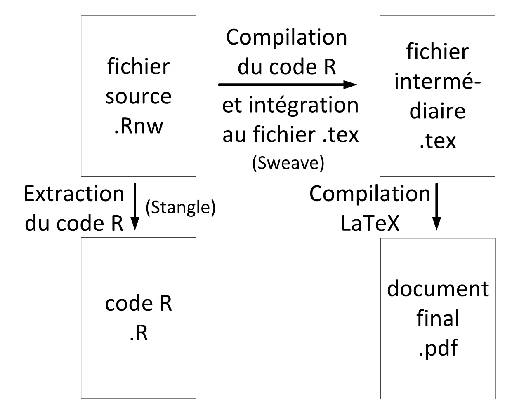
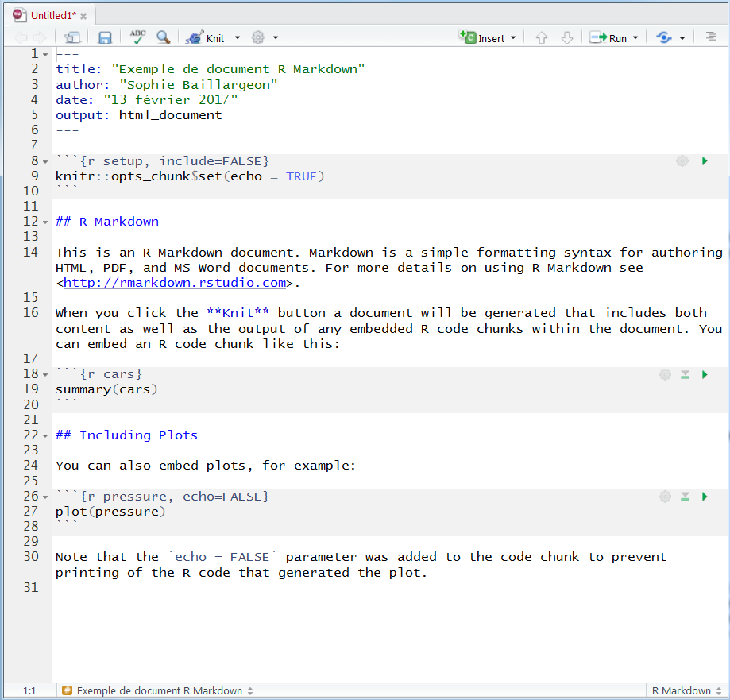
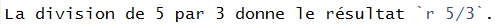

```{r echo = FALSE} 
knitr::opts_chunk$set(fig.align = 'center', fig.show = 'hold', out.width = "50%", echo = FALSE, fig.pos = 'h')
# Afin d'afficher des blocs de code tels qu'ils aparaissent
# dans un document R Markdown
knitr::knit_hooks$set(source = function(x, options){
  if (!is.null(options$verbatim) && options$verbatim){
    opts = gsub(",\\s*verbatim\\s*=\\s*TRUE\\s*", "", options$params.src)
    bef = sprintf('\n\n    ```{r %s}\n', opts, "\n")
    stringr::str_c(
      bef, 
      knitr:::indent_block(paste(x, collapse = '\n'), "    "), 
      "\n    ```\n"
    )
  } else {
    stringr::str_c("\n\n```", tolower(options$engine), "\n", 
      paste(x, collapse = '\n'), "\n```\n\n"
    )
  }
})
```

<!--
Source d'info :
http://rmarkdown.rstudio.com/articles_verbatim2.html
-->

***

# Introduction

Pour rédiger un document destiné à être publié (rapport, article, mémoire, thèse, etc.), plusieurs outils s'offrent à nous. En science, deux des outils les plus utilisés pour la création de documents sont :

- Word,
- LaTeX.

Voyons d'abord la distinction entre ces deux outils.

#### Word :

\mbox{}

En Word, **le contenu et la mise en forme du document ne font qu'un**. Le fichier dans lequel nous travaillons pour créer le document est directement le document final. 

En anglais, ce logiciel est dit de type **WYSIWYG**. Cet acronyme signifie _**W**hat **Y**ou **S**ee **I**s **W**hat **Y**ou **G**et_.


#### LaTeX :

\mbox{}

Avec LaTeX, **le contenu est dissocié de la mise en forme**. Le fichier dans lequel nous travaillons, portant l'extension .tex, n'est pas le document final. Nous devons compiler le fichier .tex afin d'obtenir ce document final (.pdf ou autre). Le fichier .tex contient le texte du document, soit le contenu, mais aussi des tags pour la mise en forme. Par exemple, il y a des tags pour changer de sections, modifier la police de caractères, inclure une liste, un tableau ou une figure, etc.

En anglais, ce logiciel est dit de type **WYSIWYM**. Cet acronyme signifie _**W**hat **Y**ou **S**ee **I**s **W**hat **Y**ou **M**ean_.


## Logiciels de type WYSIWYM

Avec les logiciels de type WYSIWYM, un document se crée en :

- éditant un fichier source, puis en
- compilant le fichier source pour obtenir le document final.

```{r, out.width = "45%", fig.cap = "Production de documents avec un logiciel de type WYSIWYM"}
knitr::include_graphics("fig/WYSIWYM.png")
```


#### Utilisation de LaTeX :

\mbox{}

En fait, LaTeX est un **langage de composition de documents**. Afin de créer un document en utilisant ce langage, nous avons besoin de :

- un **éditeur LaTeX** (un éditeur de texte fait aussi l'affaire, mais les fonctionnalités offertes par un éditeur LaTeX facilitent le travail de l'utilisateur) : 
    + TeXstudio (multiplateforme, gratuit) : http://texstudio.sourceforge.net/,
    + Overleaf (en ligne, facilite le travail collaboratif) : https://www.overleaf.com/
    + ou autre : https://en.wikipedia.org/wiki/Comparison_of_TeX_editors.
- un **compilateur LaTeX** : 
    + MiKTeX (Windows, gratuit) : http://miktex.org/,
    + ou autre : https://www.overleaf.com/learn/latex/Choosing_a_LaTeX_Compiler.


#### Markdown :

\mbox{}

Markdown est un langage simple de composition de documents en format HTML (interprétable par un navigateur web). Il s'agit donc d'un outil permettant de créer des pages web sans avoir à connaître le langage HTML.

```{r out.width = "45%", fig.cap = "Production de documents avec Markdown"}
knitr::include_graphics("fig/Markdown.png")
```

Markdown offre moins de possibilités de mise en forme que LaTeX, mais il est plus simple à apprendre et à utiliser. 


## Recherche reproductible et programmation lettrée

#### Recherche reproductible :

\mbox{}

La recherche reproductible (en anglais *reproducible research*) est un courant en recherche qui prône le partage de données et de programmes informatiques en accompagnement de publications scientifiques faisant intervenir de l'analyse de données. Le but de ce partage est de **permettre à tout lecteur de reproduire par lui-même les résultats publiés**. Ainsi, la publication est plus facile à comprendre, les résultats peuvent être vérifiés et la poursuite des travaux est facilitée. La recherche devrait en ressortir accélérée.

##### Programmation lettrée :

\mbox{}

La programmation lettrée (en anglais *literate programming*) est une approche de programmation dans laquelle le code n'est pas simplement documenté par quelques commentaires. Du texte expliquant ce que le code doit produire est entrelacé avec le code, à l'intérieur du même document. Pour que ce texte explicatif soit clair, il devrait pouvoir inclure toutes sortes d'éléments usuels dans des documents textuels, tels que des listes, des tableaux, des images, etc. Il n'est pas facile d'inclure de tels éléments dans des commentaires à l'intérieur d'un script. En programmation lettrée, le document de travail devient donc principalement un document texte, mais celui-ci contient des bouts de code bien identifiés en étant encadrés par des tags. Et il existe une façon de soumettre facilement ce code.

En fin de compte, le principe de programmation lettrée devient en quelque sorte de la rédaction de **documents combinant du texte et des bouts de code informatique**. Il s'agit d'une façon de mettre en oeuvre de la recherche reproductible. C'est aussi une façon productive de rédiger des documents devant contenir des bouts de code et/ou des sorties informatiques. En effet, le document contenant le « programme lettré » peut être compilé afin de générer un autre document qui lui peut afficher, pour chaque bout de code :

- seulement le code ou
- le code et les sorties informatiques qu'il produit lorsqu'il est soumis (par exemple un affichage texte comme dans une console, ou encore un graphique) ou
- seulement les sorties informatiques ou
- rien du tout.


Cette approche est très utile pour rédiger un **guide d'utilisation d'un langage informatique**. Par exemple, j'ai utilisé R Markdown, un outil de programmation lettrée, pour rédiger le document que vous êtes en train de lire, ainsi que toutes les autres notes du cours STT-4230/STT-6230 R pour scientifique publiées sur le site web https://stt4230.rbind.io/.

Une autre utilité de cette approche est la rédaction facilitée de **rapport d'analyse de données**. Nous nous intéressons ici à une analyse de données effectuée en R, mais la programmation lettrée pourrait s'appliquer avec n'importe quel logiciel d'analyse de données fonctionnant avec du code informatique (plutôt que seulement avec une interface utilisateur composée de menus et de boutons cliquables). Avec un outil de programmation lettrée, il est facile de rédiger un rapport contenant du texte explicatif et des résultats d'analyse sous forme de sorties informatiques. Nul besoin de copier/coller des valeurs dans un tableau, ou d'insérer manuellement un graphique. Tout est fait automatiquement lors de la compilation du document. Ainsi, si les données changent ou si nous décidons de modifier une analyse, nous n'avons pas besoin d'effectuer manuellement les mises à jour dans les résultats. Nous avons seulement besoin de mettre à jour le code et de recompiler le rapport. Cette approche peut nous permettre de sauver beaucoup de temps et minimise les risques d'erreur dans les résultats rapportés.  


## `Sweave` et `knitr`

En R, il est possible d'effectuer de la programmation lettrée avec la fonction `Sweave` (du package `utils`) ou avec le package `knitr`. 

Ces packages permettent de créer des publications qui contiennent des **bouts de code et/ou des sorties R**, sans faire de copier/coller à partir d'un programme R ou de la console R.


#### `Sweave` :

\mbox{}

`Sweave` est le premier outil a avoir été développé pour faire de la programmation lettrée en R. Il permet d'intégrer du code R à des **documents LaTeX**.

Les tags encadrant les bouts de code R dans le fichier source acceptent des options permettant de contrôler :

- ce qui doit être compilé ou non,
- ce qui doit être affiché ou non (code, sorties, figures),
- la mise en forme de l'affichage.


```{r fig.cap = "Schéma de compilation avec Sweave"}

```


#### `knitr` :

\mbox{}

`knitr` est une alternative à `Sweave`, plus récente et maintenant plus utilisée. Les options de mise en forme par défaut des éléments R intégrés au fichier LaTeX ne sont pas les mêmes avec `knitr` qu'avec `Sweave`.

De plus, `knitr` permet d'intégrer des éléments R à d'autres types de fichiers que LaTeX, notamment à des fichiers Markdown. C'est ce qui est appellé le **R Markdown**.


```{r fig.cap = "Schéma de compilation avec R Markdown"}
knitr::include_graphics("fig/RMarkdown.png")
```


# R Markdown

```{r echo = FALSE, out.width = "80%", fig.pos = 'h', fig.align = 'center'}
knitr::include_graphics("fig/rmarkdown_wizards.png")
```

Illustration de @allison_horst https://github.com/allisonhorst/stats-illustrations

## Création d'un document R Markdown en RSudio

Un bon outil pour rédiger et compiler des documents R Markdown est RStudio. Les instructions suivantes se rapportent à RStudio.

Nous pouvons créer un nouveau document R Markdown (extension .Rmd) par le menu :

- « File > New File > R Markdown... »

Une fenêtre s'ouvre alors. Nous devons spécifier quelques informations à propos de notre fichier.

1. Le menu de gauche sert à indiquer quel **type de produit final** nous voulons créer :
    + un document,
    + une présentation,
    + un document avec composantes interactives (Shiny) ou
    + un document suivant un certain modèle prédéfini (p. ex. document GitHub ou vignette de package).
2. Dans la partie de droite de la fenêtre, nous spécifions :
    + le titre du document,
    + le nom de l'auteur,
    + le format préféré pour le fichier final.

En cliquant sur OK, un fichier est créé. Il devrait avoir l'allure suivante :

\newpage

```{r out.width = "100%", fig.cap = "Exemple de nouveau document R Markdown"}

```

Il ne reste plus qu'à :

1. **enregistrer** le fichier,
2. **éditer** le fichier en respectant :
    + la syntaxe Markdown et 
    + les noms d'options de `knitr` pour les bouts de code R,
3. **compiler** le fichier.

\newpage

#### Formats du document final :

\mbox{}

Bien qu'à l'origine Markdown ait été créé pour générer des documents HTML, nous pouvons maintenant l'utiliser pour générer des documents dans d'autres formats. Avec RStudio, il est facile de compiler un fichier Markdown ou R Markdown notamment dans les formats suivants, grâce à Pandoc (intégré à RStudio) :

- HTML,
- PDF (à la condition d'avoir un compilateur LaTeX),
- Word.

#### Entête d'un fichier R Markdown :

\mbox{}

Un fichier R Markdown débute presque toujours par un entête entre les lignes :
```
---
```
et

```
---
```

Cet entête peut contenir des informations à inclure dans l'entête du document final, tel que :

- le titre du document,
- le nom de l'auteur,
- la date de publication du document.

Cet entête peut aussi contenir des informations spécifiant le format et des options de mise en forme du document final. Ces options varient en fonction du format de sortie. Le site web suivant fourni de l'information sur les options possibles : http://rmarkdown.rstudio.com/formats.html


## Syntaxe Markdown

La syntaxe Markdown utilisée par R Markdown est la version Pandoc, documentée sur le site web suivant :  

* http://rmarkdown.rstudio.com/authoring_pandoc_markdown.html

Les éléments de base de cette syntaxe sont bien présentés sur la page web suivante :  

* http://rmarkdown.rstudio.com/authoring_basics.html  

ainsi que dans une partie du document suivant :

*  https://github.com/rstudio/cheatsheets/blob/master/rmarkdown-2.0.pdf

(aussi disponible en RStudio via le menu « Help > Cheatsheets > R Markdown Cheat Sheet »).


Par exemple, pour mettre des caractères en italique, il suffit de les encadrer de `*` ou `_`. Ainsi, `*bonjour*` ou `_bonjour_` dans un fichier source R Markdown devient *bonjour* dans le document final obtenu suite à la compilation.

Aussi, la syntaxe suivante :

```
- premier élément (obligatoirement précédé d'une ligne vide)
    - sous élément (obligatoirement précédé de 4 à 7 espaces)
        - sous-sous élément (obligatoirement précédé de 8 à 11 espaces)
- dernier élément (obligatoirement suivi d'une ligne vide)
```

crée la liste suivante :

- premier élément (obligatoirement précédé d'une ligne vide)
    - sous élément (obligatoirement précédé de 4 à 7 espaces)
        - sous-sous élément (obligatoirement précédé de 8 à 11 espaces)
- dernier élément (obligatoirement suivi d'une ligne vide)
        
Je vous laisse découvrir par vous même les autres possibilités de la syntaxe Markdown à partir des sources proposées ci-dessus.


## Compilation de fichier R Markdown en RStudio

Les deux étapes de compilation s'effectuent en cliquant sur un seul bouton, dans la barre en haut du fichier :

- bouton **Knit** (accompagné d'un logo représentant une pelote de laine avec une aiguille à tricoter).

La petit triangle vers le bas semblable à $\blacktriangledown$ à côté du bouton **Knit** permet de sélectionner le format du fichier final. Le symbole de roue d'engrenage permet d'ouvrir un menu pour modifier les paramètres de la compilation.

Peu importe le format final de la sortie, la compilation cache toujours en fait plusieurs étapes intermédiaires dont :

- la compilation du code R dans une nouvelle session R (pas dans celle déjà ouverte en RStudio);
- l'intégration des résultats de cette compilation à un document
    + Markdown (.md) pour un résultat final en HTML,
    + LaTeX (.tex) pour un résultat final en PDF,
    + Word;
- la compilation de ce document (sauf pour le format Word) pour produire le fichier final.


## Blocs de code R

Dans un fichier R Markdown, le code R doit être encadré par le tag d'ouverture composé de trois apostrophes inversées suivies de `{r}` et le tag de fermeture composé de trois apostrophes inversées. Entre les accolades et après le `r`, nous pouvons ajouter un nom et des options de blocs de code R, séparées par des virgules. Nommer les blocs de code est utile pour se retrouver plus facilement dans un document contenant plusieurs blocs de code. Voici un exemple de bloc de code nommé, mais pour lequel aucune option n'a été modifiée.

`r knitr::opts_chunk$set(eval = FALSE, echo = TRUE)`
```{r chunck, verbatim = TRUE}
a <- 1 + 1
a
```
`r knitr::opts_chunk$set(eval = TRUE, echo = FALSE)`

Sans modifier les options par défaut du bloc de code, le code et les sorties produites seront intégrés au document comme suit.

```{r echo = TRUE}
a <- 1 + 1
a
```


#### Options de blocs de code R :

\mbox{}

Les options de blocs de code R les plus utiles sont les suivantes :

- `eval` (`TRUE` par défaut, ou `FALSE`) : détermine si le code R doit être évalué ou non,
- `echo` (`TRUE` par défaut, ou `FALSE`) : détermine si le code R doit être affiché ou non,
- `results` (`'markup'` par défaut, ou `'hide'` ou `'hold'` ou `'asis'`) :  
détermine comment les sorties doivent être affichées,
- `error` (`FALSE` par défaut, ou `TRUE`) : détermine si les messages d'erreur doivent être affichés.
- `warning` (`TRUE` par défaut, ou `FALSE`) : détermine si les messages d'avertissement doivent être affichés.

Il existe bien d'autres options, résumées dans le document suivant :    
https://www.rstudio.com/wp-content/uploads/2015/03/rmarkdown-reference.pdf

Voici un exemple de bout de code R avec options :

`r knitr::opts_chunk$set(eval = FALSE, echo = TRUE)`
```{r, R.options = list(width = 50), comment = "", verbatim = TRUE}
b <- c(1:10, rep(11, 20))
b
```
`r knitr::opts_chunk$set(eval = TRUE, echo = FALSE)`

Voici ce que ce bout de code inclut dans le document final.

```{r, echo = TRUE, R.options = list(width = 50), comment = ""}
b <- c(1:10, rep(11, 20))
b
```

La largeur de la sortie a été contrôlée avec `R.options = list(width = 50)`, qui permet de modifier n'importe quelle option de session R. Les caractères `##` au début de chacune des lignes de sortie ont été retirés avec `comment = ""`.


## Commande R intégrée à un bout de texte (*inline*)

Il est aussi possible d'inclure une commande R retournant un simple vecteur dans un bout de texte (en anglais on parle de *inline R code*). Seulement la sortie produite par la commande R sera affichée. Il faut encadrer la commande du tag ouvrant composé d'une seule apostrophe inversée suivie de `r` et du tag fermant composé uniquement d'une apostrophe inversée.

Par exemple, la phrase suivante dans un document R Markdown :

```{r, out.width = "55%", fig.align = 'left'}

```

produit le résultat suivant :

La division de 5 par 3 donne le résultat `r 5/3`.


## Intégration de figures

#### À partir d'un fichier image :

\mbox{}

Il est possible d'intégrer une figure provenant d'un fichier image en utilisant la syntaxe Markdown suivante :

- fichier local : ``
- fichier provenant du web : `` 

**Note** : Seuls les chemins relatifs à l'emplacement du fichier source R Markdown sont acceptés. Alors le fichier image local doit être dans le même répertoire que le fichier .Rmd ou dans un sous-répertoire de ce répertoire.

Si nous ajoutons du texte entre les crochets, celui-ci devient le titre de la figure.

Par exemple, la commande Markdown suivante :

`` 

produit le résultat suivant :

\newpage


Il n'est cependant pas possible de contrôler la taille de l'image avec cette syntaxe. Si nous travaillons dans un document R Markdown plutôt que simplement Markdown, il existe une autre façon d'intégrer une figure provenant d'un fichier image qui permet un meilleur contrôle sur la figure produite. Pour ce faire, il faut créer un bloc de code R dans lequel la fonction `include_graphic` du package `knitr` est appelée. En voici un exemple suivi du résultat produit.

```{r}
knitr::opts_chunk$set(echo = TRUE)
# Afin d'afficher des blocs de code tels qu'ils aparaissent
# dans un document R Markdown
knitr::knit_hooks$set(source = function(x, options){
  if (!is.null(options$verbatim) && options$verbatim){
    opts = gsub(",\\s*verbatim\\s*=\\s*TRUE\\s*", "", options$params.src)
    bef = sprintf('\n\n    ```{r echo = FALSE, %s}\n', opts, "\n")
    stringr::str_c(
      bef, 
      knitr:::indent_block(paste(x, collapse = '\n'), "    "), 
      "\n    ```\n"
    )
  } else {
    stringr::str_c("\n\n```", tolower(options$engine), "\n", 
      paste(x, collapse = '\n'), "\n```\n\n"
    )
  }
})
```

```{r, out.width = "45%", fig.align = 'center', fig.cap = "Autre exemple de figure", verbatim = TRUE}
knitr::include_graphics("fig/WYSIWYM.png")
```

```{r echo = FALSE}
# Afin d'afficher des blocs de code tels qu'ils aparaissent
# dans un document R Markdown
knitr::knit_hooks$set(source = function(x, options){
  if (!is.null(options$verbatim) && options$verbatim){
    opts = gsub(",\\s*verbatim\\s*=\\s*TRUE\\s*", "", options$params.src)
    bef = sprintf('\n\n    ```{r %s}\n', opts, "\n")
    stringr::str_c(
      bef, 
      knitr:::indent_block(paste(x, collapse = '\n'), "    "), 
      "\n    ```\n"
    )
  } else {
    stringr::str_c("\n\n```", tolower(options$engine), "\n", 
      paste(x, collapse = '\n'), "\n```\n\n"
    )
  }
})
```

Les options `out.height` et `out.width` permettent de contrôler les dimensions de la figure, `fig.align` contrôle son alignement et `fig.cap` permet d'ajouter un titre.

<!--
Ma source d'info :
http://stackoverflow.com/questions/15625990/how-to-set-size-for-local-image-using-knitr-for-markdown
-->


#### À partir d'un bloc de code R qui génère un graphique :

\mbox{}

Nous pouvons aussi intégrer une figure à un fichier R Markdown à l'aide d'un bloc de code R qui génère un graphique. Voici un exemple suivi du résultat produit.

```{r, fig.height = 3.5, out.width = "70%", fig.cap = "Encore un exemple de figure", verbatim = TRUE}
plot(cars, main = "Relation entre la vitesse et la distance de freinage de voitures")
```

\newpage

Lorsque la figure est créée par le code R, nous pouvons contrôler les dimensions de la fenêtre graphique avec les options `fig.height` et `fig.width`. Malgré tout, les options `out.height` et `out.width` continuent de contrôler la dimension de la figure dans le document final.


## Intégration de tableaux

Il existe une syntaxe Markdown pour créer des tableaux. Par exemple, le code Markdown suivant :

```
| Droite | Gauche | Défaut | Centré |
|-------:|:-------|--------|:------:|
| 12 | 12 | 12 | 12 |
| 123 | 123 | 123 | 123 |
| 1 | 1 | 1 | 1 | 

Table: Premier exemple de tableau
```

produit le tableau suivant :

| Droite | Gauche | Défaut | Centré |
|-------:|:-------|--------|:------:|
| 12 | 12 | 12 | 12 |
| 123 | 123 | 123 | 123 |
| 1 | 1 | 1 | 1 |

Table: Premier exemple de tableau


C'est l'emplacement des caractères « deux-points » (`:`) sur la ligne séparant l'entête du tableu à son contenu qui détermine l'alignement de la colonne. Pour donner un titre au tableau, il faut ajouter au-dessus ou en-dessous du code source du tableau une ligne débutant par `Table: `, suivi du titre.

Aussi, la fonction `kable` du package `knitr` permet d'intégrer un data frame R sous forme de tableau dans un document produit avec R Markdown. 

\newpage

Voici un exemple suivi du résultat produit (l'option `results = 'asis'` est nécessaire ici).

```{r, results = 'asis', verbatim = TRUE}
knitr::kable(head(cars, 3), caption = "Exemple de tableau")
```

Notons que d'autres fonctions permettent de formater une matrice ou un data frame R pour créer un tableau dans un document rédigé en R Markdown. Notamment, le [package `kableExtra`](http://haozhu233.github.io/kableExtra/) ajoute des possibilités à la fonction `kable` du package `knitr`. Quelques autres outils sont mentionnés dans le document https://github.com/rstudio/cheatsheets/blob/master/rmarkdown-2.0.pdf. La mise en forme du tableau obtenu diffère légèrement d'une fonction à l'autre.

Si le document final doit être en HTML uniquement, des outils supplémentaires s'offrent à nous pour mettre en forme des tableaux, notamment :

- la fonction `paged_table` du package `rmarkdown` pour créer des tableaux pouvant posséder des pages : https://bookdown.org/yihui/rmarkdown/html-document.html#data-frame-printing
- le package `formattable` pour formater un data frame à afficher sous forme de tableau : https://github.com/renkun-ken/formattable
- le package `DT` pour créer des tableaux interactifs :
    + https://rstudio.github.io/DT/
    + https://stt4230.rbind.io/tutoriels_etudiants/hiver_2019/dt/


## Trucs divers dans l'édition de documents R Markdown

- Pour faire un retour de chariot sans changer de paragraphe :  
insérer **deux caractères espace** à la fin d'une ligne, avant le retour de chariot.

- Pour insérer une ligne vide dans le document final :  
insérer une ligne contenant uniquement le caractère « `&nbsp;` », qui représente un espace en HTML.

- Pour insérer un commentaire (texte n'apparaissant pas dans le document final) :  
utiliser les tags html pour des commentaires, soit  

```
<!-- commentaire ici (possiblement sur plusieurs lignes) -->
```

- Raccourci clavier pour insérer un bloc de code R dans un fichier R Markdown en RStudio : 
    + Sous Windows : « Ctrl + Alt + i » ou « Alt Car + i »,
    + Sous Mac OS X / OS X / macOS : « Command + Option + i ».

- Pour modifier les options par défaut pour les blocs de code R :  
insérer la ligne suivante (avec les options désirées) au tout début du fichier .Rmd (juste en dessous de l'entête)

```{r echo = TRUE, eval = FALSE}
`r knitr::opts_chunk$set(echo = FALSE, results = 'hide')`
```

- Pour avoir des noms automatiques d'éléments en français lors de la création d'un document final au format PDF (par exemple le titre de la table des matières) : ajouter dans l'entête les lignes suivantes

```
header-includes:
- \usepackage[french]{babel}
```


\newpage

# Références

Recherche reproductible :

- https://en.wikipedia.org/wiki/Reproducibility#Reproducible_research
- https://annakrystalli.me/talks/r-in-repro-research-dc.html

Programmation lettrée : 

- https://fr.wikipedia.org/wiki/Programmation_lettr%C3%A9e

 Documentation de R Markdown :

- http://rmarkdown.rstudio.com/
- Xie, Y., Allaire, J. J., et Grolemund, G. (2018). *R markdown: The definitive guide*. Chapman and Hall/CRC. URL https://bookdown.org/yihui/rmarkdown/
- https://github.com/rstudio/cheatsheets/raw/master/rmarkdown-2.0.pdf
- https://www.rstudio.com/wp-content/uploads/2015/03/rmarkdown-reference.pdf

Options de blocs de code R :

- https://yihui.name/knitr/options/

Autre introduction à R Markdown en français :

- http://larmarange.github.io/analyse-R/rmarkdown-les-rapports-automatises.html


