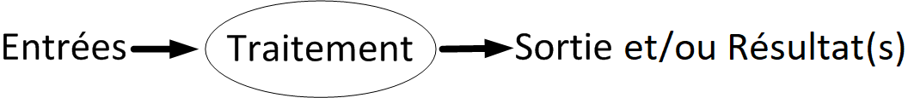

`r knitr::opts_chunk$set(R.options = list(width = 90))`


***

*Note préliminaire : Lors de leur dernière mise à jour, ces notes ont été révisées en utilisant R 4.0.3 et RStudio 1.4.1103. Pour d'autres versions, les informations peuvent différer.*

***

# Introduction

## Console R

R est un langage interactif. La console de R est un peu comme une calculatrice.

```{r}
1 + 1
2*5 + 1
```

Dans les blocs de code précédents, l'invite de commande (en anglais *prompt*) de la console R n'est pas affichée. Elle ne sera jamais affichée dans ces notes, pour alléger la présentation. Par défaut dans la console R, l'invite de commande est le symbole `> `. Lorsque la dernière ligne de la console R débute par ce symbole, R est prêt à recevoir une commande. Le symbole `+ ` indique quant à lui que la dernière commande soumise dans la console est incomplète, comme dans cet exemple.

```{r prompt = TRUE}
1 + 3 -
  2
```

Ici, il manque un terme dans l'opération sur la première ligne puisque l'opérateur de soustraction `-` n'est pas suivi d'une valeur. Les commandes incomplètes sont souvent dues à des parenthèses ou des guillemets non fermés.

Dans ces notes, les blocs débutant par le symbole `##` seront toujours des sorties produites par R.


## Résultats en mémoire

\vspace{6pt}
<p style="font-size:110%">
**Comment garder une copie en mémoire d'un résultat?**
</p>

Il faut **assigner** le résultat à un **nom**, ce qui crée un objet en mémoire&nbsp;:

```{r}
a <- 1 + 1
```

- `<-` est l'[opérateur d'assignation](https://stat.ethz.ch/R-manual/R-patched/library/base/html/assignOps.html); 
- `a` est le nom (ou le symbole) référant à l'objet créé en mémoire;
- `1 + 1` est l'expression générant le résultat à enregistrer, dans laquelle `1` est une valeur et `+` un [opérateur arithmétique](https://stat.ethz.ch/R-manual/R-patched/library/base/html/Arithmetic.html);
- `2` est la valeur contenue dans l'objet créé.

Notons que `=` est aussi un opérateur d'assignation. Cet opérateur est utilisé en R pour assigner une valeur à un argument lors de l'appel d'une fonction. Cependant, pour l'assignation d'une valeur à un nom d'objet, la pratique la plus recommandée en programmation R est d'utiliser `<-` plutôt que `=`. La différence entre `<-` et `=` sera abordée plus tard, dans les [notes sur les bonnes pratiques](https://stt4230.rbind.io/amelioration_code/bonnes_pratiques_r/#op%C3%A9rateur-dassignation).


```{r, eval = FALSE, echo = FALSE}
#Si vous êtes intéressés par la différence entre les deux opérateurs d'assignation, voir&nbsp;:
#http://stackoverflow.com/questions/1741820/assignment-operators-in-r-and
a <- b <- 2 # OK
a = b = 3 # OK
a <- b = 4 # ERREUR à cause de l'ordre de préséance des opérateurs
if(x <- 0) 1 else x # OK
if(x = 0) 1 else x # ERREUR
rep(1, times = 3) # OK
rep(1, times <- 3) # Oups, times se retrouve dans l'environnement de travail
```


### Noms acceptés {#noms}

Un nom d'objet R doit respecter les règles suivantes [@make_names].

- Le nom d'un objet peut uniquement contenir des lettres, des chiffres, des
points ou des barres de soulignement.

- Il commence obligatoirement par une lettre ou un point. S'il commence
par un point, le deuxième caractère ne doit pas être un chiffre.

- Il ne doit pas être un des mots suivants, qui sont réservés par R [@reserved]&nbsp;: `if`, `else`, `repeat`, `while`, `function`, `for`, `in`, `next`, `break`, `TRUE`, `FALSE`, `NULL`, `Inf`, `NaN`, `NA`, `NA_integer_`, `NA_real_`, `NA_complex_`, `NA_character_`, `...` et `..1`, `..2`, etc.

Remarques&nbsp;:

- Les lettres accentuées sont acceptées, mais il vaut mieux les éviter, car leur transfert d'un système d'exploitation à un autre est souvent problématique.

- Il n'y a aucune restriction sur la longueur des noms.

- Si vous tentez de créer un objet portant un nom qui ne respecte pas une des règles précédentes, une erreur sera générée.


## Accéder à un objet en mémoire

\vspace{6pt}
<p style="font-size:110%">
**Comment accéder à un résultat gardé en mémoire dans un objet?**
</p>

Il faut utiliser le nom référant à l'objet dans nos instructions R. Par exemple, pour afficher un objet, il suffit de taper son nom dans la console&nbsp;:
```{r}
a
```
mais pas&nbsp;:
```{r}
"a"
```
car les guillemets servent à créer des chaînes de caractères.

De plus, il faut **respecter la casse** car R différencie les majuscules et les minuscules. Donc `A` n'est pas le même symbole que `a` en R.


\vspace{6pt}
<p style="font-size:110%">
**Remarque&nbsp;:**
</p>

Soumettre une commande R contenant uniquement le nom d'un objet est équivalent à soumettre un appel à la fonction `print` en fournissant cet objet comme premier argument. Ainsi, les commandes suivantes sont équivalentes&nbsp;:

```{r}
a
print(a)
```


### Objets accessibles 

<p style="font-size:110%">
**Est-ce le seul objet accessible?**
</p>

La commande `ls()` (équivalente à `objects()`) retourne la liste des noms des objets, dans l'**environnement de travail** (en anglais *workspace*), parfois appelé environnement courant ou environnement global. Il s'agit de la liste des noms des objets créés depuis le démarrage de la session R (et jamais effacés).

```{r}
ls()
```

Ces noms sont ici entre guillemets, car ils sont affichés par `ls` en tant que chaînes de caractères. 


\vspace{6pt}
<p style="font-size:110%">
**Mais est-ce vraiment le seul objet accessible?**
</p>

Non. En plus des objets que vous avez créés, vous avez accès aux objets venant avec l'installation de R. Ils sont simplement rangés ailleurs que dans l'environnement de travail. Voici la liste de tous les *groupes* d'objets auxquels vous avez accès directement. 

```{r}
search()
```

Ces groupes d'objets portent le nom d'**environnements**. Il s'agit pour la plupart d'environnements de packages. Le premier environnement de cette liste, nommé `".GlobalEnv"`, est votre environnement de travail. La fonction `ls` affiche par défaut le contenu de cet environnement, mais elle peut afficher le contenu de n'importe quel environnement grâce à l'argument `name`.

```{r, echo = FALSE}
op.default <- options()
options(max.print = 15)
```

```{r}
ls(name = "package:stats")
```

```{r, echo = FALSE}
options(max.print = op.default$max.print)
```


\vspace{6pt}
<p style="font-size:110%">
**Quelle est la nature de tous ces objets?**
</p>

Il s'agit principalement de fonctions et de jeux de données. Par exemple l'environnement du package `base` contient la fonction suivante&nbsp;:
```{r}
casefold
```
La [fonction `casefold`](https://stat.ethz.ch/R-manual/R-patched/library/base/html/chartr.html) sert à convertir la casse de caractères alphabétiques dans une ou plusieurs chaînes de caractères, réunies dans un vecteur. Elle permet donc de convertir des lettres majuscules (en anglais *upper case characters*) en lettres minuscules (en anglais *lower case characters*) et vice versa.

L'environnement du package `base` contient aussi le jeu de données suivant&nbsp;:
```{r}
women
```
L'[objet `women`](https://stat.ethz.ch/R-manual/R-patched/library/datasets/html/women.html) contient des valeurs moyennes de grandeur et de poids, calculées en 1975, pour des femmes américaines âgées entre 30 et 39 ans.  


\vspace{6pt}
<p style="font-size:110%">
**Astuce&nbsp;:**
</p>

Utilisez la fonction `str` pour avoir un aperçu d'un objet plutôt que de l'afficher en entier.

```{r}
str(casefold)
str(women)
```

Ainsi, si l'objet est de grande taille, vous ne surchargerez pas la console en affichant la totalité de son contenu.


# Fonctions R

<p style="font-size:110%">
**Qu'est-ce qu'une fonction R?**
</p>

Une fonction R est, comme dans tout langage informatique, un bout de code qui produit un certain résultat lorsqu'exécuté. Pour exécuter le code composant une fonction, celle-ci doit être *appelée*. Lorsqu'elle est appelée, la fonction prend des valeurs en entrée, qui sont assignées à des *arguments*. Le code de la fonction réfère à ces arguments de façon à ce que l'appel de la fonction provoque un traitement des valeurs fournies en entrée. En fin de compte, la fonction génère un résultat, qui est la plupart du temps *retourné* dans un objet en sortie. Ce résultat peut aussi être un [*effet de bord*](https://fr.wikipedia.org/wiki/Effet_de_bord_(informatique)) tel que la production d'un graphique, l'écriture dans un fichier externe, la modification d'un paramètre de la session R, etc.


```{r echo = FALSE, out.width = "80%", fig.pos = 'h', fig.align = 'center', fig.cap = "Représentation schématique de l'exécution d'un appel à une fonction R"}

```


Un objet R de type fonction est composé des éléments suivants.

\vspace{6pt}

- Une liste d'arguments, avec leurs valeurs par défaut s'il y a lieu. Exemple&nbsp;:
```{r}
args(casefold)
```
La fonction `casefold` possède deux arguments&nbsp;: `x` et `upper`. L'argument `x` n'a pas de valeur par défaut, mais `upper` a `FALSE` comme valeur par défaut.

\vspace{6pt}

- Le corps de la fonction, soit le code composant la fonction. Exemple&nbsp;:
```{r}
body(casefold)
```
Le corps de la fonction `casefold` est particulièrement court. Le plus souvent, le corps d'une fonction R se compose de plus d'une instruction.

Pour utiliser une fonction, il faut l'appeler en fournissant, au besoin, des valeurs à ses arguments. Exemple&nbsp;:
```{r}
casefold(x = c("Bonjour", "à", "tous!"), upper = TRUE)
```

Ici la fonction `c` est utilisée pour fournir en entrée à `casefold` trois chaînes de caractères, dans un vecteur.


\vspace{6pt}
<p style="font-size:110%">
**Remarque&nbsp;: opérateurs = fonctions**
</p>

Tous les opérateurs sont aussi des fonctions. Par exemple, l'opérateur mathématique d'addition&nbsp;:

```{r, eval = FALSE}
1 + 1
```

est en fait un raccourci pour la fonction nommée `'+'`&nbsp;:

```{r, eval = FALSE}
'+'(1, 1)
```


## Écriture d'un appel à une fonction

<p style="font-size:110%">
**Comment écrire un appel de fonction R?**
</p>

Un appel de fonction est une instruction formée des éléments suivants, en respectant cet ordre&nbsp;:

1. le nom de la fonction à appeler;
2. une parenthèse ouvrante `(`;
3. au besoin, des valeurs pour les arguments, spécifiées comme suit (et séparés par une virgule si plus d'une valeur d'argument est à donner en entrée)&nbsp;: 
    a) nom de l'argument, suivi de l'opérateur `=` (éléments non obligatoires),
    b) expression générant la valeur à assigner à l'argument (souvent simplement le nom d'un objet);
4. une parenthèse fermante `)`.

Dans l'exemple précédent, c'est-à-dire&nbsp;:
```{r eval = FALSE}
casefold(x = c("Bonjour", "à", "tous!"), upper = TRUE)
```
deux valeurs sont fournies en entrée, en spécifiant les noms des arguments auxquels les assigner. Le résultat suivant est obtenu&nbsp;:
```{r echo = FALSE}
casefold(x = c("Bonjour", "à", "tous!"), upper = TRUE)
```

Ici, la valeur par défaut de l'argument `upper` est `FALSE`. Pour utiliser cette valeur, il n'est pas nécessaire de fournir de valeur à l'argument dans l'appel de fonction.
```{r}
casefold(x = c("Bonjour", "à", "tous!"))
```

Cependant, l'argument `x` n'a pas de valeur par défaut et ne lui fournir aucune valeur génère une erreur.
```{r error = TRUE}
casefold()
```

\vspace{6pt}
<p style="font-size:110%">
**Comment sont interprétées les valeurs passées en entrée sans être assignées à un argument?**
</p>

Si une valeur est passée en entrée sans être explicitement assignée à un argument, elle est par défaut assignée au premier argument non spécifié, en respectant l'ordre des arguments dans la définition de la fonction. Voici quelques exemples et les résultats obtenus.
```{r, error = TRUE}
casefold(c("Bonjour", "à", "tous!"))
```
Ici, la valeur `c("Bonjour", "à", "tous!")` n'est pas assignée explicitement à un argument par l'utilisateur. R l'assigne donc implicitement au premier argument, soit `x`.

&nbsp;

```{r, error = TRUE}
casefold(c("Bonjour", "à", "tous!"), TRUE)
```
Ici, les deux valeurs fournies en entrée ne sont pas assignées explicitement à des arguments par l'utilisateur. Elles sont donc assignées implicitement en respectant l'ordre des arguments&nbsp;: la première valeur fournie, soit `"Bonjour", "à", "tous!"` est assignée au premier argument, soit `x`; la deuxième valeur fournie, soit `TRUE` est assignée au deuxième argument, soit `upper`.

&nbsp;

```{r, error = TRUE}
casefold(FALSE, c("Bonjour", "à", "tous!"))
```

Ici, l'ordre dans lequel les valeurs sont fournies implique que `FALSE` est assigné à `x` et `c("Bonjour", "à", "tous!")` est assigné à `upper`. Cela génère un avertissement et une erreur, car les arguments reçoivent alors des valeurs qui ne sont pas des types attendus.

&nbsp;

```{r, error = TRUE}
casefold(FALSE, x = c("Bonjour", "à", "tous!"))
```

Si la valeur `c("Bonjour", "à", "tous!")` est explicitement assignée à l'argument `x`, la valeur `FALSE` est implicitement assignée à `upper`, même si elle est fournie en première position, car les assignations explicites ont préséance sur les assignations implicites.

&nbsp;

<p style="font-size:110%">
**Astuce&nbsp;:**
</p>

Pour éviter les erreurs dans un appel de fonction, il vaut mieux toujours assigner les valeurs passées en entrée à des arguments. Par contre, dans la pratique, lorsque le premier argument d'une fonction R est un objet contenant des données sur lesquelles appliquer un calcul (ce qui est fréquent en R), il est habituel de ne pas le nommer. Ainsi, dans l'exemple initial, l'appel le plus usuel est le suivant&nbsp;:

```{r, eval = FALSE}
casefold(c("Bonjour", "à", "tous!"), upper = TRUE)
```


## Fonctionnement vectoriel

Une particularité de R, qui le distingue de nombreux autres langages informatiques, est que plusieurs de ses fonctions agissent de façon vectorielle. Cela signifie qu'elles effectuent un traitement élément par élément sur le ou les objets reçus en entrée. Ainsi, l'appel précédent à la fonction `casefold`, génère l'application répétitive d'un traitement sur tous les éléments du vecteur de chaînes de caractères assigné à l'argument `x`. Dans plusieurs langages informatiques, il aurait fallu écrire une boucle pour arriver à répéter le traitement.

Lors de la réalisation de calculs, ce fonctionnement vectoriel de R est très pratique. Il est simple, par exemple, d'additionner deux vecteurs numériques élément par élément,
```{r}
c(3, 6, 2, 6) + c(4, 2, 2, 1)
```
ou encore de calculer la racine carrée tous les éléments d'un vecteur en une seule commande.
```{r}
sqrt(c(3, 6, 2, 6))
```


## L'argument `...` et ses deux utilités.

Certaines fonctions R possèdent un argument nommé  «&nbsp;`...`&nbsp;». C'est le cas par exemple de la [fonction `c`](https://stat.ethz.ch/R-manual/R-patched/library/base/html/c.html) utilisée précédemment, qui sert à combiner des valeurs dans un vecteur ou une liste.

```{r}
args(c)
```

C'est aussi le cas de la [fonction `apply`](https://stat.ethz.ch/R-manual/R-patched/library/base/html/apply.html), servant à appliquer un calcul sur des sous-sections d'un objet.

```{r}
args(apply)
```

L'argument `...` n'a pas la même utilisé dans ces deux fonctions. Je vais utiliser ces deux exemples de fonction pour illustrer les deux utilités potentielles de `...`. 

\vspace{6pt}
<p style="font-size:110%">
**Utilité 1&nbsp;: recevoir un nombre indéterminé de valeurs en entrée**
</p>


La première utilité de `...` est de permettre à une fonction de recevoir en entrée un nombre indéterminé de valeurs. Si `...` est placé au tout début de la liste des arguments, il a typiquement cette utilité. C'est le cas pour la fonction `c`. Cette fonction peut combiner autant de valeurs que désiré par l'utilisateur grâce à l'argument `...`. Voici des exemples.

```{r}
c("a", "c")
c(4.5, 6.8, 2.3, 5.1, 0.9)
```


\vspace{6pt}
<p style="font-size:110%">
**Astuce&nbsp;:**
</p>

Les valeurs «&nbsp;attrapés&nbsp;» par `...` peuvent être assignées à des noms, tant que ceux-ci diffèrent des noms des autres arguments de la fonction. Dans un appel à la fonction `c`, nommer les valeurs attrapées par `...` a pour effet de nommer les éléments dans le vecteur créé. Voici un exemple.

```{r}
c("Zoé" = 4.5, "Luc" = 6.8, "Ian" = 2.3, "Mia" = 5.1, "Kim" = 0.9)
```

\vspace{6pt}
<p style="font-size:110%">
**Utilité 2&nbsp;: passer des arguments à une autre fonction**
</p>

La deuxième utilité de l'argument `...` est de passer des arguments à une autre fonction appelée dans le corps de la première fonction. Si `...` est placé à la fin de la liste des arguments, il a typiquement cette utilité. 

Considérons par exemple la fonction `apply`. 

```{r}
args(apply)
```

Supposons que cette fonction soit utilisée pour calculer la moyenne des valeurs par colonne dans le jeu de données `women`.

```{r}
apply(X = women, MARGIN = 2, FUN = mean)
```

Cet appel à la fonction `apply` provoque des appels à la fonction fournie comme argument `FUN`, ici la fonction `mean`. Pour demander le calcul de moyennes tronquées via l'argument `trim` de la fonction `mean`, il suffit d'ajouter cet argument, et sa valeur désirée, dans l'appel à la fonction `apply`.

```{r}
apply(X = women, MARGIN = 2, FUN = mean, trim = 0.3)
```

Ici, l'argument portant un nom autre que `X`, `MARGIN` et `FUN` (les trois arguments nommés dans la liste des arguments de `apply`), soit l'argument `trim`, a été inclus automatiquement dans les sous-appels à la fonction `mean`.

Il est possible de passer à la sous-fonction autant d'arguments que désiré. Pour éviter toute erreur, il vaut mieux toujours assigner des noms aux valeurs passées en argument à une sous-fonction via `...`. 


## Comment utiliser une fonction d'ajustement de modèle ?

Étant donné que R est un langage conçu pour effectuer des calculs statistiques et créer des graphiques, il sert fréquemment à ajuster des modèles statistiques. R possède une classe d'objets particulière dédiée à la spécification de modèles&nbsp;: les **formules**. Comprendre comment utiliser une fonction d'ajustement de modèle en R revient principalement à comprendre comment correctement spécifier une formule R.

Par exemple, la fonction `lm` sert à ajuster un modèle linéaire. Le premier argument de cette fonction est une formule. Voici un exemple d'ajustement d'une régression linéaire simple sur les données `women`, en utilisant le poids comme variable réponse et la grandeur comme variable explicative.

```{r}
reg <- lm(weight ~ height, data = women)
```

L'objet `weight ~ height` est une formule.

```{r}
str(weight ~ height)
```

La partie de gauche de la formule (à gauche du `~`) contient le ou, plus rarement, les noms des variables réponse. La partie de droite contient pour sa part le ou les noms des variables explicatives. Ces noms sont accompagnés, au besoin, d'opérateurs et de fonctions pour désigner comment former les termes du modèle à partir des variables explicatives. Par exemple, voici la formule à utiliser dans l'appel à la fonction `lm` pour effectuer une régression polynomiale de degré deux avec les données `women`.

```{r}
reg_poly <- lm(weight ~ height + I(height^2), data = women)
```

L'écriture de formule sera abordée dans les [notes sur les calculs en R](https://stt4230.rbind.io/calculs/calculs_stat_math_r/#ajustement-de-mod%C3%A8les). 

\vspace{6pt}
<p style="font-size:110%">
**Comment accéder aux résultats d'une fonction d'ajustement de modèle?**
</p>

Un objet obtenu en sortie d'une fonction d'ajustement de modèle contient beaucoup plus d'informations qu'il ne le laisse paraître à première vue.

Par exemple, affichons dans la console l'objet `reg` créé dans le premier exemple d'ajustement de modèle.

```{r}
reg 
```

Seul un court extrait des résultats contenus dans `reg` est imprimé. Un résumé plus complet des résultats est obtenu avec la fonction `summary`.
```{r}
summary(reg)
```

Cependant, en réalité, l'objet `reg` contient plus d'éléments que ce que le laisse croire les sorties précédentes.

L'objet `reg` est une liste de sous-objets contenant les résultats de l'ajustement du modèle&nbsp;:
```{r}
str(reg, max.level = 1, give.attr = FALSE)
```

Un élément de la liste `reg` peut être extrait avec l'opérateur `$` comme suit&nbsp;:
```{r}
reg$coefficients
```

Cependant, il existe des fonctions servant spécifiquement à extraire des éléments d'une sortie de modèle. Par exemple, la fonction `coefficients` extrait les coefficients du modèle&nbsp;:
```{r}
coefficients(reg)
```

La fonction `summary`, en plus d'afficher un résumé des résultats tel que vu précédemment, retourne en sortie une liste contenant quelques résultats complémentaires à ceux retournés par la fonction d'ajustement du modèle&nbsp;:
```{r}
regSummary <- summary(reg)
str(regSummary, max.level = 1, give.attr = FALSE)
```

# Packages R

<p style="font-size:110%">
**Qu'est-ce qu'un package R?**
</p>

Un package R est un **regroupement de fonctions et/ou de données documentées**. En fait, lors de l'ouverture d'une session R, en supposant que l'environnement de travail est vide, tous les objets accessibles proviennent d'un package. 

L'installation de base de R est composée d'un certain nombre de packages R. Beaucoup de packages supplémentaires sont aussi disponibles sur le web. Les packages sont la façon formelle de partager publiquement des fonctions R.

La majorité des développeurs de packages R les rendent disponibles sur le **CRAN** (*Comprehensive R Archive Network*)&nbsp;:  http://www.r-project.org/  >  «&nbsp;CRAN&nbsp;» dans le menu de gauche.

Le site web **Bioconductor** (http://www.bioconductor.org/) propose aussi beaucoup de packages R spécifiques au domaine de la bio-informatique.

Finalement, certains développeurs distribuent leurs packages R sur un service web d’hébergement et de gestion de versions tel que **GitHub** ([https://github.com/](https://github.com/search?utf8=%E2%9C%93&q=language%3AR&type=Repositories&ref=advsearch&l=R&l=)).


\vspace{6pt}
<p style="font-size:110%">
**Comment utiliser un package?**
</p>

Pour utiliser un package R, il faut premièrement qu'il soit installé. Installer R provoque l'installation de certains packages. Les packages supplémentaires doivent être installés séparément. La [fiche sur l'installation de R](https://stt4230.rbind.io/introduction/installation_r_rstudio/) explique comment procéder à ces installations.

Ensuite, pour utiliser un package, une pratique courante est de charger celui-ci dans une session R, ce qui donne directement accès à toutes les fonctions publiques qu'il contient. Le démarrage d'une session R provoque automatiquement le chargement de certains packages. Par défaut, les packages suivants sont chargés automatiquement&nbsp;: `base`, `methods`, `datasets`, `utils`, `grDevices`, `graphics`, `stats`. Pour charger d'autres packages, il faut utiliser la fonction `library`, comme dans cet exemple&nbsp;:
```{r message = FALSE}
library(dplyr)
```
Pour accéder à une fonction publique d'un package chargé, il suffit de l'appeler par son nom. Par exemple, nous pouvons maintenant extraire des lignes d'un jeu de données avec la fonction `slice` du package `dplyr` comme suit.
```{r}
slice(women, c(1, 4, 5))
```
Il est aussi possible d'accéder à une fonction d'un package non chargé, **mais installé**, grâce à l'opérateur `::` précédé du nom du package. Ainsi, même si la commande `library(dplyr)` n'avait pas été exécutée, la commande suivante fonctionnerait, à la condition que `dplyr` soit installé.

```{r}
dplyr::slice(women, c(1, 4, 5))
```


<!--
Info sur les packages chargés par défaut trouvée dans le fichier
"C:\Program Files\R\R-4.0.3\library\base\R\Rprofile"
-->


# Obtenir de l'information

<p style="font-size:110%">
**Comment obtenir de l'information sur une fonction?**
</p>

Avant d'utiliser une fonction pour la première fois, il est utile de savoir&nbsp;:

- ce que la fonction fait;
- les utilités de ses arguments et les formats d'objets acceptés comme valeur en argument;
- le format du résultat en sortie et/ou l'effet de bord produit.

Toutes les fonctions ont une fiche d'aide, toujours structurée de la même façon, procurant ces informations. En R, la fonction `help` (ou l'opérateur `?`) permet d'accéder à cette fiche d'aide, comme dans cet exemple&nbsp;:

```{r, eval = FALSE}
help(lm)
# ou
?lm
```

Notons que pour ouvrir la fiche d'aide d'un opérateur, il faut encadrer son nom de guillemets simples ou doubles dans l'appel à la fonction `help`, par exemple&nbsp;:

```{r, eval = FALSE}
help('+')
```

La majorité des fiches d'aide de fonctions R comportent des exemples d'utilisation de la fonction à la fin. Ces exemples sont souvent très utiles pour comprendre comment utiliser la fonction.

Aussi, le CRAN comporte une page web pour chaque package R qu'il héberge (par exemple https://CRAN.R-project.org/package=dplyr). Celle-ci contient la version PDF des fiches d'aide de toutes les fonctions publiques du package. Ce document se nomme *Reference manual* (par exemple https://cran.r-project.org/web/packages/dplyr/dplyr.pdf).  Dans certains cas, la page web d'un package sur le CRAN comporte un lien vers un site web documentant davantage le package dans le champ nommé *URL* (par exemple https://dplyr.tidyverse.org/). Elle comporte aussi parfois des guides d'utilisation du package, appelés *vignettes*, créés par les développeurs du package (par exemple https://cran.r-project.org/web/packages/dplyr/vignettes/dplyr.html).

Les vignettes d'un package sont aussi consultables hors-ligne, à partir de R. Dans le bas d'une fiche d'aide R, il y a toujours un lien vers l'index du package contenant la fonction documentée dans la fiche. Dans la première partie de cet index, il y a un lien vers les vignettes du package (nommé *User guides, package vignettes and other documentation*), si celui-ci en possède.

Il n'y a pas que le *R Core Team* et les autres développeurs de packages R qui fournissent de l'information sur des fonctions R. La communauté R étant très active, il est fréquent de trouver sur le web de l'information à propos d'une fonction R provenant d'utilisateurs de la fonction. Par exemple, lançons la recherche «&nbsp;`R function lm`&nbsp;» dans un moteur de recherche web tel que **Google**. Les résultats contiennent des versions en ligne de la fiche d'aide de la fonction ainsi que des pages web très pertinentes pour apprendre à utiliser la fonction, créées par des utilisateurs. 


\vspace{6pt}
<p style="font-size:110%">
**Comment dénicher une fonction pour réaliser une certaine tâche?**
</p>

Il est relativement facile d'obtenir de l'information lorsque nous connaissons le nom de la fonction à utiliser. Par contre, il est parfois moins facile de trouver le nom de la fonction qui répond à notre besoin.

Afin de trouver une fonction R qui effectue une certaine tâche, le premier endroit pour chercher est encore un moteur de recherche web. En entrant dans la barre de recherche «&nbsp;`R function`&nbsp;», suivi d'une courte description en anglais de la tâche à effectuer, il est fort probable que des résultats pertinents soient retournés. Le web contient vraiment beaucoup d'informations sur la programmation en R, principalement en anglais. Des pages sur des sites sociaux de questions/réponses tels que **StackOverflow** (http://stackoverflow.com/questions/tagged/r) ou **CrossValidated** (http://stats.stackexchange.com/questions/tagged/r) sont souvent suggérés.

Il existe aussi des outils de recherche spécifiques à R. Tout d'abord, la fonction R `help.start`, appelée sans lui fournir d'arguments en entrées, ouvre une table des matières contenant des liens vers la documentation R. Toute cette information est aussi accessible en ligne sur le site web http://stat.ethz.ch/R-manual/R-patched/doc/html/.

```{r, eval = FALSE}
help.start()
```

Aussi, la fonction R `help.search` permet de rechercher la présence de chaînes de caractères dans les fiches d'aide R, par exemple&nbsp;:

```{r, eval = FALSE}
help.search("regression")
```

Cependant, les fonctions `help`, `help.start` et `help.search` donnent uniquement accès à la documentation des packages R installés dans le chemin de recherche de la session R à partir de laquelle elles sont appelées. Pour faire une recherche dans les fiches d'aide de tous les packages R sur le CRAN, Bioconductor ou Github, le site web suivant est un bon outil.

http://www.rdocumentation.org/

Le site web http://rseek.org/ permet d'élargir la recherche à&nbsp;:

- toute la documentation distribuée par l'équipe de R, incluant les manuels du *R Core Team* (http://cran.r-project.org/manuals.html);
- les messages publiés sur les listes courriel de R (http://www.r-project.org/mail.html), dont le R-help où les abonnés peuvent poser des questions concernant R;
- le R Journal (http://journal.r-project.org/);
- des blogues et autres sites web consacrés à R, dont R-bloggers (http://www.r-bloggers.com/) et Quick-R (http://www.statmethods.net/);
- le support et d'autres ressources offertes par RStudio (https://support.rstudio.com);
- etc.

Il existe en fait plusieurs outils de recherche de documentation R.


# Graphiques en R

\vspace{6pt}
<p style="font-size:110%">
**Comment produire un graphique en R?**
</p>

La fonction graphique de base en R est `plot`.

```{r, fig.width=5, fig.height=4, fig.align= "center"}
plot(x = women$height, y = women$weight)
```

Pour deux vecteurs de données `x` et `y` fournis en entrée, elle génère un diagramme de dispersion.

Elle accepte plusieurs autres types d'objets comme premier argument. Par exemple, si elle reçoit en entrée un objet créé par la fonction `lm`, elle génère quelques graphiques de résidus (non affichés ici).

```{r, eval = FALSE}
plot(reg)
```

La fonction `plot` n'est que la pointe de l'iceberg de toutes les possibilités graphiques de R. [Un cours sera consacré à ce sujet](https://stt4230.rbind.io/communication_resultats/graphiques_r/).


# Programmation orientée objet en R

<p style="font-size:110%">
**Est-ce que de la programmation orientée objet est possible en R?**
</p>

La fonction `plot`, mentionnée ci-dessus, a un comportement qui s'adapte à la classe de l'objet assigné à son premier argument. Il s'agit d'une fonction générique *polymorphe* propre à un langage orienté objet. Ainsi, la programmation orientée objet est possible en R. Il y a même plus d'un système R de programmation orientée objet. La fonction `plot` du package `graphics` est une fonction générique issue du système orienté objet S3, le plus simple et encore le plus courant en R.

Jetons un coup d'oeil au corps de la fonction `plot`.

```{r}
plot
```

La fonction `plot` possède seulement trois arguments&nbsp;: `x`, `y` et `...`. Aussi, le corps de la fonction est un peu particulier. Il est très court. Il contient uniquement un appel à la fonction `UseMethod`. Cette caractéristique indique que `plot` est une fonction générique de type S3.

À travers l'appel à la fonction `UseMethod`, la fonction `plot` appelle une sous-fonction (appelée *méthode*), choisie selon la classe de l'objet fourni en entrée comme valeur pour le premier argument (ici `x`). Pour énumérer toutes les  «&nbsp;versions&nbsp;» d'une fonction générique auxquelles notre installation de R nous donne accès, il faut appeler la fonction `methods` comme suit.

```{r}
methods(plot)
```

Les caractères se trouvant après le point dans le nom d'une méthode S3 représentent une classe d'objets. Par exemple, `lm` est la classe des objets retournés par la fonction du même nom. C'est la méthode `plot.lm` qui est appelée lorsque `plot` reçoit en entrée un objet de classe `lm`.

Les méthodes sont souvent documentées, au même titre que les fonctions. Par exemple, la fiche d'aide ouverte par `help(plot.lm)` fourni de l'information à propos du comportement de la fonction `plot` avec un objet de classe `lm`, 

La programmation orientée objet est un sujet technique plutôt avancé. [Nous reviendrons sur ce concept vers la fin de la session](https://stt4230.rbind.io/programmation/oop_r/).


# Sessions R

R est souvent utilisé de façon interactive dans une session R pour analyser des données. Lors d'une session R, l'utilisateur soumet des commandes dans la console.

<p style="font-size:110%">
**Comment conserver une trace des commandes soumises au cours d'une session R?**
</p>

Il est possible de sauver l'**historique des commandes** soumises au cours d'une session R avec la fonction `savehistory`. Le fichier ainsi créé (d'extension `.Rhistory` par défaut) contient une énumération de toutes les commandes soumises dans la console depuis l'ouverture de R.

Il est aussi possible de sauver l'**environnement de travail** avec la fonction `save.image`. Le fichier ainsi créé (d'extension `.RData` par défaut) contient tout le contenu de l'environnement de travail, soit tous les objets créés depuis l'ouverture de R  (et jamais effacés).


\vspace{6pt}
<p style="font-size:110%">
**Astuce&nbsp;:**
</p>

En fait, la console R garde toujours une trace en mémoire des commandes que vous avez soumises (comme le Terminal Linux). Vous pouvez parcourir cet historique, dans la console, avec les touches  «&nbsp;flèche vers le haut&nbsp;» et  «&nbsp;flèche vers le bas&nbsp;» de votre clavier. Ainsi, pour soumettre de nouveau une commande, vous pouvez éviter de la retaper en y accédant à l'aide de la touche  «&nbsp;flèche vers le haut&nbsp;».

\vspace{6pt}
<p style="font-size:110%">
**Comment terminer une session R?**
</p>

La commande `q()` provoque la fin de la session R, tout comme la fermeture de la fenêtre de la console R. R demande alors si une **image de la session** doit être sauvegardée. Si la réponse fournie à cette question est oui, R sauvegarde l'historique des commandes dans un fichier nommé  «&nbsp;`.Rhistory`&nbsp;» et le contenu de l'environnement de travail dans un fichier nommé  «&nbsp;`.RData`&nbsp;».


\vspace{6pt}
<p style="font-size:110%">
**Comment charger un fichier d'extension `.RData`?**
</p>

Les objets sauvegardés dans un fichier d'extension `.RData` deviennent accessibles en R après que le fichier soit chargé avec la fonction `load`. 

\vspace{6pt}
<p style="font-size:110%">
**Attention&nbsp;:**
</p>

Si à l'ouverture d'une nouvelle session R le répertoire de travail (voir ci-dessous) contient un fichier `.RData`, les objets contenus dans ce fichier sont automatiquement chargés en R. Dans ce cas, l'environnement de travail n'est pas vide en début de session.

\vspace{6pt}
<p style="font-size:110%">
**Astuce&nbsp;:**
</p>

Je recommande de ne jamais accepter l'enregistrement d'une image de la session à la fermeture d'une session R, afin que le répertoire de travail par défaut ne contienne pas de fichier d'extension `.RData` et que toute nouvelle session R démarre avec un environnement de travail vide. Partir d'un environnement de travail vide aide à garder le contrôle sur son contenu et ainsi à éviter des erreurs de manipulation de mauvaises données.


## Paramètres d'une session R

<p style="font-size:110%">
**Comment connaître et modifier les paramètres d'une session R?**
</p>

Une session R comporte un certain nombre de paramètres nommés options. La fonction R `options` permet de connaître les paramètres d'une session en cours, ainsi que de les modifier. Il faut d'abord aller voir la fiche d'aide de la fonction (ouverte par la [commande `help(options)`](https://stat.ethz.ch/R-manual/R-patched/library/base/html/options.html)), pour obtenir de l'information sur ces paramètres.

Par exemple, la façon dont les nombres sont affichés dans la console est notamment contrôlée par les options `digits` et `scipen`. Ces options prennent par défaut les valeurs suivantes.

```{r}
# Afin de garder une copie des valeurs par défaut avant de les modifier
optionsDefaut <- options()
```

```{r options}
optionsDefaut$digits
optionsDefaut$scipen
```

\vspace{6pt}
<p style="font-size:110%">
**Option `digits`&nbsp;: contrôle du nombre maximal de chiffres affichés**
</p>

L’option `digits` représente le nombre maximal de chiffres affichés, par exemple&nbsp;:
```{r}
1.23456789
```
Le nombre est arrondi pour respecter ce nombre maximal de chiffres. Cette option peut être modifiée comme suit.
```{r}
options(digits = 4)
1.23456789
```
Pour toute nouvelle session R démarrée, la valeur par défaut de `digits` retombe à `r optionsDefaut$digits` (sauf si ce paramètre est modifié dans le fichier de configuration de R). Si nous avons préalablement enregistré les valeurs par défaut des options, il est facile de redonner à `digits` sa valeur par défaut comme suit.
```{r}
options(digits = optionsDefaut$digits)
```

\vspace{6pt}
<p style="font-size:110%">
**Option `digits`&nbsp;: contrôle de l'affichage en format scientifique**
</p>

L’option `scipen` contrôle pour sa part l'affichage en format scientifique. R affiche les très grands nombres dans ce format. Par exemple, par défaut
```{r}
100000
```
est affiché en format scientifique, mais pas
```{r}
10000
```
En modifiant la valeur de `scipen` comme suit
```{r}
options(scipen = -1)
```
10000 sera lui aussi affiché en format scientifique.
```{r}
10000
```


# Répertoire de travail

<p style="font-size:110%">
**Qu'est-ce que le répertoire de travail?**
</p>

R a parfois besoin de lire ou d'écrire dans des fichiers externes. Il le fait par exemple&nbsp;:

- lors de l'importation de données provenant d'un fichier externe (lecture dans un fichier, par exemple avec la fonction `load`);
- lors de l'enregistrement de l'historique des commandes ou de l'environnement de travail (écriture dans un fichier).

R se définit un emplacement par défaut pour ces fichiers. Cet emplacement se nomme **répertoire de travail** (en anglais *working directory*), parfois appelé répertoire courant. Lorsqu'aucun emplacement n'est spécifié lors d'une communication entre R et un fichier externe, R considérera par défaut que le fichier se situe dans le répertoire de travail.

\vspace{6pt}
<p style="font-size:110%">
**Comment contrôler le répertoire de travail?**
</p>

La commande suivante permet de connaître le répertoire de travail&nbsp;:

```{r, eval = FALSE}
getwd()
```

La suivante permet de le modifier&nbsp;:

```{r, eval = FALSE}
setwd("cheminAccesRepertoire")
```
où `"cheminAccesRepertoire"` est le chemin d'accès d'un répertoire sur votre ordinateur, par exemple `"C:/MesDocuments"` ou autre.

\vspace{6pt}
<p style="font-size:110%">
**Attention&nbsp;:**
</p>

En R, les chemins d'accès contenant le caractère `\` ne sont pas acceptés. Ce n'est pas très pratique pour ceux qui travaillent sous Windows, car un chemin d'accès copié à partir d'un explorateur de fichiers Windows contient ce caractère. Il faut toujours remplacer, dans un chemin d'accès fourni à R, les `\` par `/` ou `\\` (ex.: `"C:\MesDocuments"` devient `"C:/MesDocuments"` ou `"C:\\MesDocuments"`). 


# Programmes R

<p style="font-size:110%">
**Pourquoi créer des programmes R plutôt que de travailler directement dans la console?**
</p>

Retrouver des commandes spécifiques dans un ancien historique peut être difficile. Une meilleure méthode de travail que de travailler directement dans la console R consiste à rédiger des *programmes R*, aussi appelés *scripts R*. Les programmes facilitent la réutilisation du code. Ils sont composés d'une série d'instructions.

Faire rouler un ancien programme recrée tous les objets produits par les instructions dans le programme (ce qui remplace une image de session). Si le code de création de certains objets est long à exécuter, ces objets peuvent être enregistrés dans un fichier externe lors de leur création d'origine. Ensuite, pour utiliser ces objets, il suffit de les charger dans une session R (au lieu de faire rouler de nouveau le code pour les créer). Nous verrons comment faire ça dans les [notes traitant de lecture et d'écriture dans des fichiers à partir de R](https://stt4230.rbind.io/manipulation_donnees/lecture_ecriture_r/).


## Règles de syntaxe

<p style="font-size:110%">
**Quelles sont les règles de syntaxe du langage R?**
</p>

Lors de l'écriture d'un programme R, il y a quelques règles de syntaxe à respecter. En plus des [règles concernant les choix de noms d'objets](#noms) énumérées précédemment, voici les règles syntaxiques de base du langage R [@rintro].

- R respecte la casse des caractères (il fait toujours la distinction entre les majuscules et les minuscules, comme il a déjà été mentionné).
- Dans un nombre réel, la décimale est représentée par un point et non par une virgule.
- Chaque commande doit se terminer par un retour de chariot ou un point-virgule (moins usuel).
- Une commande peut s'étaler sur plusieurs lignes.
- Il est possible de mettre plusieurs commandes sur une même ligne, à condition
de séparer les commandes par des points-virgules.
- Les différents éléments d'une commande peuvent ou non être séparés par
un ou plusieurs espaces. C'est uniquement une question de style.
- Le symbole `#` sert à insérer des commentaires dans un programme R. Sur une ligne, tout ce qui se trouve après un `#` est ignoré par R lors de l'exécution d'un programme.

```{r, eval = FALSE}
# Exemple de ligne en commentaire, donc non exécutée
1 + 1  # exemple de commentaire suivant une instruction
```


## Éditeurs de code R

<p style="font-size:110%">
**Quel outil utiliser pour éditer un programme R?**
</p>

Un programme R s'édite dans une fenêtre séparée de la console. Le GUI de la version Windows de R possède un éditeur de code R minimaliste, qui s'ouvre par le menu  «&nbsp;Fichier > Nouveau script&nbsp;». Par convention, l'**extension `.R` ou `.r`** est donnée à un programme R. À partir de cet éditeur, le raccourci clavier **Ctrl-R** permet de soumettre dans la console des lignes de code de l'éditeur. 

Il existe cependant des outils bien plus performants que cet éditeur pour programmer en R. Plusieurs éditeurs de code R ou environnements intégrés de développement R (en anglais IDE pour Integrated Development Environment) sont offerts, notamment&nbsp;:

- RStudio (http://www.rstudio.com/), 
- des extensions R pour Visual Studio Code (par exemple https://marketplace.visualstudio.com/items?itemName=Ikuyadeu.r)
- Emacs avec ESS (http://ess.r-project.org/), 
- Eclipse avec StatET (https://eclipse.org/statet), 
- Tinn-R (http://sourceforge.net/projects/tinn-r/), 
- etc.


# RStudio

RStudio est probablement le plus populaire de ces outils. Il s'agit d'un IDE déjà très complet et qui continue d'être activement développé. Une version gratuite du logiciel est offerte (https://www.rstudio.com/products/rstudio/download/, version  «&nbsp;Desktop, Open Source License&nbsp;»). Nous utiliserons RStudio dans ce cours. 

RStudio facilite le travail en R, par exemple grâce aux caractéristiques suivantes.

## Éditeur de code R

L'éditeur de code R de RStudio est pourvu de plusieurs fonctionnalités, notamment&nbsp;:

- **coloration syntaxique**;
- **complètement automatique** (en anglais *autocompletion*);
- **fermeture automatique** de parenthèses, crochets, accolades (potentiellement colorés selon leur niveau) et guillemets;
- création possible de **sections** (commentaires terminant par quatre tirets ou plus) et accès à un __*outline* permettant de se déplacer facilement entre les sections__;
- **pliage de code**;
- **configurable** (beaucoup d'options dans le menu «&nbsp;Tools > Global Options... > Code&nbsp;»).

La [fiche sur l'installation de R](https://stt4230.rbind.io/introduction/installation_r_rstudio/#config) mentionne quelques configurations de RStudio qui pourraient vous intéresser.


\vspace{6pt}
<p style="font-size:110%">
**Détails concernant le complètement automatique (*autocompletion*)&nbsp;:**
</p>

RStudio peut compléter nos commandes pour nous. En cours de saisie d'une commande dans la console ou dans un script R, RStudio ouvre une petite fenêtre contenant des suggestions de suite à notre commande. Si cette fenêtre ne s'ouvre pas d'elle-même, la touche «&nbsp;Tab&nbsp;» devrait permettre de l'ouvrir. RStudio propose des suggestions de suite pour&nbsp;:

- les noms d'objets se trouvant dans un des environnements dans le chemin de recherche,
- les noms des éléments d'une liste ou les noms de colonnes d'un data frame après l'opérateur $, 
- les arguments à ajouter à un appel de fonction,
- etc.

Si vous n'aimez pas ce comportement, vous pouvez le configurer par le menu «&nbsp;Tools > Global Options... > Code > Completion&nbsp;».

\vspace{6pt}
<p style="font-size:110%">
**Détails concernant la fermeture automatique de parenthèses, guillemets et crochets&nbsp;:**
</p>

RStudio offre aussi de fermer les parenthèses, guillemets et crochets automatiquement. Ainsi, si nous ouvrons une parenthèse dans un programme ou dans la console, une parenthèse fermante est automatiquement ajoutée à la ligne de commande.

Si vous n'aimez pas cette fonctionnalité, vous pouvez l'enlever par le menu «&nbsp;Tools > Global Options... > Code > Editing&nbsp;», en décochant l'option «&nbsp;Insert matching parens/quotes&nbsp;».


## Sous-fenêtres

La fenêtre principale de RStudio est divisée en sous-fenêtres, comprenant chacune potentiellement un choix de sous-fenêtres en onglets. La configuration par défaut propose les 4 sous-fenêtres suivantes&nbsp;:

- en haut à gauche&nbsp;: l'**éditeur R** (possibilité d'avoir plusieurs programmes ouverts, accessibles via des onglets); 
- en bas à gauche&nbsp;: la **console R** (aussi une fenêtre *Terminal* et autres);
- en haut à droite&nbsp;: la visualisation du contenu des **environnements** chargés (aussi de l'historique des commandes et autres);
- en bas à droite&nbsp;: la visualisation de, notamment,
    + l'arborescence de **fichiers** (*Files*) sur votre ordinateur,
    + les **graphiques** produits (*Plots*),
    + les **packages** installés ,
    + les fiches d'**aide** (*Help*).


## Fonctionnalités diverses

Plusieurs autres fonctionnalités de RStudio permettent de travailler de façon plus productive, par exemple les suivantes&nbsp;:

- Possibilité de lancer certaines commandes à partir de menus, notamment&nbsp;:
    + des appels aux fonctions courantes telles que&nbsp;:
        + `help`&nbsp;: en utilisant la barre de recherche de la sous-fenêtre *Help*,
        + `install.packages`&nbsp;: en utilisant le bouton *Install* de la sous-fenêtre *Packages*, 
        + `setwd`: par le menu *Session* > *Set Working Directory*;
    + des commandes de construction de package par le menu *Build*;
    
- Nombreux raccourcis clavier (https://support.rstudio.com/hc/en-us/articles/200711853-Keyboard-Shortcuts), notamment&nbsp;:
    + les raccourcis usuels tels que&nbsp;: 
        + **Ctrl-C** / **Ctrl-V** pour effectuer un copier / coller,
        + **Ctrl-Z** pour annuler la dernière action,
        + **Ctrl-S** pour enregistrer le document courant,
        + etc.;
    + **Ctrl-Enter** pour soumettre (dans la console) la ligne du programme source où le curseur se situe ou la sélection (dans l'éditeur);
    + **Tab** ou **Ctrl+Space** pour tenter un complètement automatique.


# Sources d'informations

Voici des sources d'informations sur l'utilisation de R et la programmation R. Cette liste n'est pas exhaustive. Les sources d'informations R sont très nombreuses!

**Documentation de R**&nbsp;: fiches d'aide des fonctions et manuels du R core team&nbsp;: 

- accessible à partir de la console au cours d'une session R grâce aux fonctions `help.start`, `help` et `help.search`;
- accessible en ligne&nbsp;:
    + http://stat.ethz.ch/R-manual/R-patched/doc/html/
    + https://cran.r-project.org/manuals.html
    + http://www.r-project.org/ > «&nbsp;Documentation&nbsp;» dans le menu de gauche.


**Documentation de packages R** qui ne se retrouvent pas dans l'installation de base&nbsp;:

- accessible à partir de la console au cours d'une session R lorsque les packages sont installés dans le chemin de recherche de la session grâce aux fonctions `help.start`, `help` et `help.search`;
- accessible en ligne&nbsp;:
    + https://cran.r-project.org/web/packages/
    + http://bioconductor.org/packages


**Outils de recherche dans la documentation de R et des packages sur le CRAN**&nbsp;:

- http://www.rdocumentation.org/
- http://rseek.org/
- https://r-pkg.org/
- https://rdrr.io/
- package `pkgsearch`, pour effectuer des recherches dans la documentation des packages sur le CRAN à partir de la console R : https://r-hub.github.io/pkgsearch/index.html


**Documentation relative à RStudio**&nbsp;:

- https://rstudio.com/
- support utilisateurs&nbsp;: https://support.rstudio.com/hc/en-us
- feuille de triche&nbsp;: https://github.com/rstudio/cheatsheets/blob/master/rstudio-ide.pdf


**Sites web à propos de R**&nbsp;:

- http://larmarange.github.io/analyse-R/
- http://www.statmethods.net/
- http://www.cookbook-r.com/
- http://www.r-graph-gallery.com/


**Exercices ou formations R**&nbsp;:

- http://r-exercises.com/
-	http://swirlstats.com
- http://swcarpentry.github.io/r-novice-inflammation/
- http://swcarpentry.github.io/r-novice-gapminder/
- https://www.udemy.com/course/r-basics/

**Outils sociaux de questions/réponses**&nbsp;:

- StackOverflow (http://stackoverflow.com/questions/tagged/r),
- CrossValidated (http://stats.stackexchange.com/questions/tagged/r)
- la liste courriel R-help (https://stat.ethz.ch/mailman/listinfo/r-help)


**Outils pour suivre la communauté R**&nbsp;:

- http://www.r-bloggers.com/
- https://rweekly.org/
- hashtag #rstats sur Twitter&nbsp;: https://twitter.com/hashtag/rstats
- le groupe «&nbsp;The R Project for Statistical Computing&nbsp;» sur LinkedIn&nbsp;: https://www.linkedin.com/groups/77616


**Livres**

Livres que j'utilise le plus&nbsp;:

- Matloff, N. (2011). *The art of R programming: A tour of statistical software design*. No Starch Press.
- Wickham, H. (2019). *Advanced R*. 2e édition. Chapman and Hall/CRC. URL https://adv-r.hadley.nz/
    + Solutionnaire des exercices dans ce livre&nbsp;: https://advanced-r-solutions.rbind.io/
- Wickham, H. (2015). *R packages*. O'Reilly Media, Inc. URL de la 2e édition en développement (avec Bryan J.) http://r-pkgs.had.co.nz/
- Grolemund, G. et Wickham, H. (2016). *R for Data Science*. O'Reilly Media, Inc. URL http://r4ds.had.co.nz/

Autres livres&nbsp;:

- Adler, J. (2010). *R in a nutshell: A desktop quick reference*.  2e édition. O'Reilly Media, Inc.
- Braun, W. J. et Murdoch, D. (2007). *A first Course in Statistical Programming with R*. Cambridge University Press.
- Chambers, J. M. (2016). *Extending R*. Chapman and Hall/CRC.
- Chambers, J. M. (2008). *Software for Data Analysis: Programming with R*. Springer.
- Cotton, R. (2013). *Learning R: A Step-by-Step Function Guide to Data Analysis*. O'Reilly Media.
- Davies, T. M. (2016). *The Book of R: A First Course in Programming and Statistics*. No Starch Press.
- Gillespie, C. et Lovelace, R. (2016). *Efficient R Programming: A Practical Guide to Smarter Programming*. O'Reilly Media, Inc. URL https://csgillespie.github.io/efficientR/
- Gentleman, R. (2009). *R Programming for Bioinformatics*. Chapman and Hall/CRC.
- Grolemund, G. (2014). *Hands-on programming with R*. O'Reilly Media, Inc. URL https://rstudio-education.github.io/hopr/
- Kabacoff, R. (2015). *R in action*. 2e édition. Manning Publications.
- Muenchen, R. A. (2011). *R for SAS and SPSS Users*. 2e édition. Springer.
- Teetor, P. (2011). *R Cookbook*. O'Reilly Media.
- Zumel, N. et Mount, J. (2014). *Practical Data Science with R*. Manning Publications Co. 
- Zuur, A. F., Ieno, E. N. et Meesters, E. H.W.G. (2009). *A Beginner’s Guide to R*. Springer.


**Notes de cours**

Référence officielle pour les notes de ce cours&nbsp;:

- Baillargeon, S. (2020). *R pour scientifique*. Notes de cours, STT-4230/STT-6230. Université Laval, Département de mathématiques et de statistique. URL https://stt4230.rbind.io/

Notes d'autres cours à propos de R

- Introduction à R et à la programmation informatique (en français) : Goulet, V. (2020). *Programmer avec R*. Université Laval, École d'actuariat. URL https://vigou3.gitlab.io/programmer-avec-r/
- Manny Gimond (2020). *Exploratory Data Analysis in R*. Colby College. URL https://mgimond.github.io/ES218/
- Bryan, J. (2020). *Data wrangling, exploration, and analysis with R*. University of British Columbia et RStudio. URL https://stat545.com/


Encore plus : https://www.bigbookofr.com


# Références {-}

**Remarque** : Le texte de ces notes contient aussi quelques hyperliens vers des pages web permettant au lecteur de facilement obtenir plus d'information. Tout texte en bleu (en dehors de blocs de code) est un hyperlien.


\vspace{6pt}
<p style="font-size:110%">
**Références citées dans le texte&nbsp;:**
</p>

<div id="refs"></div> 


\vspace{6pt}
<p style="font-size:110%">
**Référence supplémentaire&nbsp;:**
</p>

Référence officielle pour le logiciel R et sa documentation (retournée par la commande `citation()`)&nbsp;:

R Core Team (2020). *R: A language and environment for statistical computing*. R Foundation for Statistical Computing, Vienna, Austria. URL https://www.R-project.org/

